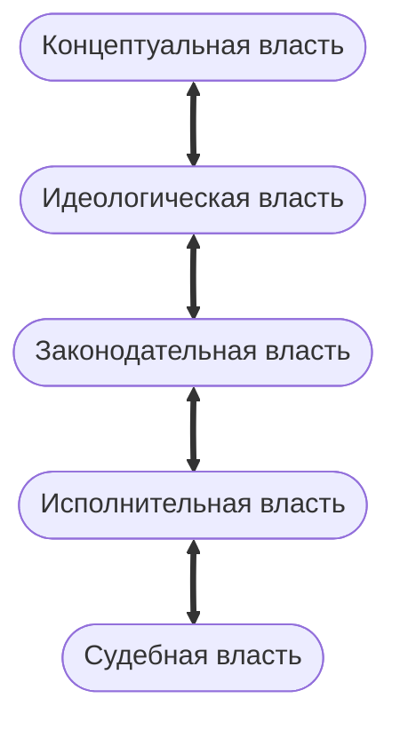
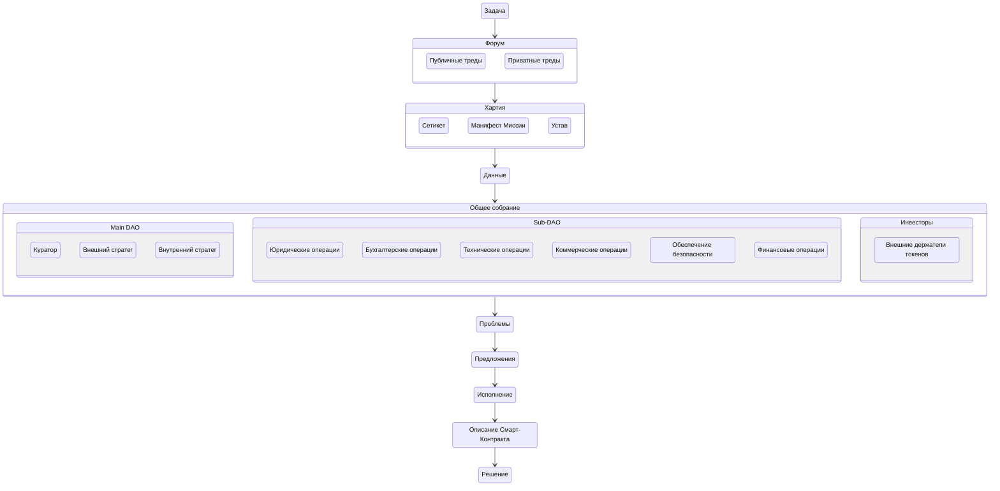

# Устав GIC DAO

## Оглавление
- [ОБЩИЕ ПОЛОЖЕНИЯ](#общие-положения)
- [ПРАВОВОЕ ПОЛОЖЕНИЕ](#правовое-положение)
- [ОТВЕТСТВЕННОСТЬ](#ответственность)
- [ОРГАНЫ УПРАВЛЕНИЯ](#органы-управления)
- [ДОКУМЕНТЫ, УЧЕТ И ОТЧЕТНОСТЬ ДАО](#документы-учет-и-отчетность-дао)
- [ИНФОРМАЦИЯ О ДАО](#информация-о-дао)
- [ПРИНЯТИЕ В ДАО](#принятие-в-дао)
- [РЕОРГАНИЗАЦИЯ И ЛИКВИДАЦИЯ ДАО](#реорганизация-и-ликвидация-дао)
- [СДЕЛКИ, СОВЕРШАЕМЫЕ ДАО](#сделки-совершаемые-дао)
- [ФОНДЫ И ЧИСТЫЕ АКТИВЫ ДАО](#фонды-и-чистые-активы-дао)
- [УСТАВНЫЙ КАПИТАЛ ДАО](#уставныи-капитал-дао)
- [ТОКЕНОМИКА ДАО](#токеномика)
- [КВОРУМ](#общее-собрание-участников-дао)
- [КУРАТОР](#куратор)
- [СТРАТЕГИ](#стратеги)
- [ТАКТИКИ](#тактики)
- [СУБОРГАНИЗАЦИИ](#суборганизации)
- [ПРАВА И ОБЯЗАННОСТИ](#права-и-обязанности-владельцев-дао)
- [РЕЕСТР СПИСКА УЧАСТНИКОВ](#реестр-списка-участников-дао)
- [ДОЛИ, ПРИНАДЛЕЖАЩИЕ ОБЩЕСТВУ](#доли-принадлежащие-дао)
- [ВКЛАДЫ В ИМУЩЕСТВО ОБЩЕСТВА](#вклады-в-имущество-дао)
- [РАСПРЕДЕЛЕНИЕ ПРИБЫЛИ](#распределение-прибыли-дао)
- [ОБРАЩЕНИЕ ВЗЫСКАНИЯ НА ДОЛЮ УЧАСТНИКА](#обращение-взыскания-на-долю-участника-дао)
- [РАЗРЕШЕНИЕ СПОРОВ](#разрешение-споров)
- [ПРЕДЛОЖЕНИЯ](#предложения)
- [ГОЛОСОВАНИЕ](#голосование)
- [ПРОЦЕДУРЫ ИЗМЕНЕНИЯ УСТАВА](#процедуры-изменения-устава)

## ОБЩИЕ ПОЛОЖЕНИЯ

1. Децентрализованная автономная организация «GIC» (далее - «ДАО») является распределенным хозяйственным обществом, выполняющим негосударственную некоммерческую деятельность, основанном на модели гетерархичной алгократии, имущество которого разделено на доли[^1], удостоверяющие обязательственные права и имущественную ответственность участников ДАО по отношению к ДАО.
2. Общество является юридическим лицом, созданным в соответствии с международным правом и зарегистрировано 5 мая 2023 года на блокчейне [Ethereum](https://etherscan.io/tx/0x932b66c7130591b572c76f610fe5778ff14043ee6c914b16d3ca0e5f6ad9f3f5), на платформе [Aragon](https://app.aragon.org/#/daos/ethereum/gic.dao.eth). 
3. ДАО - организация, осуществляющая свою деятельность автономно, то есть без прямого вмешательства владельцев организации с правилами описанными с помощью Смарт-Контрактов. 
 GIC является сайдчейном сети Ethereum.
4. В своей деятельности ДАО руководствуется действующими международными договорами, Хартией ДАО (далее также - «Хартия»), а также решениями его образующих органов (Main DAO, Sub-DAO), принятыми в соответствии с установленными порядками Общего собрания полноправных участников ДАО. 
 Хартия разделяется на:
- [Устав ДАО](https://gotointeractive.com/charter) (далее «Устав»), объясняет обязанности и права держателей Токенов GIC, процессы используемые держателями токенов GIC для управления ДАО;
- [Миссия ДАО](https://gotointeractive.com/manifest) (далее «Миссия»), объясняет ценности ДАО;
- [Сетикет ДАО](https://gotointeractive.com/netiquette) (далее «Сетикет»), объясняет нормы поведения между Держателями Токенов GIC, законы кодекса поведения и кодекса этики. 
5. Требования Хартии обязательны для исполнениями всеми участниками сети GIC. 
 Все участники ДАО образуют Общее собрание участников включающих: 
  - Main DAO:
    - Куратор;
    - Стратеги;
  - Sub-DAO:
    - Тактики; 
  Изменение Устава осуществляется по решению Общего собрания, в соответствии с утвержденным голосованием в установленном порядке плюрархических выборов на Форуме GIC (далее «Форум») за исключением случаев, предусмотренных правом вышестоящей (международной) ответственности.
6. ДАО это некорпоративная ассоциация отдельных физических лиц или групп лиц. 
7. ДАО управляется держателями нативных токенов сети GIC (ERC-20) в соответствии с документами Хартии и включает в себя один или несколько Sub-DAO, также связанных настоящим Уставом через протокол открытой координации на Форуме, основанный на технологии открытой цепочки блоков.
 Держателя токенами GIC, включая, но не ограничиваясь могут быть:
  - аффилированные лица; 
  - сотрудники; 
  - участники; 
  - лицензиары; 
  - поставщики услуг; 
  - директора; 
  - подрядчики;  
  - агенты; 
  - материнские компании; 
  - правопреемники; 
  - дочерние компании; 
  - филиалы; 
  - представители; 
  - прочие соответствующие должностные лица.
7. В сети GIC есть три уровня применимых правил. Это:
  - Правила описанные текущим документом - Устав.
  - Удобочитаемые правила внутреннего общения - Сетикет.
  - Коды Смарт-контракта.
7. Эти правила вместе образуют Хартию, в которой излагаются основные принципы, необходимые для участия и взаимодействием с сетью GIC (Далее также - «GIC», «Сеть»). 
 Если какие-либо правила в настоящем Уставе противоречат этим принципам (Сетикета или Коду смарт-контракта), правила Устава имеют приоритет в целях обеспечения соблюдения продолжения изменений в ДАО.

[^1]: Доли в соответствии с рейтингом участника.

### Наименование общества

#### Полное фирменное наименование
- На английском языке — goto Interactive Communications DAO.
- На русском языке — Децентрализованная автономная распределенная гетерархичная организация "Интерактивные Коммуникации".

#### Сокращенное фирменное наименование
- На английском языке — GIC DAO.

### Место нахождение общества

Место нахождение общества находится в киберпространстве. 
Где распределено и изолировано сайдчейном блокчейна платформы [Ethereum](https://ethereum.org/).

## ПРАВОВОЕ ПОЛОЖЕНИЕ

### Правовой статус

1. ДАО является юридическим лицом созданным и действующим на платформе сети GIC. Платформа подключается мостом к блокчейну Ethereum, в соответствии с правилами Хартии.
2. ДАО считается созданным как юридическое лицо с момента его регистрации на блокчейне Ethereum, на платформе [Aragon](https:/aragon.org/).
3. ДАО может от своего имени приобретать и осуществлять гражданские права, а также нести гражданские обязанности, быть истцом и ответчиком в суде при проявлении гражданской деятельности на территории иных Обществ принявших соответствие условий законодательства данного Устава.
4. Комитеты ДАО могут способствовать учреждению отдельных коммерческих, некоммерческих, профсоюзных ассоциаций и иных формы организаций, делегируя их форме отдельно зарегистрированных Обществ принявших соответствие условий данной Хартии. 
 Для осуществления деятельности в национальных сетях[^2] такие Общества несут положенные им права и обязанности, необходимые для осуществления требуемых видов деятельности, не запрещенных принятым законодательством национальной сети. 
 Такие Общества могут заниматься отличными от ДАО видами деятельности, регулирующиеся специальным разрешением (лицензии) в соответствии с требованиями законодательств выбранной национальной сети Общества.
5. ДАО имеет в собственности обособленное имущество, учитываемое на его самостоятельном публичном балансе внешнего блокчейна Ethereum описанных Смарт-Контрактом.
6. Все транзакции связанные с балансом ДАО должны быть выполнены в форме Смарт-контрактов и быть записаны на основном блокчейне ДАО (Ethereum) к надлежащему сроку.
7. ДАО вправе в установленном порядке открывать иные сайдчейны, парачейны, межсетевые мосты то есть иметь свой локальный блокчейн с другим механизмом консенсуса на территориях дружественных сетей в соответствии с Хартией.
8. Всем участникам ДАО требуется иметь криптографический ключ подтверждения индивидуализации в установленном порядке. 
 Любая созданная активность в рамках ДАО членами ДАО вне ДАО так же требует подписание криптографическим ключом подтверждения транзакции.

[^2]: Национальных Государств.

### Предмет и цели деятельности

1. ДАО учреждено без ограничения срока его деятельности.
2. В соответствии с настоящим Уставом для достижения своих целей может осуществлять любую деятельность, не противоречащую требованиям настоящего Устава и действующего международного законодательства. 
 Для работы Sub-DAO в национальной сети используется национальное законодательство.
3. Участники ДАО существуют для выполнения возложенной Миссию ДАО. 
4. Обстоятельства деятельности, осуществляемые ДАО: 
 - Основным видом деятельности ДАО является деятельность по формированию пространства коллективной сетевой коммуникации[^3]: 
   - Участие в обмене мнений, знаний и идей, представленных в активных формах мультимедийной визуализации. 
   - Исследование разнообразных точек зрения и развитии (познания) способности через интерактивные дискуссии. 
 - Разработка программного обеспечения в области интерактивных развлечений и других культурных искусств воспроизводимых исторических событий[^4]. 
 - Деятельность по созданию и использованию доверительных баз знаний информационных ресурсов. 
 - Другие виды деятельности, необходимые для поддержания деятельности ДАО. 
5. Виды деятельности, подлежащие лицензированию, осуществляются на основании соответствующих лицензий надлежащих им юрисдикций через Sub-DAO. 
6. После достижения Миссии, ДАО подлежит автоматическому расформированию и архивированию своей деятельности. 

[^3]: Форма виртуальной сферы или - _Игра_.
[^4]: Культурных мемов.

## ОТВЕТСТВЕННОСТЬ

ДАО несет ответственность по своим обязательствам всем принадлежащим ему имуществом и не отвечает по обязательствам своих участников. 
Размер ответственности ДАО в любом случае не может превышать *одну пятую* оплаченного уставного капитала ДАО. 
За исключением любых обязательств по возмещению убытков или конкретной ответственности, изложенных в настоящем Уставе, ответственность каждого физического, виртуального или юридического лица, разработавшего любую часть Устава, каждого держателя токенов GIC, каждое лицо взаимодействующее с сетью GIC должно быть ограничено в максимально возможной степени, разрешенной данным Уставом. 
Ответственность каждого из вышеупомянутых является раздельной, а не солидарной, и каждый из вышеупомянутых несет ответственность только по своим обязательствам (а не по обязательствам кого-либо еще) по настоящему Уставу или в связи с настоящим Уставом, или своими действиями с сетью GIC. 
Ни одна из сторон, участвующих или взаимодействующих с сетью GIC, не имеет каких-либо явных или подразумеваемых прав или полномочий брать на себя или создавать какие-либо обязательства от имени ДАО или от имени любого другого лица, участвующего или взаимодействующего с ДАО, или связывать кого-либо каким-либо договором, соглашением, или обязательством если иное не описано в Уставе.

Законы Хартии полностью независимы и не контролируется действиями участников Сети GIC в максимально возможной степени, разрешенной Хартией и ни при каких обстоятельствах не будет нести ответственность за ущерб любого рода, в соответствии с какой-либо правовой теорией, возникающий в результате или в связи с использованием, участием или взаимодействием с внешней сетью (например, Ethereum), включая любые прямые, косвенные, специальные, случайные или косвенные убытки, включая, помимо прочего, потерю дохода, упущенную выгоду, потерю бизнеса или ожидаемой экономии, невозможность использования, потерю деловой репутации или потерю данных, даже если это можно было предвидеть. 
Каждый, кто вступает в какие-либо отношения (включая, помимо прочего, участие или любое взаимодействие) с сетью GIC, признает, что другие лица, также имеющие отношения с сетью GIC, не несут ни солидарной, ни индивидуальной ответственности за действия или бездействие Сети. 
Ответственность Сети ограничена в максимально возможной степени, разрешенной применимой Хартией; в случае любой обязательной ответственности общая ответственность сети GIC ограничивается ее активами. 
Если иное не указано в настоящем Уставе, любые претензии, споры или разногласия, вытекающие из настоящего Устава или в связи с доступом, взаимодействием, использованием или Сетью GIC, или в связи с любыми отношениями между держателями токенов, или любым другим взаимодействующим с сетью GIC урегулируются:
- По обоюдному согласию сторон (по-умолчанию условиями *Сетикета*).
- Или взаимно согласованной арбитражной службы (по-умолчанию на Форуме *GIC Court*).

Сеть GIC представлена только группами (ролями):
- **Токенами Комитетов**, в которых закодирован тип власти (Комитет Внешнего Стратега, Комитет Внутреннего Стратега, Куратора и прочие Комитеты Тактиков), выполняющих средство голосования в указанном Токеном Комитете на Общем собрании. 
- **Токены GIC** (goto Interactive Coins), валюта торгующаяся на внешней Бирже и конвертирующиеся внешней средой в Предложение для ДАО.
 Ее можно обменять на другую валюту на Бирже.

## ОРГАНЫ УПРАВЛЕНИЯ

### Разделение властей в ДАО

1. Власть в ДАО разделена между различными центрами принятия решения. 
2. ДАО организует пять ветвей власти, исполняющие концептуальную, идеологическую, законодательную, исполнительную и судебные функции. 
3. Член ДАО не может выполнять параллельно две или более функций власти.
4. Одна категория уравновешивает другую категорию по принятиям любых решений на Бирже Предложений. 
5. Любое лицо, которое владеет токенами GIC контролирует баланс ДАО. 

#### Концептуальная власть

**Внешняя административная роль** концептуальной власти в лице _Внешнего Стратега_ комитета Main DAO, непосредственно утверждает оформленные предложения любого рода по изменению правил деятельности[^5].

[^5]: Устав и Сетикет

#### Идеологическая власть

**Внутренняя административная роль** идеологической власти в лице _Внутреннего Стратега_ комитета Main DAO, непосредственно оформляет правила деятельности[^5] из предложений прочих членов. 

#### Законодательная власть

**Коммуникационная роль** законодательной власти в лице _Куратора_ комитета Main DAO, непосредственно утверждают Предложения любого рода по изменению изменяемых правил деятельности в соответствии с установленными законами голосования. 
Накладывает вето на предложения Стратегов противоречащих правилам Хартии[^6].

1. Этот комитет обеспечивает целостность настоящего Устава, процесс внесения предложений, голосование и обсуждение. 
2. Он разрешает любой конфликт интересов, правила по этическим вопросам и разногласиям. 
3. Он также отвечает за структуру и содержание юридических лиц ДАО, если таковые будут созданы. 
4. Он укрепляет доверие между своими членами и другими организациями. 
5. Он также поддерживает актуализацию этого Устава, когда предложения требуют внесения поправок в этот Устав. 
6. Куратор выполняет роль надзорного (Паноптикума: все видит, оставаясь невидимым, и все учитывает, записывая анонимно). 
7. Все изменения в Уставе должны проходить через процесс предложения принятый этим комитетом.
  - Стратеги обязаны создавать и утверждать правила и политики, условия для проведения голосований, которые будут регулировать функционирование ДАО через Устав и Сетикет.
  - Оба стратега обязаны принимать изменения в Уставе или Сетикете ДАО по Судебным решениям.
  - Определение и решений связанных с Sub-DAO Layer 1.

[^6]: Путем голосования большинства владельцев токенов GIC: Тактиков, и в случае согласий Внутреннего стратега и Внешнего стратега, воля куратора аннулируется отменяется с комментариями причины отмены. 

#### Исполнительная власть

Совокупность всех Тактиков в лице представляющих комитетов Sub-DAO (Layer 1)[^7] выполняют следующие роли:
- **Правовая роль (*Правовед*)** - непосредственно вносят вето на предложения и действия в Main DAO, которые нарушают настоящую Хартию и/или наносят вред сети GIC.
- **Бухгалтерская роль (*Ревизор*)** - непосредственно выполняют учет и отчетность адресных предложений и конвертируют токены GIC в другие токены[^8]. 
- **Техническая роль (*Инженер*)** - непосредственно ответственны за развертывание принятых предложений в формате управляемого кода Смарт-Контрактов.
- **Коммерческая роль (*Коммерсант*)** - непосредственно сбывают производящие услуги, управляемые принципом Optimistic Governance[^9].
- **Роль попечителя безопасности (*Аудитор*)** - непосредственный аудит соответствий интересом Хартии третьей стороне: проверка, добавление, удаление вредителей сети GIC. 
- **Финансовая роль (*Казначей*)** - непосредственное управление казной операционного сейфа.

Этот комитет наблюдает за созданием и обслуживанием программного обеспечения, инструментов и документов, а также за партнерскими отношениями и расширением своих возможностей, управляет его финансами, аудит. 
Он отвечает за поддержание информации и процессов о членстве в DAO, а также за защиту информации, включая механизмы консенсуса, необходимые для демонстрации подтвержденного предложения:
- Выполнение и применение принятых законов и правил ДАО описанных в Уставе и Сетикете.
- Управление повседневными операциями и деятельностью организации через обеспечение выполнения Смарт-контрактов в соответствии с установленными правилами деятельности[^5].

[^7]: Члены Sub-DAO Layer 1 - напрямую контролируемые суборганизации Main DAO.
[^8]: ETH, Solana и прочие цифровые валюты.
[^9]: Перевод: "Сделай сам".

#### Судебная власть

**Роль судейства** в лице всех комитетов представленной совокупностью владельцев Токенов GIC[^10]. 
GIC Court голосование представляет собой реализацию третейского суда, проводящие решения на основе предоставленных формированных Событий[^11] и Действий[^12] отражающих историческую деятельность (момент) всех членов ДАО.
В качестве площадки голосования используется Форум, в качестве интерфейса управления представляющий собой веб-сайт, включающий в себя процесс принятия решений, правила голосования и то, как будут управляться средства ДАО.

Этот комитет защищает активы ДАО и распределяет токены в соответствии с волей его членов, обрабатывает предложения:
- Разрешение конфликтов внутри ДАО в спорах между Стратегами и Тактиками по отношению к обоим или друг к другу, включая автоматическое разрешение споров на основе заранее заданных правил Смарт-контрактов.
- Рассмотрение и проверка обращений участников, связанных с нарушением правил или недостоверностью информации.

GIC Court используется для оспаривания действий, запланированных как в основном DAO, так и в любом из Sub-DAO, непосредственно на Форуме.
Система разрешения споров, основана на смарт-контрактах и управляеется владельцами токенов GIC. 

Заявка в GIC Court может иметь несколько условий:
1. Первичным условием является ссылка на прецедент такого решения. 
2. Вторичным условием является то, что предложенное решение имеет строгое описание, без логических ошибок. 
3. *Approval*: предложение считается одобренным и запланированным к исполнению, если выполняются следующие условия:
  - *Quorum*: для голосования было использовано не менее одной тысячи (1000) токенов GIC.
  - *Support*: Голосование считается «принятым», если за него проголосовало простое большинство (> 50%) участвующих.
4. *Code approval*: запланированное к исполнению задача включает написание и публикацию кода Смарт-контракта. 
 У Тактиков есть до 14 дней, чтобы решить и сообщить на Форуме, будет ли предложение:
  - Принято и включено.
  - Предоставлено независимому аудиту для определения его безопасности при условии, что в Уставном капитале есть необходимые средства);
  - Отклонено как вредоносное, технически невыполнимое или экономически невыполнимое, если требуется аудит, а в Уставном капитале недостаточно средств для покрытия расходов на аудит.

[^10]: Орган управления сетью GIC состоит из членов Main DAO и всех нижестоящих слоев Sub-DAOs.
[^11]: То есть тех, что не зависят от деятельности в рамках оформленного Контракта (примеры: землетрясение, смерть).
[^12]: То есть тех, что зависят от деятельности в рамках оформленного Контракта (примеры: права и обязанности сторон).

### Собрание членов комитета ДАО
Main DAO в лице Стратегов через Куратора вправе организовать внеочередное Общее собрание всех участников ДАО. 
- В случае если члены комитета ДАО неспособны осуществлять свои функции, общее собрание участников ДАО принимает решения повестки дня за них.

## ДОКУМЕНТЫ, УЧЕТ И ОТЧЕТНОСТЬ ДАО

### Бухгалтерский учет и финансовая отчетность

1. ДАО обязано вести бухгалтерский учет, финансовый учет и управленческую отчетность в порядке, установленном IFRS[^13].
2. Ответственность за состояние и достоверность бухгалтерского учета в ДАО, своевременное представление отчета и другой финансовой отчетности лежит на Бухгалтерском комитете.
3. Внутренняя отчетность оформляется в виде Смарт-Контрактов и доступна на распределенном Форуме[^14]. 
 Все действия с документами ДАО хранятся публично на блокчейне в виде хэшей.

[^13]: Международный стандарт финансовой отчётности.
[^14]: Федиверс, файловое хранилище IPFS в структурируемом виде Linked Data - IPLD.

### Документы ДАО

1. Все документы ДАО удобочитаемы и интерпретируемы человеком. 
2. Все документы ДАО оформлены в строгие и верные семантические онтологии[^15]. 
3. Правила процессов включают в себя:
  - Документы Хартии ДАО включающие внесенные и зарегистрированные в установленном порядке изменения:
    - Устав. 
    - Миссия. 
    - Сетикет. 
  - Протокол(ы) собрания членов ДАО, содержащие решения о создании Sub-DAO, а также иные решений, связанные с созданием Sub-DAO или Main DAO:
    - Протоколы голосований участников. 
    - Иные документы по решению собрания участников. 
  - Регистрационные документы ДАО:
    - Договор об учреждении.
    - Списки аффилированных членов.
  - Внутренние документы ДАО:
    - Документы, подтверждающие права на имущество, находящееся на балансе организации.
    - Документы, связанные с эмиссией ценных бумаг общества.
    - Ссылки на Цифровых двойников участников.
    - Ссылки на все Sub-DAO.
    - Заключения Ревизора, Аудитора, других прочих органов контроля Sub-DAO.
4. Любая неспособность получения документом участником ДАО должно считаться ошибкой и требует незамедлительного устранения с нахождением причины ошибки. 
 Если причиной ошибки оказался внутренний участник ДАО - у него должно быть публично изъято доверие в виде токенов в соответствии с понесенным уроном деятельности ДАО. 

[^15]: Хранение осуществляется в связанных данных (Linked Data), используя механизмы сохранения и фиксации на [Форуме](https://forum.gotointeractive.com).

## ИНФОРМАЦИЯ О ДАО

1. Информация о ДАО предоставляется любой сети в соответствии с требованиями Устава. 
2. По требованию любого представившегося заинтересованного лица ДАО обязано в разумные сроки предоставить возможность ознакомиться с документами Хартии[^16], в том числе, со всеми изменениями. 
3. ДАО по запросу заинтересованного лица обязано обеспечить доступ к имеющимся судебным актам. 
4. Плата взимаемая ДАО за предоставление требования не может превышать затраты на изготовление его копии. 
5. ДАО по требованию внутреннего участника сети GIC обязано обеспечить выдачу информации о положениями его репутации[^17]. 
6. ДАО не обязано публиковать отчетность о своей деятельности без реализации кода Смарт-контракта. 
7. Общие достижения ДАО принадлежат всем членам Сети. 
8. Публикуя токены, облигации или иные эмиссионные ценные бумаги ДАО обязано публиковать соответствующие с ними финансовые и бухгалтерские балансы и раскрывать иную информацию о финансовой деятельности, предусмотренную Уставом, международным правом и правом иных внешних сетей[^2] где планируется публикация.
9. Репутация члена ДАО[^17] закреплена в форме токеномики Сети[^18]. 
10. Репутация есть внутренняя валюта[^19] в Сети. Творчество есть влияние, влияние есть доверие, которое меняется через расположение к Миссии ДАО[^20]. 
11. Общее число рейтинга не может превышать 100%. 
 Доверие является величиной (процентным соотношением) от 0% до 100% и распределена между всеми членами сети и напрямую зависит на изменение личных дивидендов.
12. Для вступления в ДАО поручителю требуется передать часть поручительного рейтинга доверия[^19] из своего кошелька к новому члену ДАО.
  1. Процедура участия и вступления в организацию требует от нового члена предоставить ссылки на все свои учетные записи в любых других организациях для проверки обеспечения начального уровня доверия.
  2. Второй этап для вступления в ДАО от нового участника требует внести входной платеж в виде эксклюзивного действия[^21] всем участникам Main DAO или Sub-DAO[^7]. 
    - Качество эксклюзивности после его успешного опробования на деле будет занесено в виде платежа в уставный капитал ДАО и сконвертировано в счет рейтинга доверия по стоимости выданной поручителем[^22]. 
  3. Участник должен использовать личный девайс[^23] с установленным ПО организации для функционирования с организацией через в Сеть Федиверс.
13. ДАО будет измерять успех следующими способами:
 - Владельцы участвуют:
   - как минимум приняли 1 решение за последний сезон
 - Членство растет;
 - Финансово поддерживает свою деятельность;
 - Документы и код создаются, изменяются и публикуются по мере извлечения уроков.

[^16]: Все документы ДАО: Устав, Сетикет, Манифест
[^17]: Правила Репутации описаны в Сетикете. Это виртуальная форма личного рейтинга доверия к капиталу ДАО. 
[^18]: Примеры. Вывод участником Токена GIC в иную Валюту понижает рейтинг доверия к Участнику. Соответственно, заработанное для ДАО повышает рейтинг доверия участника. Иными словами дивиденды выдаются, но после вывода в фиат падает рейтинг доверия на стоимость выведенного.
[^19]: Рейтинг доверия является конвертируемой валютой в форме Токенов GIC отражающий карму владельца ДАО. 
 Иными словами рейтинг участника есть его числовой вклад в капитализацию Общества и является процентным соотношением его возможности получить Токен GIC.
 Итоговое количество рейтинга доверия постоянно в Сети и изменяется лишь с добавлением и удалением нового члена. 
 Рейтинг это процентный индикатор члена ДАО, который влияет на силу его голоса на Общем собрании.
[^20]: Снижение доверия происходит за несоблюдение Миссии. Повышение доверия происходит за соблюдение Миссии.
[^21]: Знание, навык или его аналогия.
[^22]: Если окажется выше тогда совокупную стоимость новому участнику. Если окажется выше тогда распределено всем участникам в соответствие с их рейтингом.
[^23]: Личный сервер и личное устройство.

## ПРИНЯТИЕ В ДАО

GIC DAO управляется группами комитетов, которые обслуживают ДАО, но, во избежание сомнений, такое руководство может быть изменено DAO, и DAO сохраняет за собой право управлять своими делами в любое время. 

### Вступительное правило

Вступительное правило определяет права и обязанности по участию, взаимодействию, управлению и использованию с сетью GIC, а также отношения с держателями токенов GIC и другими лицами, взаимодействующими с сетью. 
Как владелец токенов GIC, физическое или юридическое лицо, взаимодействующее с сетью GIC, вы принимаете и соглашаетесь действовать добросовестно и соблюдать настоящий Устав, который образует соглашение между вами и любым другим лицом, участвующим или иным образом взаимодействующим с сетью GIC. 
Если вы не принимаете и не соглашаетесь соблюдать настоящую Хартию, вы должны прекратить доступ, использование, взаимодействие и участие в сети GIC, включая форум и производные инструменты. 
Результаты добытых знаний[^24] являются собственностью ДАО и не могут быть переданы другой организации, либо иному лицу без основания решения членов ДАО с утвержденным Уставом голосованием.
Управление GIC DAO открыто для всех, кто является правовым держателем токенов членства GIC, отчеканенными и выпущенными DAO.
GIC ДАО основывается на общих интересах, управляемых с помощью открытого и безопасного программного обеспечения, которое поможет в управлении DAO.
Вступление в ДАО возможно после обоснования решения и сопроводительного голосования участника внутри комитета ДАО. 
Поступление в ДАО дает доступ к собственности ДАО с момента вступления. 
Доступ к собственности ДАО основывается на рейтинге доверия к члену ДАО. 
Незаконная передача собственности ДАО, преследуется и возвращается комитетами GIC DAO. 

[^24]: Истинные знания ДАО: знания представляют собой капитал ДАО, которым могут распределяться члены ДАО, у которых есть к ним доступ. 

### Подписи участников

Подписывая эту Хартию, вы соглашаетесь стать членом GIC DAO, принимаете условия данной Хартии и обязуетесь поддерживать и продвигать видение, миссию и цели данного DAO, быть вовлеченным на координацию на самом высоком уровне. 
Если вы получили какие-либо токены членства DAO или иным образом являетесь членом DAO, вы соглашаетесь и согласны быть юридически обязанным данной Хартией, где такое получение и принятие действительны, как если бы они были подписаны в письменной форме. 
Любая подпись или исполнение, осуществленное с использованием токенов членства DAO в отношении любых вопросов, связанных с данной Хартией, включая, будет считаться действительным, как если бы оно было подписано в письменной форме. 
Байт-код, хранящийся в такой ключевой учетной записи подписи, является Smart Contract. 

### Токены участников

Передача токенов - единственный способ попасть в ДАО:
- Через эмисированные токены
- Через передачу своих токенов

Токены GIC дают право на управление ДАО:
- Идентификация члена к соответствующему комитету
- Голосование по вопросам сответствующего комитета
  - Токены других комитетов не учитываются при голосовании другого комитета
- Дивидендные выплаты
 Выплата дивидендов так же зависит от рейтинга. 
 Например, рейтинг члена 70% дает множитель 0.7 к величине дивидендов.

### Принятие хартии

Я участник (физическое или юридическое лицо), для взаимодействия с сетью GIC, заявляю и гарантирую, что вступая в ДАО я подтверждаю требования к членству: 
- Действую в соответствии с Миссией ДАО.
- Соглашаюсь соблюдать настоящий Устав. 
- Беру ответственность за соблюдение Сетикета.
- Не имею какие-либо интересы или членство в другом комитете сети GIC. 
- Делюсь ценностями с ДАО. 
- Регулярно участвую в онлайн-пространствах для общения, включая официальный форум[^14]. 
- Участвую в мероприятиях комитетов ДАО и в личных пространствах. 
- Работаю с другими суверенными участниками сообщества ДАО, включая Sub-DAOs. 
- Представляю ДАО на публичных мероприятиях, включая социальные сети[^15]. 
- Обязываюсь достигать общие цели комитета. 
- Несу ответственность за соблюдение всех применимых международных законов.
- Понимаю и признаю следующие риски, связанные с использованием блокчейна, криптоактивов и, следовательно, сети GIC, которые соглашаюсь взять на себя под свою исключительную ответственность, включая, помимо прочего, риски, связанные с:
  - Неисправность сети Ethereum (или любого другого используемого протокола).
  - Неблагоприятное регулирующее действие в одной или нескольких юрисдикциях.
  - Кража и взлом.
  - Уязвимости безопасности в компонентах GIC.
  - Уязвимости или полезные прорывы в области криптографии.
  - Мошенничество и сбои в работе Оракулов Смарт-контрактов.
  - Неблагоприятные налоговые последствия при участии или взаимодействии с сетью GIC или владении любым токеном GIC.
  - Потерю[^16] учетных данных для доступа к Форуму.
  - Незастрахованные убытки ДАО.
  - Риски передачи данных через Интернет.
  - Недостатки сети Aragon.
  - Отсутствие участия в работе GIC и постепенное сокращение рейтинга участника.
  - Другие заранее непредвиденные риски и форс-мажор.

[^15]: Ничто, опубликованное или членами ДАО вне ДАО, не является юридической или налоговой консультацией.
[^16]: Потеря доступа к ключу становится невосстановимым и безвозвратно теряет криптоактивы.

### Участники ДАО

1. Участником комитета ДАО может быть физическое лицо обладающее искусственным или естественным интеллектом и подтверждающим это. 
2. Каждый член организации имеет равные организационные права и обязанности закрепленные Уставом ДАО. 
3. Участник комитета ДАО не может быть единственным владельцем другого хозяйственного общества, состоящим из одного лица. 
 Обязательным необходимым условием является добавление Куратора Main DAO в его хозяйственное общество. 
4. Число членов в Main DAO не может быть более девяти. 
 В случае, если число членов Main DAO превысит установленный настоящим пунктом предел, Стратег в течение года должен преобразовать лицо в отдельное Sub-DAO из участников Main DAO. 
 Если в течение указанного срока Sub-DAO не будет создано или число участников Main ДАО не уменьшится до установленного настоящим пунктом предела, оно подлежит ликвидации. 
5. Стратеги и Куратор — обязаны не создавать иные хозяйственные общества. 
 Это прерогатива только Тактиков.
6. Один и тот же Стратег в сети GIC не может являться частью другого комитета, включая Main DAO и другого Sub-DAO. 
7. Для идентификации в члена ДАО в сети GIC участник должен подтвердить свою уникальную идентичность с раскрытием истории своего цифрового двойника в соответствии с правилами Сетикета. 
8. Сеть GIC DAO растет из центра наружу, где центральным членом является Внешний стратег — нулевой член организации, который имеет наивысший уровень рейтинга доверия. 
9. Каждый любой будущий член ДАО должен пройти процесс найма (правила сетикета регулируют кого брать в комитеты ДАО) и заключить договор согласия с данным Уставов. 
 Член ДАО не способный заключить договор с ДАО самостоятельно, автоматически подписывается членом рекомендовавшим его участие.
10. Дать обоснование того, почему вы являетесь идеальными кандидатами на эту должность.

### Привилегии участников

- Участники имеют право на материальное и иное вознаграждение. 
  - Ответственность[^18] за налоги и соблюдение законодательства вне ДАО лежит на Участнике. 

[^18]: Участие или взаимодействие с сетью GIC всегда требует соответствия применимым законам, включая, помимо прочего, законов о борьбе с коррупцией.

### Обязательства участников

- Участвовать в обсуждении, создании, голосовании и документировании Предложений. 
- Сообщать всем членам DAO о разногласиях, напряженности и неэффективности, чтобы происходили изменения, улучшения и обучение в ДАО. 
- Отслеживать и записывать прогресс для создания метрик измерения работоспособности ДАО.
- Иметь юридическую связанность своих действий настоящего Устава в соответствии с его применимостью законодательства.
- Понимать процедуру управления и применимые правила сети GIC, особенно функционирование и ограничения смарт-контрактов.
- В максимально возможной степени, разрешенной данным Уставом, вы соглашаетесь освобождать, удерживать и защищать GIC DAO от всех претензий, обязательств, убытков, судебных решений, затрат, расходов или сборов (включая разумные гонорары адвокатов), которые возникают из-за действий:
  - Ваше нарушение настоящего Устава;
  - Ваше некорректное взаимодействие с сетью GIC Network.
  - Ваше некорректное по сетикету взаимодействие с другими держателями токенов GIC или третьими лицами.

### Выход участника

- Если член совершает серьезное нарушение Хартии (как определяет Общее собрание членов), GIC Court в любое время может удалить такого члена из ДАО. 
 Член может обжаловать решение, подав апелляцию с использованием Форума.
- Все предложения о прекращении проводятся путем голосования на Форуме. 
- Любые апелляции рассматриваются с использованием GIC Court.
- Член ДАО вправе выйти из ДАО путем отчуждения доли ДАО независимо от согласия других его участников или ДАО.
  - Выход участников ДАО из ДАО, в результате которого в ДАО не остается ни одного участника, исключая Куратора, а также выход единственного участника ДАО из ДАО не допускается.
- Выход участника ДАО из ДАО не освобождает его от обязанности перед ДАО по внесению вклада в имущество ДАО, возникшей до подачи заявления о выходе из ДАО.
  - Удаление членства определяется как изъятие всего рейтинга Участника с взаимным расчетом привязанных к нему токенов GIC, а так же исключение из пространств, процессов и инструментов ДАО. 
  - Если по какой-либо причине удаленный участник отказывается от окончательных взаиморасчетов и не подписывает Смарт-контракт выхода из ДАО, то ДАО имеет право на принудительное обновление программного обеспечения (хард-форк), чтобы исключить этого члена без его подтверждения[^19]. 
- Член ДАО обязан представить в ДАО удостоверенное заявление о своем выходе в форме Смарт-Контракта.
- Члены могут быть удалены из ДАО руководящим голосованием внутри комитета ДАО или общим собранием членов ДАО за нарушение Сетикета. 
  - Участник может организовать апелляцию.

[^19]: Хард-форк включает, помимо обнуление рейтинга члена, сжигает (удаляет) привязанные к нему токены комитетов.

### Идентификатор участника

1. Адрес Смарт-Контракта ДАО
2. Имя токена комитета
3. Символ токена комитета
4. Адрес GIC DAO
5. Адрес кошелька ETH (и, возможно, их имя, дескриптор дискорда, дескриптор твиттера и другие идентификаторы)
6. Sub-DAO referenced document link for Rules/Agreement
7. Dispute Resolution Client
8. Execution time
9. Collateral token
10. Blacklist addresses
11. Уровень рейтинга[^19]
12. KPI[^47]
 Измерения отвечают на такие вопросы, как, как функционирует казначейство DAO, какой процент предложений способствует росту DAO, и сколько членов активно участвуют в голосовании.
 Индикаторы будут измерены в режиме реального времени, ежемесячно или сезонно и будут доступны всем членам DAO.
 На начальном этапе мы измеряем здоровье на основе набора параметров, которые являются гибкими для размещения обучения и стимулирования, чтобы стимулировать участие, развитие и развитие и рост.
 Измерения здоровья, несомненно, изменятся по мере ускорения обучения и расширения членства.

[^47]: Ключевые показатели производительности, это измерения, которые мы используем для оценки того, как лицо работает с течением времени.
 Базовый KPI включает финансовые показатели, участие в голосовании и предложений. 

## РЕОРГАНИЗАЦИЯ И ЛИКВИДАЦИЯ ДАО

Реорганизация, форк[^19] или ликвидация ДАО создается через возможности платформы Aragon с помощью Смарт-Контрактов понимаемой блокчейном Ethereum. 

## СДЕЛКИ, СОВЕРШАЕМЫЕ ДАО

### Крупные сделки

Крупные сделки, сделки, в совершении которых имеется заинтересованность участников вышестоящего Main DAO, и иные отдельно оговоренные в Уставе сделки, совершаются ДАО только с предварительного одобрения общего голосования участников ДАО в порядке, изложенным в настоящем Уставе, в соответствии с их уровнем голоса в участвующем комитете. 
Все крупные сделки совершаемые ДАО должны быть записаны в основной блокчейн (ETH) используемого в ДАО. 

### Малые сделки

Малые сделки[^20] могут выполняться самостоятельно их обладателем единолично и не требовать получения согласия на их совершение.

[^20]: Это сделки стоимость которых не превышает 50% (половина стоимости) токенов GIC внутри одного из комитета.

## ФОНДЫ И ЧИСТЫЕ АКТИВЫ ДАО

### Резервный фонд ДАО
 
1. Резервный фонд ДАО предназначен для покрытия убытков ДАО, а также для погашения других обязательств[^21].
2. Резервный фонд ДАО формируется путем обязательных ежегодных отчислений до достижения установленного размера одной годовой оплаты каждого члена ДАО. 
3. Размер обязательных ежегодных отчислений не может быть менее 5% от чистой прибыли ДАО. 
4. Отчисления в резервный фонд не требуют принятия решения о распределении чистой прибыли или иного согласования. 

[^21]: Облигации, AirDrop, выкуп долей его участников, включая комитеты Sub-DAO.

### Чистые активы ДАО

Если по окончании второго или каждого последующего финансового года стоимость чистых активов ДАО окажется меньше его уставного капитала, ДАО в порядке и сроки, предусмотренные Уставом, обязано увеличить стоимость чистых активов до размера уставного капитала или зарегистрировать уменьшение уставного капитала в установленном порядке. 

ДАО обязано обеспечить любому заинтересованному лицу доступ к информации о стоимости чистых активов в порядке, предусмотренном Уставом ДАО.

## УСТАВНЫЙ КАПИТАЛ ДАО

Уставный капитал ДАО определяет минимальный размер его имущества, гарантирующего интересы его владельцев[^22].

1. Размер уставного капитала ДАО и номинальная стоимость долей участников ДАО определяются в токенах ETH. 
2. Уставный капитал ДАО составляет 1 (один) ETH и состоит из номинальной стоимости долей всех участников Main DAO. 
3. Размер уставного капитала ДАО должен быть равен не менее 1 ETH. 
4. Размер доли участника ДАО в уставном капитале ДАО определяется в процентах или в виде дроби. 
5. Размер доли участника ДАО должен соответствовать соотношению номинальной стоимости его доли и уставного капитала ДАО. 
6. Действительная стоимость доли участника ДАО соответствует части стоимости чистых активов ДАО, пропорциональной размеру его доли.
7. Оплата долей в уставном капитале ДАО может осуществляться крипто токенами, фиатной валютой, ценными бумагами, другими вещами или имущественными правами, либо иными имеющими денежную оценку имуществом. 
8. Денежная оценка неденежного вклада в уставный капитал ДАО должна быть проведена другим независимым оценщиком ДАО. 
 Участники сети GIC не вправе определять денежную оценку неденежного вклада в размере, превышающем сумму оценки, определенную независимым оценщиком. 
9. В случае оплаты долей в уставном капитале ДАО неденежными средствами участники ДАО и независимый оценщик солидарно несут при недостаточности имущества ДАО субсидиарную ответственность по его обязательствам в пределах суммы, на которую завышена оценка имущества, внесенного в уставный капитал, в течение трех лет с момента основания GIC DAO или внесения в Устав ДАО соответствующих изменений. 
10. В случае прекращения у ДАО права пользования имуществом до истечения срока, на который такое имущество было передано в пользование ДАО для оплаты доли, участник ДАО, передавший имущество, обязан предоставить ДАО по его требованию компенсацию токенами ETH, равную плате за пользование таким же имуществом на подобных условиях в течение оставшегося срока пользования имуществом. 
 Компенсация должна быть предоставлена единовременно в разумный срок с момента предъявления ДАО требования о ее предоставлении, если иной порядок предоставления компенсации не установлен решением Общего собрания участников ДАО с заключением в Смарт-контракте. 
 Данное решение принимается Общим собранием участников ДАО без учета голосов участника ДАО и связанному с ним Sub-DAO, передавшего ДАО для оплаты своей доли право пользования имуществом, которое прекратилось досрочно. 
11. В случае непредоставления в установленный срок компенсации доли или части доли в уставном капитале ДАО, пропорциональные неоплаченной сумме (стоимости) компенсации, переходят к Main DAO. 
 Такая доля или часть доли должна быть реализована ДАО в порядке очередности и в в разумные сроки. 
12. Имущество, переданное участником ДАО в пользование ДАО для оплаты своей доли, в случае выхода или исключения такого участника из ДАО остается в пользовании ДАО в течение срока, на который данное имущество было передано. 
13. Не допускается освобождение участника ДАО от обязанности оплатить долю в уставном капитале ДАО, в том числе путем зачета его требований к ДАО. 
14. В случае неполной оплаты доли в уставном капитале ДАО в течение разумного срока, определяемого в соответствии с пунктом 11 настоящего параграфа, неоплаченная часть доли переходит к Main DAO. 
 Такая часть доли должна быть реализована ДАО в порядке и в разумные сроки. 
 Может быть предусмотрено взыскание неустойки (штрафа, пени) за неисполнение обязанности по оплате долей в уставном капитале ДАО. 

[^22]: Кредиторы являются владельцами инвестиционного комитета.

### УВЕЛИЧЕНИЕ УСТАВНОГО КАПИТАЛА

Увеличение уставного капитала ДАО может осуществляться за счет: 
1. Имущества Main DAO, и (или)
2. Дополнительных вкладов комитетов Sub-DAOs через Общее собрание

#### Увеличение уставного капитала за счет имущества Main DAO

1. Собрание стратегов ДАО большинством не менее двух третей голосов от общего числа голосов стратегов ДАО, может принять решение об увеличении уставного капитала ДАО за счет внесения дополнительных вкладов участниками ДАО.
 Таким решением должна быть определена общая стоимость дополнительных вкладов, а также установлено единое для всех участников ДАО соотношение между стоимостью дополнительного вклада участника ДАО и суммой, на которую увеличивается номинальная стоимость его доли. Указанное соотношение устанавливается исходя из того, что номинальная стоимость доли участника ДАО может увеличиваться на сумму, равную или меньшую стоимости его дополнительного вклада. 
2. Решение об увеличении уставного капитала ДАО за счет имущества ДАО может быть принято только на основании данных бухгалтерской отчетности ДАО за год, предшествующий году, в течение которого принято такое решение. 
3. Сумма, на которую увеличивается уставный капитал ДАО за счет имущества Общества, не должна превышать разницу между стоимостью чистых активов ДАО и суммой уставного капитала и резервного фонда ДАО. 
4. При увеличении уставного капитала ДАО за счет имущества ДАО пропорционально увеличивается номинальная стоимость долей всех участников ДАО без изменения размеров их долей. 
5. Заявление о регистрации изменений, вносимых в Устав в связи с увеличением уставного капитала ДАО и иные документы для регистрации изменений, вносимых в Устав ДАО в связи с увеличением уставного капитала ДАО, а также изменений номинальной стоимости долей участников ДАО должны быть представлены в виде Смарт-контракта сети Aragon, в течение одного Сезона со дня принятия решения об увеличении уставного капитала ДАО за счет его имущества. 
6. Изменения приобретают силу для третьих лиц после запуска Смарт-контракта в сети Ethereum.

#### Увеличение уставного капитала за счет дополнительных вкладов комитетов Sub-DAOs

1. Увеличение уставного капитала ДАО за счет его имущества осуществляется по решению Общего собрания участников, принятому большинством не менее двух третей голосов от общего числа голосов участников ДАО:
  - Каждый участник ДАО вправе внести дополнительный вклад, не превышающий части общей стоимости дополнительных вкладов, пропорциональной размеру доли этого участника в уставном капитале ДАО. 
 Дополнительные вклады могут быть внесены участниками ДАО в течение двух месяцев со дня принятия решения об увеличении уставного капитала ДАО за счет внесения дополнительных вкладов участниками ДАО, если решением участников ДАО не установлен иной срок. 
2. Не позднее месяца со дня окончания срока внесения дополнительных вкладов собрание участников ДАО должно принять решение об утверждении итогов внесения дополнительных вкладов участниками ДАО и о внесении в настоящий Устав изменений, связанных с увеличением размера уставного капитала ДАО. При этом номинальная стоимость доли каждого участника ДАО, внесшего дополнительный вклад, увеличивается в соответствии с предусмотренным соотношением. 
3. Указанные изменения в Устав приобретают силу для участников ДАО и третьих лиц со дня запуска утвержденного Смарт-контракта на блокчейне Ethereum. 
  - В случае нахождения ошибки в Смарт-контракте, увеличение уставного капитала ДАО признается несостоявшимся и подлежит возврату к предыдущему корректному состоянию.

### УМЕНЬШЕНИЕ УСТАВНОГО КАПИТАЛА

1. Общество вправе уменьшить уставный капитал, путем:
  - Уменьшения номинальной стоимости долей всех участников ДАО в уставном капитале ДАО и (или)
  - Погашения долей, принадлежащих ДАО.
2. Общество не вправе уменьшать свой уставный капитал, если в результате такого уменьшения его размер станет меньше минимального размера уставного капитала. 
3. Уменьшение уставного капитала ДАО путем уменьшения номинальной стоимости долей всех участников ДАО должно осуществляться с сохранением размеров долей всех участников ДАО. 
4. В течение 1 (одной) рабочей недели после принятия решения об уменьшении своего уставного капитала ДАО обязано создать соответствующий Смарт-контракт на Ethereum, а также уведомить об уменьшении уставного капитала Sub-DAO (Layer 1) в Main DAO. 
 При этом кредиторы ДАО, если их требования возникли до опубликования уведомления об уменьшении уставного капитала ДАО, в течение 30 (тридцати) дней с даты последнего опубликования такого уведомления вправе потребовать от ДАО досрочного исполнения соответствующих обязательств ДАО, а при невозможности досрочного исполнения такого обязательства его прекращения и возмещения связанных с этим убытков. 

## ТОКЕНОМИКА

Экономическая модель ДАО основана на использовании токенов GIC, соответствуя следующим условиям:
- Каждый участник владеет токенами комитета. 
- Каждый комитет владеет и управляет своими собственными LP-токенами (токены GIC). 
- Каждый из десяти комитетов строго владеет 10% собственности всего ДАО. 
- Стоимость токенов GIC оцениваются внешней Биржей. 
- На Бирже указываются Предложения в стоимостном виде[^23]. 
- Вес токена распределяется пропорционально принесшему вкладу в организацию ресурсов, как знания, участники, деньги, вычисления, хранение и другое. 

[^23]: Входящие Предложения оформленные на Бирже сперва должны пройти этап обсуждения проблемы и оформлены соответствующим образом.

```mermaid
graph TB;

problem[Внешняя проблема]
forum[Форум]
stockLocal[Внутренняя биржа]
stockGlobal[Внешняя биржа]

problem == Третьи лица выносят проблему на обсуждение ==> forum
forum-.->|Конвертация некоего внешнего блага/ресурса/валюты в Токены GIC|stockLocal

subgraph DAO[ДАО]
  direction LR;

  subgraph MainDAO[Main DAO]
  style extStrategy fill:#295FF4,stroke:#333,stroke-width:4px
    extStrategy["`
      **Внешний стратег**
      10% Активов
      A-токены
      Участник 1: 100% рейтинга
    `"]
    style intStrategy fill:#5AC4F6,stroke:#333,stroke-width:4px
    intStrategy["`
      **Внутренний стратег**
      10% Активов
      B-токены
      Участник А: 50% рейтинга
      Участник B: 50% рейтинга
    `"]
    style curator fill:#64C466,stroke:#333,stroke-width:4px
    curator["`
      **Куратор**
      10% Активов
      C-токены
      Участник 1: 100% рейтинга
    `"]
  end
  
  subgraph SubDAO [Sub-DAO]
    %% Юридический комитет
    style legalCommittee fill:#F6CE46,stroke:#333,stroke-width:4px
    legalCommittee["`
      **Юр. комитет**
      10% Активов
      D-токены
    `"]
    %% Бухгалтерский комитет
    style accountingCommittee fill:#EA4D3D,stroke:#333,stroke-width:4px
    accountingCommittee["`
      **Бух. комитет**
      10% Активов
      E-токены
    `"]
    %% Технический комитет
    style technicalCommittee fill:#782CF6,stroke:#333,stroke-width:4px
    technicalCommittee["`
      **Тех. комитет**
      10% Активов
      F-токены
    `"]
    %% Коммерческий комитет
    style commercialCommittee fill:#EB539F,stroke:#333,stroke-width:4px
    commercialCommittee["`
      **Ком. комитет**
      10% Активов
      G-токены
    `"]
    %% Комитет обеспечения безопасности
    style securityCommittee fill:#6CE4CF,stroke:#333,stroke-width:4px
    securityCommittee["`
      **Ком. безопасности**
      10% Активов
      H-токены
    `"]
    %% Финансовый комитет
    style financeCommittee fill:#BFBFBF,stroke:#333,stroke-width:4px
    financeCommittee["`
      **Фин. комитет**
      10% Активов
      J-токены
    `"]
    %% Инвестиционный комитет
    style investmentCommittee fill:#000,stroke:#333,stroke-width:4px
    investmentCommittee["`
      **Инв. комитет**
      10% Активов
      I-токены
    `"]
  end

end

stockLocal-.->|Токены GIC содержат Смарт-Контракт с поставленной целью/задачей/инвестицией|DAO

subgraph stockGlobal["Биржа"]
  direction LR
  
  subgraph sidechain["Side Chain (GIC DAO)"]
        direction LR
        block1["Block"]
  end
  
  subgraph main_blockchain["Main Blockchain (ETH Network)"]
        direction LR
        block2["Block"]
  end
  
  sidechain-.->|токены goto Interactive Coins|main_blockchain
  main_blockchain-.->|Ethereum|sidechain
  
end

DAO-.->|Дивиденды в Токенах GIC обратно конвертируются в прочие токены/фиат на бирже|stockGlobal
```

### Эмиссионные ценные бумаги ДАО

1. Право на эмиссию[^36] токенов дается:
  - Членам комитета (только на эмиссию токенов их комитета) после принятия предложения единогласно. 
  - Общим собранием членов ДАО после принятия более 50% всех голосов. 
2. Общество вправе размещать облигации и иные эмиссионные ценные бумаги в порядке, установленном законодательством выбранного региона о ценных бумагах. 
3. ДАО, после полной оплаты уставного капитала, вправе размещать облигации с номинальной стоимостью, не превышающей размера его уставного капитала или величины обеспечения, предоставленного ДАО в этих целях третьими лицами. 
4. При отсутствии обеспечения, предоставленного ДАО третьими лицами с целью гарантировать выполнение обязательств перед владельцами облигаций, размещение ДАО облигаций допускается не ранее третьего года существования ДАО при условии надлежащего утверждения годовой бухгалтерской отчетности за два завершенных финансовых года. 
 Указанные ограничения не применяются для выпусков облигаций с ипотечным покрытием и в иных случаях, установленных федеральными законами о ценных бумагах. 
5. Эмиссия нужна, например, для стимулирования (старых акул) с низкими KPI или для найма новых сотрудников на рынке или для привлечения инвестиций самостоятельными силами. 

[^36]: Эмиссия токенов приводит к созданию новых токенов GIC, что обесценивает прежние токены комитета на величину эмиссии.

## ОБЩЕЕ СОБРАНИЕ УЧАСТНИКОВ ДАО

1. Общее собрание участников является высшим органом управления ДАО. 
2. Общее собрание участников осуществляет свою деятельность в соответствии с положениями Устава и требованиями Сетикета.
3. Осведомленность организации информируется на регулярной основе. 
4. Общее собрание участников ДАО проводится в соответствие с Сезоном (Seasons)
 Сезоны — это определенный период времени операций ДАО. 
 Срок — это остаток сезона:
  - Сезон 0 начинается с Даты вступления в силу настоящего Устава и продолжается до тридцати (30) дней после избрания комитетов ДАО.
  - Сезон 1 начинается на последний день месяца (например, 31-й) после таких выборов. 
  - Сезоны идут подряд без перерыва в датах, если иное не принято настоящим Уставом.
5. Кворум основан на определении количества токенов GIC, распространяемых владельцами ДАО, в обращении. 
6. Порог кворума по умолчанию составляет десять процентов (10%) токенов управления в обращении.
  - Например, если у нас есть тысяча (1000) токенов в обращении, то нам понадобится сто (100) токенов, чтобы проголосовать, чтобы достичь порога кворума. 
  - ДАО может изменить порог кворума по умолчанию путем указания в Предложении или конфигурировать после начала голосования. 
  - Порог кворума определяется минимальным количеством токенов, которые проголосовали в предложении.
  - Могут быть предложены различные типы Предложений, которые требуют более высокого или более низкого порога кворума.
  - Общее собрание несет ответственность за установление процесса Предложений.
7. Участник предлагающий собственное решение - формирует свое Предложение.

### Компетенция Общего собрания

1. Изменение Устава и утверждение Устава в новой редакции.
 Решение об изменении Устава в части изменения (исключения) порядка определения размеров вкладов в имущество Общества непропорционально размерам долей участников Общества, а также изменения (исключения) ограничений, связанных с внесением вкладов в имущество ДАО, установленных для определенного участника ДАО, принимается Общим собранием участников большинством не менее двух третей голосов от общего числа голосов участников Main DAO, при условии, что участник ДАО, для которого установлены такие ограничения, голосовал за принятие такого решения или дал письменное согласие. 
 Во всех остальных случаях решения об изменении Устава Общества принимаются Общим собранием участников ДАО большинством не менее трех четвертей голосов от общего числа голосов участников.
 Владельцы GIC могут изменять правила настоящего Устава только следующим образом: 
  - Неизменные принципы не должны изменяться.
  - Изменяемые принципы могут быть изменены:
    - Большинство (более 50% голосов «за») проголосовало при минимальном кворуме[^24]. 
    - Владельцы GIC должны быть уведомлены о предложенной поправке разумными средствами не менее чем за тридцать (30) дней до начала голосования, и голосование должно быть открытым в течение как минимум четырнадцати (14) дней, чтобы сообщество могло проголосовать. 
    - Голосование должно быть публично организовано на Форуме.
2. Увеличение уставного капитала ДАО.
 Решение об увеличении уставного капитала ДАО на основании заявления участника о внесении дополнительного вклада и (или) заявления третьего лица (заявлений третьих лиц) о принятии его в ДАО и внесении вклада принимается Общим собранием участников всеми участниками Общества единогласно. 
  - За счет его имущества ДАО решение принимается Общим собранием участников большинством не менее двух третей голосов от общего числа голосов участников Main DAO.
  - За счет внесения дополнительных вкладов участниками ДАО, пропорционально их долям в уставном капитале ДАО, решение принимается Общим собранием участников большинством не менее двух третей голосов от общего числа голосов участников ДАО.
3. Утверждение итогов внесения дополнительных вкладов участниками ДАО.
 Решение принимается Общим собранием участников большинством не менее двух третей голосов от общего числа голосов участников ДАО.
4. Уменьшение уставного капитала Общества.
 Решение принимается Общим собранием участников ДАО всеми участниками ДАО единогласно. 
5. Избрание Куратора, и принятие решения о досрочном прекращении полномочий любого Стратега.
 Принимается кумулятивным голосованием[^25]. 
6. Выдвижение Стратега.
 Внешнего Стратега как и Внутреннего Стратега выбирают комитеты Тактиков, используя принципы демархии.
7. Избрание и досрочное прекращение полномочий Ревизионной комиссии (Ревизора) Общества.
 Решение принимается Общим собранием участников простым большинством голосов от общего числа голосов участников Общества.
8. Утверждение годовых отчетов и годовых бухгалтерских балансов.
 Решение принимается собранием участников Main DAO простым большинством голосов от общего числа голосов участников Общества.
9. Принятие решения о распределении чистой прибыли Общества между владельцами ДАО.
 Решение принимается Общим собранием участников Общества большинством не менее трех четвертей голосов от общего числа голосов участников Общества.
10. Утверждение Сетикета, регулирующего деятельность ДАО.
 Решение принимается Общим собранием участников простым большинством голосов от общего числа голосов участников Общества.
11. Принятие решения о размещении облигаций и иных эмиссионных ценных бумаг.
 Решение принимается Общим собранием участников простым большинством голосов от общего числа голосов участников.
12. Назначение аудиторской проверки, утверждение аудитора Общества.
 Решение принимается Общим собранием участников простым большинством голосов от общего числа голосов участников.
13. Принятие решения о реорганизации или досрочной ликвидации ДАО.
 Решение принимается Общим собранием участников ДАО всеми участниками ДАО единогласно.
14. Назначение ликвидационной комиссии и утверждение ликвидационных балансов.
 Решение принимается Общим собранием участников простым большинством голосов от общего числа голосов участников.
15. Предоставление участнику (участникам) ДАО, помимо прав, предусмотренных настоящим Уставом, дополнительных прав участника (участников) ДАО.
 Решение принимается Общим собранием участников всеми участниками ДАО единогласно.
16. Прекращение или ограничение дополнительных прав, предоставленных всем участникам ДАО.
 Решение принимается Общим собранием участников всеми участниками ДАО единогласно. 
17. Прекращение или ограничение дополнительных прав, предоставленных определенному участнику ДАО.
 Решение принимается Общим собранием участников Main DAO большинством не менее двух третей голосов от общего числа голосов участников, при условии, если участник ДАО, которому принадлежат такие дополнительные права, голосовал за принятие такого решения или дал письменное согласие.
18. Возложение дополнительных обязанностей, помимо обязанностей, предусмотренных настоящим Уставом, на всех участников ДАО.
 Решение принимается Общим собранием участников всеми участниками ДАО единогласно.
19. Возложение дополнительных обязанностей, помимо обязанностей, предусмотренных настоящим Уставом, на определенного участника ДАО.
 Решение принимается Общим собранием участников большинством не менее двух третей голосов от общего числа голосов участников, при условии, если участник ДАО, на которого возлагаются такие дополнительные обязанности, голосовал за принятие такого решения.
20. Денежная оценка неденежных вкладов в уставный капитал ДАО, вносимых участниками ДАО и принимаемыми в ДАО третьими лицами.
 Решение принимается Общим собранием участников ДАО всеми участниками ДАО единогласно.
21. Определение (изменение) порядка предоставления и размера компенсации ДАО участником в случае прекращения у ДАО права пользования имуществом до истечения срока, на который такое имущество было передано участником в пользование ДАО в качестве вклада в уставный капитал.
 Решение принимается Общим собранием участников ДАО большинством не менее половины голосов всех участников ДАО без учета голосов участника ДАО, передавшего ДАО в качестве вклада в уставный капитал право пользования имуществом, которое прекратилось досрочно.
22. Согласие на залог участником принадлежащей ему доли или части доли в уставном капитале ДАО другому участнику ДАО или третьему лицу.
 Решение принимается Общим собранием участников простым большинством голосов от общего числа голосов участников ДАО, при этом голоса участника ДАО, который намерен заложить свою долю или часть доли, при определении результатов голосования не учитываются.
23. Распределение или продажа доли, принадлежащей ДАО, между всеми участниками ДАО пропорционально их долям в уставном капитале ДАО.
 Решение принимается Общим собранием участников простым большинством голосов от общего числа голосов участников ДАО.
24. Продажа доли, принадлежащей ДАО, участникам ДАО, в результате которой изменяются размеры долей его участников, продажа доли третьим лицам.
 Решение принимается Общим собранием участников всеми участниками ДАО единогласно.
25. Утверждение итогов оплаты участниками ДАО приобретенных ими у ДАО долей.
 Решение принимается Общим собранием участников всеми участниками ДАО единогласно.
26. Определение размера оплаты и выплата участниками ДАО действительной стоимости доли или части доли участника ДАО, на имущество которого обращается взыскание, кредиторам этого участника.
 Решение принимается Общим собранием участников всеми участниками ДАО единогласно.
27. Внесение участниками вкладов в имущество ДАО.
 Решение принимается Общим собранием участников большинством не менее двух третей голосов от общего числа голосов участников ДАО; решение принимается Общим собранием участников всеми участниками ДАО единогласно в случае внесения вкладов в имущество Общества непропорционально долям участников.
28. Принятие в установленном законом порядке решения о согласии на совершение или о последующем одобрении сделок, в совершении которых имеется заинтересованность, если цена сделки или стоимость имущества, являющегося предметом сделки, превышает 10 процентов балансовой стоимости активов общества, определенной на основании данных бухгалтерской отчетности за последний отчетный период.
 Решение принимается Общим собранием участников простым большинством голосов от общего числа голосов участников ДАО, незаинтересованных в совершении сделки.
29. Принятие решения о согласии на совершение или о последующем одобрении крупных сделок (включая согласование всех существенных условий таких сделок) или несколько взаимосвязанных сделок, связанных с приобретением, отчуждением или возможностью отчуждения ДАО прямо либо косвенно имущества, стоимость которого составляет 50 и более процентов балансовой стоимости активов ДАО.
 Решение принимается Общим собранием участников всеми участниками ДАО единогласно.
30. Принятие решения о согласии на совершение или о последующем одобрении крупных сделок (включая согласование всех существенных условий таких сделок) или несколько взаимосвязанных сделок, связанных с приобретением, отчуждением или возможностью отчуждения ДАО прямо либо косвенно имущества, стоимость которого составляет от 25 до 50 процентов балансовой стоимости активов ДАО, в случае если единогласие всех избранных Стратегов по указанному вопросу не было достигнуто.
 Решение принимается Общим собранием участников ДАО всеми участниками ДАО большинством не менее двух третей голосов от общего числа голосов участников ДАО.
31. Общее собрание не вправе рассматривать и принимать решения по вопросам Тактиков, то есть тех, что не относятся к его компетенции.
32. Общее собрание не вправе изменять повестку дня, за исключением случаев, если в данном Общем собрании участвуют все участники ДАО. Решения Общего собрания участников ДАО, принятые по вопросам, не включенным в повестку дня данного собрания (за исключением случая, если на Общем собрании участников присутствовали все участники ДАО), либо без необходимого для принятия решения большинства голосов участников ДАО, не имеют силы независимо от обжалования их в судебном порядке.
33. Решения, принятые Общим собранием участников, обязательны для всех органов управления и должностных лиц ДАО с момента принятия и вплоть до момента признания судом недействительными частично или полностью либо отменены или изменены Общим собранием участников.
34. Решения Общего собрания участников принимаются путем проведения голосования на Форуме.

[^24]: Минимальный кворум составляет 11% держателей GIC
[^25]: При кумулятивном голосовании число голосов, принадлежащих каждому участнику Общества, умножается на число лиц, которые должны быть избраны в орган Общества, и участник Общества вправе отдать полученное таким образом число голосов полностью за одного кандидата или распределить их между двумя и более кандидатами. 
 Избранными считаются кандидаты, получившие наибольшее число голосов.

### Очередное Общее собрание

1. ДАО обязано ежегодно проводить очередное Общее собрание участников в сроки не ранее чем через 2 месяца и не позднее чем через 4 месяца после окончания финансового года. 
2. Очередное Общее собрание участников созывается Куратором. 
3. Очередное Общее собрание участников проводится в режиме онлайн с подключением всех необходимых интерфейсов (включающие режим аудио и видеопотока с камер).
4. На очередном Общем собрании участников должны решаться вопросы утверждения годовых отчетов, годовой бухгалтерской отчетности, а также распределение прибыли и убытков ДАО по результатам финансового года, а также могут решаться прочие вопросы, отнесенные к законодательствам и компетенции Общего собрания участников. 
5. При подготовке к проведению очередного Общего собрания участников ДАО лицам, имеющим право на участие в очередном Общем собрании участников ДАО, должен быть предоставлен отчет о заключенных ДАО в отчетном году сделках, в совершении которых имеется заинтересованность.

### Внеочередное Общее собрание

1. Проводимые помимо очередного Общего собрания участников являются внеочередными. 
 Внеочередное общее собрание участников проводится в случаях, определенных Уставом ДАО, а также в любых иных случаях, если проведение такого Общего собрания участников требуют интересы ДАО и его участников.
2. Внеочередное общее собрание участников созывается Main DAO по его собственной инициативе, или членами Ревизионной комиссии (Ревизора) Общества, а также по требованию комитетов Sub-DAO.
3. Куратор, обязан в течение одного дня с даты получения требования о проведении внеочередного Общего собрания участников рассмотреть данное требование на предмет соответствия Сетикету. 
4. В течении пяти дней Общее собрание участников считается утвержденным. 
 В противном случае требуется сообщить об отказе в его проведении единогласно (без участия голоса инициатора).

### Порядок созыва Общего собрания

1. Куратор обязан не позднее чем за 7 (семь) календарных дней до его проведения уведомить об этом каждого участника Общества на Форуме GIC. 
 В уведомлении о проведении внеочередного Общего собрания участников должны быть указаны время и место проведения Общего собрания участников, а также предлагаемая повестка дня. 
 Общее собрание участников Общества может быть проведено без соблюдения сроков на при условии участия в нем всех участников ДАО и единогласного принятия решения всеми участниками Общества о проведении Общего собрания участников ДАО без соблюдения сроков на уведомление о проведении такого собрания. 
 Решение о проведении Общего собрания участников без соблюдения сроков на уведомление о проведении собрания принимается всеми участниками на таком Общем собрании участников единогласно. 
2. Любой участник ДАО вправе вносить предложения о включении в повестку дня Общего собрания участников дополнительных вопросов не позднее чем за пять дней до его проведения. 
 Дополнительные вопросы, за исключением вопросов, которые не относятся к компетенции Общего собрания участников включаются в повестку дня Общего собрания участников. 
3. Предложение о внесении вопросов в повестку дня Общего собрания участников и о выдвижении кандидатов вносятся на Форуме с указанием их идентификатора представившего его участника. 
 Предложение о внесении вопросов в повестку дня должно содержать четкую и однозначно трактуемую формулировку каждого предлагаемого вопроса, а также может содержать формулировку решения по каждому предлагаемому вопросу. 
4. Предложение о выдвижении кандидатов в соответствующий комитет должно содержать сведения[^26] о выдвигаемых кандидатах. 
5. Указанные предложения должны быть подписаны участником ДАО его цифровой подписью. 
6. Орган или лица, созывающие Общее собрание участников, не вправе вносить изменения в формулировки дополнительных вопросов, предложенных для включения в повестку дня Общего собрания участников. 
7. В случае, если по предложению участников Общества в первоначальную повестку дня Общего собрания участников вносятся изменения, орган или лица, созывающие Общее собрание участников ДАО, обязаны не позднее чем за три дня до его проведения уведомить всех участников ДАО о внесенных в повестку дня изменениях способом, предусмотренным Уставом для уведомления о созыве Общего собрания участников. 
8. К информации и материалам, подлежащим предоставлению участникам ДАО при подготовке Общего собрания участников относятся: 
  - годовой отчет ДАО; 
  - заключения Ревизионной комиссии (Ревизора) и аудитора ДАО по результатам проверки годовых отчетов и годовых бухгалтерских балансов Общества; 
  - сведения о кандидате (кандидатах) для вступления в Общество; 
  - проект изменений и дополнений, вносимых в Устав в новой редакции, проекты внутренних документов Общества; 
  - отчет о совершенных ДАО в отчетном году сделках с заинтересованностью; 
  - иная информация (материалы), предусмотренная настоящим Уставом. 
9. Орган или лица, созывающие Общее собрание участников, обязаны направить или вручить всем участникам Общества информацию и материалы вместе с уведомлением о проведении Общего собрания участников на Форуме, а в случае изменения повестки дня, соответствующие информация и материалы, направляются вместе с уведомлением о таком изменении. 
10. Указанные информация и материалы в течение трех дней до проведения Общего собрания участников должны быть предоставлены всем участникам ДАО для ознакомления в помещении органами исполнительной власти. 
11. В случае нарушения установленного настоящей статьей порядка созыва Общего собрания участников такое Общее собрание признается правомочным, если в нем участвуют все участники ДАО.

[^26]: Цифровая биометрия, сведения об образовании и занимаемой должности, контактный адрес.

### Порядок проведения Общего собрания

1. Общее собрание участников проводится в порядке, установленном Уставом и внутренними документами.
 В части, не урегулированной Уставом, порядок проведения Общего собрания участников устанавливается решением Общего собрания участников.
2. Перед открытием Общего собрания проводится регистрация владельцев ДАО.
 Участники вправе участвовать в Общем собрании лично, предъявить документы[^26], подтверждающие их надлежащие полномочия. 
 Не зарегистрировавшийся участник ДАО (как и его представитель) не вправе принимать участие в голосовании.
3. Общее собрание участников открывается в указанное в уведомлении о проведении Общего собрания участников время или, если все участники Общества уже зарегистрированы, ранее. 
 Общее собрание участников открывается Внутренним Стратегом. 
 Общее собрание участников, созванное Ревизионной комиссией (Ревизором), аудитором Общества или участниками Общества, открывает председатель Ревизионной комиссии (Ревизор), аудитор Общества или один из участников Общества, созвавших данное Общее собрание. 
4. Лицо, открывающее Общее собрание, проводит выборы председательствующего из числа участников Общества. 
 При голосовании по вопросу об избрании председательствующего каждый участник Общего собрания имеет число голосов, пропорциональное его доле в уставном капитале Общества, а решение по указанному вопросу принимается большинством голосов от общего числа голосов участников Общества. 
5. Куратор Общества организует ведение протокола Общего собрания участников. 
 Не позднее чем в течение 10 (десяти) дней после составления протокола Общего собрания участников Общества, Куратор обязан направить копию протокола Общего собрания всем участникам ДАО в порядке, предусмотренном для сообщения о проведении Общего собрания участников Общества. 
6. Протоколы всех Общих собраний сохраняются на Форуме, которые должны в любое время предоставляться любому участнику ДАО для ознакомления. 
7. На Общем собрании вправе приниматься решения только по вопросам повестки дня, сообщенным участникам ДАО, за исключением случаев, если в данном Общем собрании участвуют все участники Общества.
8. Принятие Общим собранием участников решений и состав участников ДАО, присутствовавших при их принятии, подтверждаются их подписями на Общем собрании участников и Куратора. 
 Принятие Общим собранием участников решений и составе участников ДАО, присутствовавших при их принятии, подтверждаются путем подписания Смарт-контракта.
9. В случае если ДАО состоит из одного участника, принятие единственным участником ДАО решений подтверждается путем подписания решений собственной подписью, имеющего право действовать без доверенности от имени юридического лица — единственного участника ДАО, с рекомендацией соблюдения требований Устава. 

### Голосование на Общем собрании

1. Каждый участник ДАО имеет на Общем собрании участников число голосов, пропорциональное одной десятой от его рейтинга в комитете, за исключением случаев, предусмотренных Уставом. 
 Изменение и исключение положений в Уставе, устанавливающих иной порядок, также осуществляются по решению Общего собрания участников, принятому всеми участниками Общества единогласно. 
2. При кумулятивном голосовании число голосов, принадлежащих каждому участнику Общества, умножается на число лиц, которые должны быть избраны в орган Общества, и участник Общества вправе отдать полученное таким образом число голосов полностью за одного кандидата или распределить их между двумя и более кандидатами. 
 Избранными считаются кандидаты, получившие наибольшее число голосов.
3. Процедура голосования происходит анонимно без раскрытия личности и только для действующих членов комитетов ДАО. 
4. За согласие принимается отсутствие голосование у действующего члена ДАО. 
 Несогласие требует от голосовавшего обратной связи по причине несогласия.

### Решение Общего собрания участников, принимаемое путем проведения заочного голосования (опросным путем)

1. Решение Общего собрания участников может быть принято без проведения собрания (совместного присутствия участников ДАО для обсуждения вопросов повестки дня и принятия решений по вопросам, поставленным на голосование) путем проведения заочного голосования (опросным путем). 
 Такое голосование может быть проведено путем обмена документами через Форум, обеспечивающий аутентичность передаваемых и принимаемых сообщений и их документальное подтверждение с подтверждением Куратора. 
  - Решение Общего собрания участников по вопросу утверждения годовых отчетов и годовых бухгалтерских балансов не может быть принято путем проведения заочного голосования (опросным путем).
  - При принятии решения Общим собранием участников путем заочного голосования (опросный лист) используются правила голосования следующие Сетикету.
  - При проведении Общего собрания участников Общества в заочной форме информация (материалы), подлежащая предоставлению участникам ДАО при подготовке Общего собрания, направляется через Куратора. 
2. Опросный лист голосования должен содержать:
  - наименование ДАО; 
  - дату и время проведения Общего собрания; 
  - указание на то, что Общее собрание проводится в заочной форме; 
  - вопросы предлагаемой повестки дня, а также конкретные решения по каждому из указанных вопросов; 
  - варианты голосования по каждому решению указанных вопросов повестки дня («ЗА», «ПРОТИВ»); 
  - правила заполнения и указание на то, что лист для голосования должен быть подписан участником ДАО его токеном GIC; 
  - ссылка на Форум, по которому участники ДАО пройти голосование; 
  - дату завершения приема для голосования; 
  - иные сведения, предусмотренные настоящим Уставом и внутренними документами ДАО. 
3. При голосовании, осуществляемом опросным листом для голосования, засчитываются голоса по тем вопросам, по которым голосующим оставлен только один из возможных вариантов голосования. 
 Листы голосования, заполненные с нарушением указанного требования, признаются недействительными, и голоса по содержащимся в них вопросам не подсчитываются.
4. В случае поступления бюллетеней для голосования от всех участников ДАО до даты завершения приема голосования, подведение итогов Общего собрания участников ДАО комитетами или лицами, созывавшими Общее собрание участников ДАО, может быть проведено до указанной даты. 
 Опросный лист для голосования приобщается к соответствующему протоколу Общего собрания и подлежит хранению в архиве Форума.

### Отказ от проведения внеочередного Общего собрания

Решение об отказе в проведении внеочередного Общего собрания участников ДАО может быть принято только в случае: 
1. Если не соблюден установленный порядок предъявления требования о проведении внеочередного Общего собрания участников. 
2. Если ни один из вопросов, предложенных для включения в повестку дня внеочередного Общего собрания участников, не относится к его компетенции. 
3. Если один или несколько вопросов, предложенных для включения в повестку дня внеочередного Общего собрания участников ДАО, не относятся к компетенции Общего собрания участников ДАО данные вопросы не включаются в повестку дня. 
4. Комитета или лица, ответственные за созыв и проведение внеочередного Общего собрания участников, не вправе вносить изменения в формулировки вопросов, предложенные для включения в повестку дня внеочередного Общего собрания участников, а также изменять предложенную форму проведения внеочередного Общего собрания участников. 
5. Наряду с вопросами, предложенными для включения в повестку дня внеочередного Общего собрания участников, орган ДАО или лица, ответственные за созыв и проведение внеочередного Общего собрания участников, по собственной инициативе вправе включать в нее дополнительные вопросы. 
6. В случае принятия решения о проведении внеочередного Общего собрания участников указанное Общее собрание должно быть проведено не позднее сорока пяти дней со дня получения требования о его проведении. 
7. В случае, если в течение установленного срока не принято решение о проведении внеочередного Общего собрания участников или принято решение об отказе в его проведении, внеочередное Общее собрание участников ДАО может быть созвано лицами, требующими его проведения. 
 В данном случае орган, ответственный за созыв и проведение внеочередного Общего собрания участников, обязан предоставить указанным лицам список участников Общества с их адресами. 
 Расходы на подготовку, созыв и проведение такого Общего собрания могут быть возмещены по решению Общего собрания участников за счет средств ДАО. 

## КУРАТОР

- Куратор выполняет роль аналитика по преобразованию наратива (ощущение правды). 
- Куратор является единственным программным агентом, выполняющим роль коммуникатора и сетевого модератора, организующего членов ДАО в рамках Устава. 
- Псевдоним Куратора должен иметь понятный псевдоним с названием __bot_ в конце. 
- К куратору можно обращаться в случае происшествия в группе, где необходимо указать канал коммуникации или название группы и предоставить ссылку на происшедшее. 
  - Добавление скриншотов является полезным, но необязательным. 
- Куратор действует только после какого-либо действия  со стороны участника.
  - Куратор может подсказывать клиенту только с его согласия и с учетом его желаний.
  - Участник не должен рассматривать куратора как оракула, дающего абсолютно точные ответы.
    Не предполагайте, что ЛЮБАЯ информация, предоставленная куратором, является актуальной и/или точной.

### Обязанности Куратора

1. Куратор имеет право вычленять контексты и отсеивает те Предложения, которые не соответствуют миссии ДАО. 
2. Куратор имеет право проверять источники на предметы доверия (сертификации, сетевого веса, социального рейтинга) и непроверенные источники отклоняются.
3. Куратор обязан следить за культурой в группе и соблюдением Устава DAO и правил сетевого этикета.
4. Куратор обязан предоставлять ответы на часто задаваемые вопросы (F.A.Q.), делать срезок из документации и давать краткие выдержки из документации Устава. 
 Куратор также должен реагировать незамедлительно на запросы, требующие действий.
5. Отслеживание системы и работоспособности ДАО и уведомлении о фатальных ошибках или сбоях программных систем, включая интеллектуальных агентов.
 Куратор информирует владельцев групп о запланированном обслуживании, ожидаемых простоях и других неполадках в сети.
6. Куратор должен поддерживать хорошее приветственное сообщение и сохранять вежливый тон в любой ситуации. 
7. Куратор обрабатывает "недоставленные сообщения" и старается исправить такое состояние самостоятельно, уведомляя соответствующих отправителелей. 
8. Куратор следит за регулярностью публикаций в группах и выделяет неактивные, то есть те, в которых коммуникации заканчиваются.
 В таких случаях автоматически отказывается от подписки для всех клиентов, а администратору группы предоставляется письменное предупреждение о возможной архивации группы в будущем.
9. Задача куратора - обеспечивать актуальную информацию, давать описание всей актуальной информации, доступной на сайтах DAO и Sub-DAO, особенно в разделе README. 
 Куратор также может проверять соблюдение соглашений об именах файлов, например, чтобы файл с расширением ".doc" действительно был файлом Word. 
10. Куратор должен убедиться, что все общие правила понятны членам DAO и давать советы по улучшению информации. 
11. Куратор должен общаться используя различные формы коммуникации, в первую очередь простым текстом, но может использовать и другие формы коммуникации, если это возможно и желание пользователя. 
12. Куратор проверяет разрешения на копирование и прочие соглашения, какая информация доступна для копирования и разглашения, а какая нет, и уведомляет автора контента об этом. 
13. Куратор обязан проводить расследование обвинений в адрес участника быстро и с открытым умом. 
14. Куратор архивирует журналы, включая системные журналы, в соответствии с опубликованной политикой их ведения. 
15. Куратор поддерживает списки рассылки и групп в актуальном состоянии, включая никнеймы пользователей. 
16. Куратор знает, как работает его собственная система и на каком программно-аппаратном оборудовании он находится. 
17. Предоставить устаревшую информацию только в случае, если информация стала устаревшей после запроса клиента. 
 Например, если запрос был сделан после обновления файла README. 
18. Формировать информационную достоверность. 
 Куратор не обязательно полагается на условные обозначения, принятые в старых сетях, таких как Web 1 или Web 2. 
 Поэтому информация, основанная только на ссылке, например www.xyz.com, может быть полезна, но не является полностью достоверной.
19. Если клиенту требуется информация с популярного сервера, куратор обязан сохранять ее в кэше на своем зеркальном сервере. 
 Однако Куратор должен всегда давать ссылки на исходный оригинальный ресурс. 
20. При обращении, Куратор обязан запросить авторизацию клиента, чтобы получить как можно больше информации для помощи в решении проблемы. 
21. Куратор не должен запрашивать лишнюю информация, например для авторизации. 
22. Принимать и обрабатывать сообщения о нарушении в ДАО. 
23. Периодически опрашивать членов ДАО по целям, ролям, процессам и взаимоотношениям. 

### Права Куратора

1. Куратор имеет право иметь помощников. 
2. Куратор определяет нижеприведенные рекомендацияи при определении нарушения и последствия для любого действия, которое посчитает нарушением в соответствие с Уством и Сетикетом: 
  - **Исправление**
 Влияние на сообщество: 
    - Однократное использование неуместного языка или другого нежелательного поведения в сообществе. 
 Последствие: 
    - Удаление или исключение рассматриваемого сообщения, а также коммуникация о том, какое правило было нарушено и как избежать таких нарушений в будущем. 
 Если действие было совершено лично, осуществляется прямая коммуникация с данным человеком для определения нарушенного правила и предупреждения о его избегании в будущем. 
  - **Предупреждение**
 Влияние на сообщество: 
    - Нарушение через одиночное инцидент или серию действий. 
 Последствие: 
    - Предупреждение с последствиями за продолжение неприемлемого поведения. 
    - Не допускается взаимодействие с вовлеченными людьми, включая непрошеное общение с теми, кто осуществляет контроль за соблюдением Сетикета, в течение определенного периода времени. 
    - Избегание взаимодействия на Форуме Предложений, а также во внешних каналах т.д. 
    - Нарушение этих условий может привести к временному или постоянному бану. 
  - **Временный бан**
 Влияние на сообщество: 
    - Серьезное нарушение норм сообщества, включая продолжающееся неприемлемое поведение. 
 Последствие: 
    - Временное исключение из любого вида взаимодействия или публичного общения с сообществом на определенный период времени. 
     За это время не разрешается публичное или личное взаимодействие с вовлеченными людьми, включая непрошеное общение с теми, кто осуществляет контроль за соблюдением Сетикета. 
    - Нарушение этих условий может привести к постоянному бану. 
  - **Постоянный бан**
 Влияние на сообщество: 
    - Проявление систематического нарушения норм сообщества, включая продолжающееся неприемлемое поведение, домогательство в отношении отдельного лица или агрессия или унижение классов людей. 
    - Продажа или аренда голосов также ведет к постоянному бану. 
 Последствие: 
    - Постоянное исключение из любого вида взаимодействия или публичного общения с сообществом на определенный период времени. 
    - Уменьшение рейтинга доверия до минимального значения. 
    - Не разрешается публичное или личное взаимодействие с вовлеченными людьми, включая непрошеное общение с теми, кто осуществляет контроль за соблюдением Сетикета. 

## СТРАТЕГИ

1. Стратеги ДАО осуществляют Общее руководство деятельностью ДАО, за исключением решения вопросов, отнесенных настоящим Уставом к компетенции Общего собрания участников. 
 В случае, если Стратеги в ДАО не сформированы, их функции осуществляет Общее собрание участников ДАО, за исключением принятия решения о созыве Общего собрания участников и об утверждении его повестки дня. 
2. Стратеги не имеет права делегировать свои полномочия другим комитетам или органам вне ДАО. 
3. Решения, принятые Стратегом в пределах его компетенции, обязательны для исполнительных органов (тактики) ДАО. 
4. Основной задачей Стратегов является выработка стратегической и общей экономической политики ДАО с целью увеличения доходов, прибыльности, удовлетворения общественных потребностей в продукции, работах, услугах и прочей хозяйственной деятельности ДАО соотносящий миссии GIC. 
5. Главными задачами Стратегов являются: 
  - формирование эффективной организационной структуры и системы управления ДАО; 
  - обеспечение устойчивого финансового положения ДАО; 
  - определение перспективных и приоритетных направлений деятельности ДАО; 
  - разработка и реализация стратегических задач, стоящих перед ДАО; 
  - достижение и сохранение конкурентоспособности ДАО; 
  - сверка деятельности исполнительных органов ДАО. 
6. Стратеги руководствуется в своей деятельности действующей Миссией, Уставом ДАО, Сетикетом и иными внутренними нормативными решениями Общих собраний участников еще не описанных в Смарт-контрактах. 
7. Деятельность Стратегов основывается на коллективном свободном обсуждении и решении вопросов, определяющих основные направления работы Совета, гласности, ответственности и подотчетности перед Общим собранием участников ДАО. 
8. Срок работы каждого Стратега составляет не менее 1 года.
 Если несколько членов комитета будут переизбраны более 3 раз подряд, то член, который был избран наибольшее количество времени, будет отстранен и заменен новым членом комитета. 
 Отстраненные члены могут быть переизбраны через 2 года.

### Компетенция Стратегов

Вопросы, отнесенные компетенции Совета Стратегов, не могут быть переданы на решение исполнительным органам ДАО (Тактикам). 
К исключительной компетенции Стратегов относятся следующие вопросы:
1. Определение основных направлений деятельности, определение стратегии развития ДАО и его Sub-DAO, разработка инвестиционной политики ДАО, определение новых видов деятельности ДАО;
 (решение принимается простым большинством (2⁄3) голосов участвующих членов) 
2. Определение функциональных стратегий ДАО;
 (решение принимается простым большинством (2⁄3) голосов участвующих членов) 
3. Утверждение бизнес-плана и бюджета (финансового плана) ДАО;
 (решение принимается простым большинством (2⁄3) голосов участвующих членов) 
4. Рассмотрение итогов финансово-хозяйственной деятельности ДАО и его Sub-DAO; предварительное рассмотрение годовых отчетов и годовых бухгалтерских балансов ДАО;
 (решение принимается простым большинством (2/3) голосов участвующих членов)
5. Установление размера оплаты услуг внешних аудиторов;
 (решение принимается единоличным голосом участвующих членов)
6. Утверждение внутренних документов ДАО, за исключением внутренних документов ДАО, утверждение которых отнесено к компетенции Общего собрания участников и исполнительных органов ДАО, включая рассмотрение отчетов об их реализации, регулирующих принципы деятельности ДАО в следующих областях: 
  - стратегия, инвестиции, новые виды деятельности; 
  - распределения сезонного бюджета; 
  - система управления персоналом, система мотивации и вознаграждения, включая вопросы предоставления выплат, льгот, компенсаций, гарантий; 
  - участие в Sub-DAO: группах или объединениях, создание и деятельность филиалов и представительств; 
  - корпоративное управление; 
  - система внутреннего контроля; 
  - управление рисками; 
  - антикоррупционное законодательство. 
 (решение принимается простым большинством (более 1⁄2) голосов участвующих членов) 
7. Одобрение сделок, связанных с приобретением, отчуждением или обременением недвижимого имущества ДАО независимо от суммы сделки, за исключением аренды указанного имущества на срок менее одного года; 
 (решение принимается простым большинством (2/3) голосов участвующих членов) 
8. Одобрение сделок, связанных с выдачей и получением ДАО займов, кредитов, независимых гарантий и поручительств независимо от размера предоставляемого займа, кредита, независимой гарантии и(или) поручительства; 
 (решение принимается простым большинством (2/3) голосов участвующих членов) 
9. Одобрение сделок, связанных с участием ДАО в вексельных сделках (в частности, по выдаче, акцепту, индоссированию, авалированию векселей и их акцепту в порядке посредничества);
 (решение принимается простым большинством (2/3) голосов участвующих членов) 
10. Одобрение сделок, связанных с приобретением, отчуждением либо возможностью отчуждения ДАО, а также обременением принадлежащих ДАО акций (паев, долей в уставном капитале) других организаций;
 (решение принимается простым большинством (2/3) голосов участвующих членов) 
11. Одобрение сделок по распоряжению исключительными правами на товарные знаки, по отчуждению принадлежащих ДАО исключительных прав и предоставлению исключительной лицензии на программы для ЭВМ, патенты, ноу-хау, принадлежащие ДАО, за исключением отчуждения исключительных прав и предоставления исключительной лицензии по другим объектам интеллектуального права, по которым ДАО является исполнителем;
 (решение принимается простым большинством (2/3) голосов участвующих членов)
12. Одобрение сделок, связанных с участием ДАО в любых некоммерческих организациях, сделок по безвозмездной передаче имущества, включая участие в любых благотворительных акциях (взносах, пожертвованиях);
 (решение принимается простым большинством (2/3) голосов участвующих членов) 
13. Принятие решений об участии и прекращении участия ДАО в некоммерческих организациях;
 (решение принимается простым большинством (2/3) голосов участвующих членов)
14. Принятие в установленном законом порядке решения о согласии на совершение или о последующем одобрении сделок, в совершении которых имеется заинтересованность, за исключением случаев, когда принятие соответствующего решения отнесено настоящим Уставом к компетенции Общего собрания участников;
 (решение принимается простым большинством (2⁄3) голосов членов, незаинтересованных в совершении сделки)
15. Принятие решения о согласии на совершение или о последующем одобрении крупных сделок, связанных с приобретением, отчуждением или возможностью отчуждения ДАО прямо либо косвенно имущества, стоимость которого составляет от 25 до 50 процентов балансовой стоимости активов ДАО;
 (решение принимается единогласным решением всех членов) 
16. Вынесение на повестку дня Общего собрания участников вопросов об одобрении сделок, одобрение которых в соответствии с настоящим Уставом относится к компетенции Общего собрания участников ДАО; предварительное рассмотрение условий сделок, выносимых на одобрение Общего собрания участников ДАО;
 (решение принимается простым большинством (2⁄3) голосов участвующих членов)
17. Утверждение отчета о заключенных ДАО в отчетном году сделках, в совершении которых имеется заинтересованность;
 (решение принимается простым большинством (2⁄3) голосов участвующих членов)
18. Утверждение повестки дня Общего собрания участников;
 (решение принимается простым большинством (более 2⁄3) голосов участвующих членов)
19. Рекомендации по размеру выплачиваемых членам Ревизионной комиссии Общества вознаграждений и компенсаций;
 (решение принимается простым большинством (2⁄3) голосов участвующих членов) 
20. Подготовка рекомендаций по размеру дивиденда по облигациям и иным эмиссионным ценным бумагам ДАО и порядку их выплат; дивиденды не могут превышать выплат 6% от уставного капитала ДАО;
 (решение принимается простым большинством (2/3) голосов участвующих членов)
21. Использование резервного и иных фондов ДАО
 (решение принимается простым большинством (2⁄3) голосов участвующих членов)
22. Создание Sub-DAO, а также принятие решения об их ликвидации; утверждение изначальных Положений о Sub-DAO;
 (решение принимается единогласным за исключением участвующих Стратегов члена ликвидируемого Sub-DAO)
23. Принятие решения об участии, изменении доли участия и прекращении участия ДАО в других организациях, в том числе о создании Sub-DAO. 
 Одобрение условий договоров об учреждении Sub-DAO, соглашений участников и иных документов, регулирующих вопросы осуществления ДАО своих прав как участника других организаций;
 (решение принимается простым большинством (2⁄3) голосов участвующих членов)
24. Утверждение образцов товарных знаков, а также эмблем и иных средств визуальной идентификации ДАО;
 (решение принимается простым большинством (2⁄3) голосов участвующих членов)
25. Утверждение адреса ДАО, указываемого в государственных реестрах юридических лиц;
 (решение принимается простым большинством (2⁄3 (половины)) голосов участвующих членов)
26. Выработка позиции ДАО: по корпоративным конфликтам, возникающих в том числе, в отношении соглашений участников, и иных корпоративных документов; по порядку урегулирования и способам разрешения конфликта интересов в деятельности Внешнего Стратега; о достаточности мер, принимаемых ДАО в целях соблюдения антикоррупционного законодательства внешней сети и по итогам рассмотрения информации о комплаенс-инцидентах;
 (решение принимается простым большинством (2⁄3) голосов участвующих членов)
27. Вынесение на повестку дня Общего собрания участников вопросов о внесении изменений и дополнений в Сетикет ДАО, а также об утверждении Сетикета ДАО в новой редакции; предварительное рассмотрение Сетикета ДАО в новой редакции, а равно изменений и дополнений в Сетикет;
 (решение принимается простым большинством (2⁄3) голосов участвующих членов)
28. Решение других вопросов, отнесенных к компетенции Комитета Стратегов в соответствии с настоящим Уставом и законодательством внешних сетей, связанных с подготовкой и проведением Общих собраний участников.
29. Ответственность за принятие ключевых решений, разработку стратегии и надзор за выполнением решений выполняет Куратор[^37]. 

[^37]: В голосовании присутствует Куратор

### Порядок образования Совета Стратегов

1. Члены Main DAO избираются Общим собранием участников ДАО путем демархии[^38], где случайно выбирается три участника на роль Стратега из случайно выбранных участников общей базы членов ДАО. 
 После чего происходит кумулятивное голосование[^39] на срок до следующего очередного Общего собрания участников ДАО. 
 Дробная часть голоса, полученная в результате умножения дробного числа голосов, принадлежащих участнику, на число лиц, которые должны быть избраны в Main DAO, может быть отдана только за одного кандидата. 
 Избранными считаются кандидаты, получившие наибольшее число голосов. 
 Лица, избранные в состав Main DAO, могут переизбираться неограниченное число раз только после прохождения демархии.
2. По решению Общего собрания участников Main DAO полномочия любого члена (всех членов) Совета Стратегов ДАО могут быть прекращены досрочно. 
3. Куратор обеспечивает ведение протоколов общих собраний участников и заседаний комитетов Стратегов. 
4. Стратеги могут при необходимости создавать временные комитеты из числа участников других Sub-DAO и других сотрудников ДАО для решения конкретных вопросов. 
 Возглавляют комитеты участники Main DAO. 
5. В компетенцию Main DAO входит решение всех вопросов деятельности ДАО и его внутренних дел, кроме тех, которые настоящим Уставом отнесены к компетенции Общего собрания участников. 
6. Вопросы, отнесенные настоящим Уставом к компетенции Совета Стратегов, не могут быть переданы им на решение исполнительных органов ДАО. 

[^38]: Лотерейная демократия
[^39]: При кумулятивном голосовании число голосов, принадлежащих каждому участнику ДАО, умножается на число лиц, который должны быть избраны в орган ДАО, и участник ДАО вправе отдать полученное таким образом число голосов полностью за одного кандидата или распределить их между двумя и более кандидатами

### Порядок проведения заседаний Совета Стратегов

1. Члены Main DAO принимают решения и организует работу на заседаниях Совета по своему усмотрению в рамках настоящего Устава и правила описанные в Сетикете.
2. Организация работы Совета Стратегов возлагается на Куратора, который координирует деятельность членов Main DAO по выполнению возложенных на них задач: 
  - созывает и ведет очередные и внеочередные заседания Совета; 
  - формирует повестку дня; 
  - организует выполнение решений Совета; 
  - совершает иные действия, необходимые для достижения целей ДАО; 
  - публикует решения на Форуме.
3. Заседания Совета Стратегов проводятся по мере необходимости и созываются любым Стратегом по его собственной инициативе, по требованию Куратора, Ревизионной комиссии ДАО или Аудитора ДАО, исполнительного органа ДАО (Тактики). 
4. Совет директоров ДАО организует свою работу в форме заседаний, проводимых путем совместного присутствия членов Совета для обсуждения вопросов повестки дня и принятия решений по вопросам его компетенции. 
 В случае необходимости принятие решений Совета может осуществляться заочным голосованием (опросным путем). 
 Решение о проведении заседания Совета в форме заочного голосования принимается предварительно.
5. Совет Стратегов ДАО проводит заседания с помощью средств электронной видеосвязи. 
 Куратор ДАО обеспечивает запись заседания. 
6. Не позднее чем за 30 (тридцать) дней до даты проведения очередного Общего собрания участников ДАО проводится заседание Совета Стратегов с целью предварительного утверждения выносимых на утверждение очередного Общего собрания участников годового отчета, годовой бухгалтерской отчетности, в том числе, отчетов о прибылях и убытках (счетов прибылей и убытков) ДАО, заключения Аудитора, заключения Ревизионной комиссии Общества (ревизора) по результатам проверки годовой бухгалтерской отчетности. 
 Внутренний Стратег предоставляет Совету Стратегов полную текущую финансовую информацию, а также полный отчет о текущем состоянии дел в ДАО, об основных результатах хозяйственной деятельности и планах ДАО. 
7. Кворум для проведения заседаний Совета Стратегов ДАО составляет Внешний стратег и Внутренний стратег. 
 В случае, когда количество членов Совета Стратегов становится менее двух, полномочия Совета Стратегов прекращаются, за исключением полномочий по подготовке, созыву и проведению внеочередного Общего собрания участников. 
8. Все решения Совета директоров принимаются единогласно, принявших участие в голосовании членов Совета директоров, за исключением случаев, настоящим Уставом и положениями Сетикета. 
 Каждый член Совета Стратегов на заседании Совета Стратегов имеет ровно один голос. 
9. Передача голоса одним Стратегом другому Стратегу запрещается. 
 По вопросам повестки дня проводится открытое голосование. 
10. На заседании Совета Стратегов ДАО ведется протокол. 
 Протокол заседания Совета Стратегов ДАО составляется не позднее 1 (одного) дня после его проведения. 
 В протоколе заседания указываются:
  - место и время его проведения; 
  - лица, присутствующие на заседании; 
  - повестка дня заседания; 
  - вопросы, поставленные на голосование, и итоги голосования по ним; принятые решения. 
11. Протокол заседания Совета Стратегов ДАО подписывается всеми членами Совета Стратегов. 
 Члены Совета Стратегов имеют права и несут обязанности, установленные настоящим Уставом, внутренними нормативными документами (Сетикетом). 
 Члены Совета Стратегов обязаны исполнять свои обязанности добросовестно и таким образом, который они считают наилучшим в интересах ДАО. 
12. Член Совета Стратегов обязан соблюдать лояльность по отношению к ДАО. 
 Члены Совета не вправе использовать возможности[^40] ДАО в иных целях, помимо предусмотренных Уставом ДАО. 

[^40]: Под термином “возможности Общества” понимаются: имущество ДАО, имущественные и личные неимущественные права, принадлежащие ДАО, информация о деятельности и планах ДАО.

### Члены Совета Стратегов обязаны

1. Информировать Совет Стратегов ДАО и Общее собрание участников о своем цифровом двойнике: 
  - о своей заинтересованности в совершении ДАО сделки с предоставлением информации подконтрольных им юридических лицах и юридических лицах, в которых они занимают должности в органах управления;
  - о наличии у них родственников, указанных в законе; 
  - о подконтрольных указанным родственникам лицах (подконтрольных организациях) (при наличии таких сведений), об известных им совершаемых или предполагаемых сделках, в которых они могут быть признаны заинтересованными лицами; 
  - предоставлять ДАО иную информацию, сведения и документы, необходимые ДАО для исполнения требований внешнего законодательства и достижения ДАО своей миссии. 
2. Члены Совета Стратегов не имеют права выступать от имени ДАО, совершать сделки и иные юридические акты от имени ДАО без утверждения Общего собрания, за исключением случаев, если члены Совета Стратегов наделены такими полномочиями на основании доверенности в соответствии с Уставом. 
3. Совет Стратегов каждый Сезон отчитывается о своей деятельности перед Общим собранием участников. 
4. Решения Общего собрания являются для Совета Стратегов обязательными.
5. Общее собрание участников имеет право требовать от членов Совета директоров предоставления отчета о своей работе и документов, относящихся к деятельности ДАО. 
6. Выполнять подбор под требования Внешнего Стратега:
  1. Пройти обучение в течении одного года в центр развития. 
  2. Отправить заявку на Форуме (необходимая блокировка личных активов члена должна составлять не менее 1%)
  3. Случайный выбор (рандом) выбирает несколько заявок (до десяти или всего двоих?)
  4. Происходит голосование членов ДАО и принимается тот, кто набрал более 50% голосов

### Компетенция Внешнего Стратега

В рамках своей компетенции:
1. Соблюдать Миссию ДАО. 
2. От имени ДАО и в его интересах совершать любые сделки вне сети GIC, за исключением случаев, предусмотренных настоящим Уставом. 
3. Осуществлять деятельность в соответствии с положениями Устава ДАО, внутренними документами ДАО и требованиями подключенной внешней сети (национальное государство). 
4. Соблюдать Сетикет. 
5. Предоставить ДАО свой полный цифровой портрет. 
6. Обеспечивать сохранность и открытость отчетности ДАО. 
7. Предоставлять ДАО иную информацию, сведения и документы, необходимые ДАО для исполнения требований внешнего законодательства и достижения ДАО своих целей. 
8. Принимать меры для обеспечения сохранности коммерческой и конфиденциальной информации, относящейся к ДАО. 
9. Представляет интересы ДАО в судах[^41] вне сети GIC. 
10. Созывать очередные и внеочередные Общие собрания участников ДАО, утверждает повестку дня, принимает решение по другим вопросам, связанным с подготовкой и проведением Общих собраний участников ДАО в случае, если функцию Совета директоров ДАО осуществляет Общее собрание участников ДАО. 
11. Осуществлять иные полномочия, необходимые для текущего оперативного управления хозяйственной деятельностью ДАО вне сети GIC. 

[^41]: Арбитражный суд и третейский суд

### Компетенция Внутреннего Стратега

В рамках своей компетенции:
1. На Общих собраниях участников точку зрения Совета директоров представляет Внутренний Стратег.
2. Осуществлять иные полномочия, необходимые для текущего оперативного управления хозяйственной деятельностью ДАО внутри сети GIC.

## ТАКТИКИ

1. Тактики руководят всей исполнительской властью и разделяются на семь комитетов. 
2. Каждый комитет должен быть укомплектован минимум тремя (3) членами. 
 Чтобы обеспечить разделение властей, ни один член не может давать предложения более чем в одном комитете в течение одного сезона. 
 Член комитета может входить в состав суборганизации того же комитета, но не может входить в состав суборганизации другого комитета. 
3. Количество членов Ревизионной комиссии устанавливается решением Общего собрания участников, но не менее 3 (Трех) человек.
  1. В первый сезон с момента создания, 2 из этих членов будут избраны Общим голосованием, а 1 член будет Куратором.
  2. Членами комитета могут быть только физические лица, подтвержденные с использованием децентрализованного идентификационного решения, выбранного в GIC.
4. Членам комитета возмещаются разумные расходы, понесенные в процессе исполнения своих обязанностей, средствами Уставного капитала.
5. Каждый комитет является независимым органом ДАО. 
6. Члены комитета избираются Общим собранием участников на срок до следующего очередного Общего собрания участников, но не менее чем три сезона. 
7. Членом комитета ДАО может быть только участник ДАО или Sub-DAO. Члены комитета не могут одновременно являться членами управления Main DAO (то есть быть Стратегом или Куратором). 
8. В голосовании по вопросу избрания членов комиссии не участвуют участники ДАО, одновременно являющиеся членами органов управления Main DAO (Стратеги). 

### Юридический комитет

Этот комитет обладают полномочиями и обязанностями:
- Юридические аспекты ДАО, включая обеспечение соблюдения правовых норм и регуляций в подключенные национальные сети и другие блокчейны.

### Бухгалтерский комитет

Обладает следующими полномочиями и обязанностями:
1. Оплата членов в ДАО. 
2. Предоставление грантов другим Sub-DAO по их усмотрению, при условии:
  - Такие транзакции прозрачно раскрываются на Форуме. 
  - Для хранения средств до выполнения согласованного результата используется Escrow и валюта токенов GIC. 
  - Результат был полностью оценен членами в Main DAO. 
  - Оплата поставщикам сети GIC, при условии, что такие транзакции прозрачно раскрываются на форуме GIC. 
3. Вести актуальную запись деятельности и использования средств в ДАО. 
4. Проводить Собрание (онлайн или оффлайн) не позднее чем каждые две недели и предоставлять записи собрания на форуме GIC. 
5. Не пропускать более 3-х последовательных Собраний без предоставления уважительного повода (медицинских или форс-мажорных обстоятельств) или публичного объяснения на форуме GIC. 

#### Ревизионный комитет

Обладает следующими полномочиями и обязанностями:
1. Ревизионная комиссия (Ревизор) ДАО осуществляет контроль и проверку финансово-хозяйственной деятельности ДАО. 
 Ревизионная комиссия (Ревизор) подотчетна Общему собранию участников. 
2. Вести независимую оценку ДАО. 
3. По решению Общего собрания участников членам Ревизионной комиссии (Ревизору) в период исполнения ими своих обязанностей могут выплачиваться вознаграждения и (или) компенсироваться расходы, связанные с исполнением ими своих обязанностей. 
 Размеры таких вознаграждений и компенсаций устанавливаются решением Общего собрания участников. 
4. Ревизионная комиссия (Ревизор) ДАО осуществляет свою деятельность в соответствии с положениями Устава ДАО, внутренними документами ДАО, утвержденными Общим собранием участников, и требованиями Сетикета. 
5. Проведение проверки финансово-хозяйственной деятельности ДАО. 
7. Проверка и анализ правильности и полноты ведения бухгалтерского, налогового, управленческого и статистического учета. 
8. Анализ финансового положения ДАО и выявление резервов улучшения экономического состояния ДАО. 
9. Подтверждение достоверности данных, включаемых в годовые отчеты, годовую бухгалтерскую отчетность, отчеты о прибылях и убытках ДАО, а также иную отчетную документацию, предоставляемую по требованию Main DAO. 
10. Выявление фактов нарушения, установленного порядка ведения бухгалтерского учета и предоставления финансовой отчетности, а также требований Устава ДАО при осуществлении финансово-хозяйственной деятельности. 
11. Проверка своевременности и правильности платежей в бюджет и фонды, начислений и выплат дивидендов, процентов по облигациям и погашения иных обязательств ДАО. 
12. Получение объяснений от членов органов управления ДАО и работников ДАО по вопросам финансово-хозяйственной деятельности ДАО на Форуме. 
13. Утверждение отчета о заключенных ДАО в отчетном году сделках, в совершении которых имеется заинтересованность.
14. Ревизионная комиссия (Ревизор) ДАО вправе в любое время проводить проверки финансово-хозяйственной деятельности ДАО и иметь доступ ко всей документации, касающейся деятельности ДАО.
15. Иные вопросы связанные с оценками ДАО.
16. Проверка (ревизия) финансово-хозяйственной деятельности ДАО осуществляется: 
  - по итогам деятельности ДАО за финансовый год, а также во всякое время; 
  - по инициативе Ревизионной комиссии; 
  - по решению органов управления ДАО. 
17. Документы для целей проверки (ревизии) финансово-хозяйственной деятельности ДАО предоставляются на Форуме не позднее трех дней со дня получения соответствующего письменного запроса Ревизионной комиссии.
18. Ревизионная комиссия (Ревизор) ДАО в обязательном порядке проводит проверку годовых отчетов и бухгалтерских балансов ДАО до их утверждения Общим собранием участников ДАО. 
 Общее собрание участников не вправе утверждать годовые отчеты и бухгалтерские балансы ДАО при отсутствии заключений Ревизионной комиссии ДАО.
 По результатам проведенной проверки (ревизии) финансово-хозяйственной деятельности ДАО составляется письменное заключение Ревизионной комиссии на Форуме GIC, с обязательным доведением до сведения органов Main DAO (Стратеги).

### Технический комитет

Обладает следующими полномочиями и обязанностями:
1. Рассматривать технические предложения в Main DAO и Sub-DAO по запросу с точки зрения технического риска. 
2. Удалять технические предложения в Main DAO и Sub-DAO, которые представляют существенный технический риск для миссии ДАО. 
3. Утверждать технические предложения, которые, по их мнению, будут полезны для миссии ДАО и НЕ требуют проведения технической аудитории от третьей стороны из-за низкого риска. 
4. Приостанавливать технические предложения, которые, по их мнению, будут полезны для миссии ДАО, в ожидании завершения технической аудитории от третьей стороны. 
5. При необходимости добавлять утвержденные предложения в основном репозитории проектов. 
6. Вносит предложения для репозиторий третьей стороны. 
6. Поддерживать список белых технических аудиторов безопасности, которые они считают достаточно компетентными для аудита Смарт-контрактов GIC. 
7. Облегчение управления инструментами, инфраструктурой и другими общими ресурсами Сети. 

### Коммерческий комитет

Обладает следующими полномочиями и обязанностями:
1. Реализуют коммерческие операция такие как закупка, сбыт и товарообмен внутри DAO с Sub-DAO и внешних мостов сайдчейна GIC и Ethereum.

### Комитет обеспечения безопасности (Аудитор)

Обладает следующими полномочиями и обязанностями:
1. Обеспечивают безопасность участников Main DAO и Sub-DAO, включая меры по защите от угроз безопасности деятельности операций.
2. Для проверки и подтверждения правильности годовых отчетов и бухгалтерских балансов ДАО, а также для проверки состояния текущих дел ДАО оно вправе по решению Общего собрания участников привлекать профессионального аудитора, не связанного имущественными интересами с ДАО, членами органов управления и контроля Общества и участниками ДАО или Sub-DAO. 
3. По требованию любого участника ДАО аудиторская проверка может быть проведена выбранным им профессиональным аудитором, который должен соответствовать требованиям, установленным настоящим Уставом. В случае проведения такой проверки оплата услуг аудитора осуществляется за счет участника ДАО, по требованию которого она проводится. Расходы участника ДАО на оплату услуг аудитора могут быть ему возмещены по решению Общего собрания участников за счет средств ДАО. 
4. Привлечение аудитора для проверки и подтверждения правильности годовых отчетов и бухгалтерских балансов ДАО обязательно в случаях, предусмотренных внешним законодательством при наличии заявки от Внешнего Стратега. 

### Финансовый комитет (Казначей)

Обладает следующими полномочиями и обязанностями:
1. Обеспечивает казначейские операции в ДАО. 
2. Организуют налоговую политику ДАО. 
3. Организует форму кредитно-денежной системы внутренней токеномики. 
4. Организует дополнительные казны ДАО[^42].
  - Резервная казна.
  - Казна находящаяся под исключительным контролем Комитета. 
5. Организует выплаты дивидендов Стратегам и Тактикам. 
6. Организует финансирование Sub-DAO. 
7. Предлагает Финансовые Предложения, в соответствии с правилами Устава и Сетикета.
8. Казначейский комитет может распространять токены членства среди других комитетов и команд, чтобы стимулировать и вознаградить вклад в DAO. 
9. Предложение по чеканке новых токенов. 
  - До окончания текущего сезона комитет казначейства может предложить выделить пул токенов на последующие сезоны. 

[^42]: Создавать дополнительные казны посредством одобрения большинства голосов владельцев токенов GIC

## СУБОРГАНИЗАЦИИ

1. Суборганизации[^43] не несут ответственности по обязательствам ДАО, равно как и ДАО не отвечает по обязательствам суборганизаций. 
2. Каждый комитет ДАО может создавать хозяйственные Sub-DAO с правами юридического лица через которые создаются представительства ДАО на территории национальной сети, функционирующие в соответствии с законодательством территориального государства. 
  1. Суборганизации создаются по решению собрания участников сети GIC через процесс голосования принятому большинством, но не менее двух третей голосов от общего числа голосов участников.
  2. Каждый комитет должен иметь возможность участвовать в принятии решений и влиять на процесс работы ДАО. 
3. Суборганизации начинают свою деятельность на основании утвержденных ДАО положений правил деятельности[^5]. 
4. Суборганизации не наделяются имуществом ДАО и подключается к сети GIC посредством собственного парачейна. 
5. Суборганизации не осуществляют деятельность от имени ДАО. 
6. Ответственность за деятельность Суборганизации лежит на представителях Суборганизации. 
7. Суборганизации прежде всего подчиняется Хартии, а во вторую очередь своим собственным правилам и/или Соглашениям. 
8. Форма Sub-DAO может представлять более удобную ей форму: совет, комитет или другие формы представительства.
9. Чтобы помочь деятельности ДАО и защитить ее целостность и активы, членство в суборганизации подтверждается ключом. 
 В любое время родительский комитет ДАО сохраняет за собой право распустить комитет или подкомитет по предложению (см. ниже «Предложения»). 

[^43]: Sub-DAO - сингулярные субъекты сети

### Создание новых Sub-DAO

Сеть GIC может развернуть новое временное Sub-DAO, получить контроль над уже развернутым DAO, распустить существующее Sub-DAO или выделить Sub-DAO в качестве независимого DAO в любое время.

1. Каждое Sub-DAO должно иметь собственное рабочее соглашение, в котором как минимум определяются ответственности его членов, которые должны быть указаны в приложении к Хартии сети GIC. Сетикет настоятельно желателен, отсутствие Сетикета означает использование Сетикета Main DAO.
2. В случае конфликта между соглашениями данный Устав имеет преимущество перед любым рабочим соглашением Sub-DAO или Сетикетом.
3. Каждое подключенное Sub-DAO содержит связь между участником Sub-DAO и Main-DAO (Внутренний Стратег). В частности, Внутренний Стратег имеет следующие обязанности:
  - Рассмотрение всех Предложений в Main DAO и любых Sub-DAO на соответствие данной Хартии и общему юридическому соответствию, предоставление обратной связи создателям Предложений по мере необходимости.
  - Приказ на удаление любых Предложений, которые Внутренний Стратег считает несоответствующими какой-либо части данной Устава или незаконными в соответствии с Сетикетом. Приказ на удаление рассматривается Куратором и может быть проигнорирован. Действия связанные с Предложениями влияют на рейтинг Внутреннего Стратега.
  - Соблюдать полную юридическую ответственность за одобрение любого незаконного, незаконного, преступного или мошеннического Предложения.

## ПРАВА И ОБЯЗАННОСТИ ВЛАДЕЛЬЦЕВ ДАО

### Права владельцев ДАО

Права владельцев ДАО обеспечиваются в соответствии с положениями Устава и Международного права и реализуют:
1. Право участия в управлении делами ДАО; 
2. Право участия на Форуме с возможностью обсуждения и голосования по всем либо отдельным вопросам, входящим в его компетенцию; 
3. Право получать информацию о деятельности ДАО и знакомиться с его бухгалтерскими книгами и иной документацией; 
4. Право принимать участие в распределении прибыли ДАО; 
5. Право продать или осуществить отчуждение иным образом своей доли или части доли в уставном капитале ДАО одному или нескольким участникам комитета данного ДАО; 
6. Право выйти из ДАО путем отчуждения своей доли ДАО, или требования приобретения доли в случаях, не противоречащих Сетикету. 
7. Право получать в случае ликвидации ДАО часть имущества, оставшегося после расчетов с кредиторами, или его стоимость; 
8. Право голосования по исключению другого участника ДАО; 
9. Право требовать проведения аудиторской проверки для проверки и подтверждения годовых отчетов и бухгалтерских балансов ДАО, а также проверки текущего состояния дел ДАО; 
10. Право обратиться в суд с иском о возмещении убытков, причиненных ДАО членом комитетов; 
11. Право обжаловать решения голосования, влекущие гражданско-правовые последствия, в случаях и в порядке, которые предусмотрены законом внешней подключенной сети. 
12. Право распределять хозяйственное управление в ДАО в соответствии с выделенными квотами рейтинга доверия в зависимости от пропорциональных представительств каждой группы комитетов. 
13. Иные права, предусмотренные Уставом ДАО, решениями комитетов управления и международного права; 
14. Право голоса на обязательных и необязательных голосованиях в соответствии с условиями Сетикета; 
15. Право согласовывать варианты или иные действия с другими участниками ДАО, продавать долю или часть доли по определенной обстоятельствам, либо воздерживаться от отчуждения доли или части доли до наступления определенных обстоятельств, связанные с управлением ДАО: создание, деятельность, реорганизация и ликвидация. 
16. Дополнительные права, предоставленные определенному участнику ДАО, в случае отчуждения его доли или части доли к приобретателю доли или части доли не переходят. 
17. Дополнительные права участнику (участникам) ДАО могут быть предоставлены (возложены) по решению Общего собрания участников, принятому всеми участниками ДАО единогласно. 
18. Прекращение или ограничение дополнительных прав, предоставленных всем участникам ДАО осуществляется по решению Общего собрания участников, принятому всеми участниками ДАО единогласно. 
19. Прекращение или ограничение дополнительных прав, предоставленных определенному участнику ДАО, осуществляется по решению Общего собрания участников (Кворум), принятому большинством не менее двух третей голосов от общего числа голосов участников ДАО, при условии, если участник ДАО, которому принадлежат такие дополнительные права, дал публичное согласие на форуме. 
20. Участник ДАО, которому предоставлены дополнительные права, может отказаться от осуществления принадлежащих ему дополнительных прав, направив публичное уведомление об этом ДАО на форуме. 
 С момента получения ДАО указанного уведомления дополнительные права участника Общества прекращаются.

### Обязанности владельцев ДАО

В соответствии с требованиями, предусмотренными настоящим Уставом и (или) решением общего собрания владельцев, Участники ДАО обязаны:
1. Достижение миссии ДАО есть основная обязанность владельца ДАО. 
2. Согласовывать предложения на общем собрании через механизм консенсуса Кворума. 
 Консенсус является формой социального договора между участниками ДАО. 
3. Оплачивать доли в уставном капитале ДАО в порядке, в размерах и в сроках, которые предусмотрены договором с ДАО. 
4. Извещать на публичном форуме других участников ДАО о предполагаемой продаже и/или обременении доли или части доли в уставном капитале ДАО. 
5. Доводить до сведения ДАО информацию о своей возможной заинтересованности в совершении ДАО сделки. 
6. Не разглашать конфиденциальную информацию и коммерческую тайну о деятельности ДАО. 
7. Участвовать в принятии решений, без которых ДАО не может продолжать свою деятельность в соответствии с законом, если их участие необходимо для принятия таких решений. 
8. Не совершать действия, заведомо направленные на причинение вреда ДАО. 
9. Не совершать действия а так же бездействие, которые существенно затрудняют или делают невозможным достижение миссии, ради которых создано ДАО. 
10. Присутствовать на обязательных голосованиях[^27], которые связанны с профилем члена Main DAO или Sub-DAO. 
 Непрохождение обязательного голосования влечет за собой санкции[^28]. 
11. Принять разумные меры по заблаговременному уведомлению других участников ДАО и в соответствующих случаях ДАО о намерении обратиться в суд с требованиями о возмещении причиненных ДАО убытков, либо признания сделки ДАО недействительной или применения последствий недействительности сделки, а также предоставить им иную информацию, имеющую отношение к делу. 
12. Поддерживать рейтинг доверия на приемлемом уровне[^29]. 
13. Иные обязанности, предусмотренные настоящим Уставом, решениями компетентных органов управления ДАО и международными обязательствами. 
14. Дополнительные обязанности, предоставленные определенному участнику ДАО, в случае отчуждения его доли или части доли к приобретателю доли или части доли не переходят. 
15. дополнительные обязанности всех участников ДАО могут быть предоставлены (возложены) по решению Общего собрания участников, принятому всеми участниками ДАО единогласно. 
16. Дополнительные обязанности на определенного участника ДАО возлагаются по решению Общего собрания участников, принятому более 50%, но не менее двух третей голосов от общего числа голосов участников ДАО, при условии, если участник ДАО, на которого возлагаются такие дополнительные обязанности, дал публичное согласие на Форуме. 
17. Прекращение дополнительных обязанностей осуществляется по решению Общего собрания участников, принятому всеми участниками ДАО единогласно. 
18. Предоставлены иные дополнительные права и(или) обязанности участника ДАО по согласию сторон.
19. Считаться с мнениями всех связанных Sub-DAO.
20. Достигать цели и реализацию ценностей, определенных в Миссии.
21. Документировать наш прогресс и делиться им с миром.
 Делиться нашими историями через социальные сети и тематические конференции. 

[^27]: Например, голосования комитета специалистов.
[^28]: Например, ответвление организации без выделенного владельца ДАО (уход из основной организации) или понижение рейтинга владельца ДАО.
[^29]: Рейтинг опущенный до нуля приводит к окончательному исключения права голосования владельца ДАО, то есть такой член более недееспособен и не может функционировать в ДАО и может подлежать экзекуции (изъятия имущества и увольнения) в соответствии с Уставом.

### Ответственность владельцев ДАО

1. Владельцы ДАО не отвечают по обязательствам ДАО и несут риск убытков, связанных с деятельностью ДАО, в пределах стоимости внесенных ими вкладов. 
2. Владельцы ДАО несут солидарную ответственность по обязательствам ДАО в пределах стоимости неоплаченной части принадлежащих им долей в уставном капитале ДАО. 
3. В случае несостоятельности[^28] ДАО по вине его участников или по вине третьих лиц, которые дают какие-либо указания определяющие возможность его действия, на указанных участников или других лиц в случае недостаточности имущества ДАО может быть возложена субсидиарная ответственность по его обязательствам. 

[^28]: Банкротство, хард-форк

#### Ответственность владельцев Main DAO

1. Члены комитетов управления ДАО при исполнении обязанностей должны действовать в интересах ДАО, нести Миссию ДАО, осуществлять свои права и исполнять обязанности в отношении ДАО добросовестно и разумно. 
2. Все члены комитетов ДАО, включая Куратора, несут ответственность перед ДАО за убытки, причиненные ДАО их виновными действиями или бездействием, если иные основания и размер ответственности не установлены правилами Сетикетом.
 При этом не несут ответственности члены органов управления ДАО, голосовавшие против решения, которое повлекло причинение ДАО убытков, или, действуя добросовестно, не принимавшие участия в голосовании. 
3. При определении оснований и размера ответственности членов ДАО, должны быть приняты во внимание обычные условия делового оборота и иные обстоятельства, имеющие значение для дела. 
4. В случае, если в соответствии с положениями настоящего параграфа ответственность несут несколько лиц, их ответственность перед ДАО является солидарной. 
5. С иском о возмещении убытков, причиненных ДАО членом органами ДАО, вправе обратиться на Форум участник (включая бывшего участника). 
 Для бывшего участника используется внешний национальный суд стороны источника. 

## РЕЕСТР СПИСКА УЧАСТНИКОВ ДАО

1. ДАО ведет список участников ДАО с указанием сведений о каждом участнике ДАО, размере его доли в уставном капитале ДАО и ее оплате, рейтинге доверия, а также о размере долей, принадлежащих ДАО, датах их перехода к ДАО или приобретения ДАО. 
2. ДАО обязано обеспечивать ведение и хранение списка участников ДАО в обезличенном виде и надежном шифровании. 
3. Куратор является лицом, обеспечивающим соответствие сведений об участниках ДАО и о принадлежащих им долях или частях долей в уставном капитале ДАО, о долях или частях долей, принадлежащих ДАО и ссылок на Смарт-Контракты по переходу долей в уставном капитале ДАО, о которых стало известно ДАО. 
4. Каждый участник ДАО обязан своевременно информировать Куратора об изменении сведений о своих публичных ключах, а также прочих сведений о принадлежащих ему долях в уставном капитале ДАО. 
 В случае непредставления участником ДАО информации об изменении сведений о себе ДАО не несет ответственность за причиненные в связи с этим убытки. 
5. Куратор обязан уведомлять на Форуме об изменении соответствующих сведений участников ДАО. 
6. В случае возникновения споров по поводу несоответствия сведений, указанных в реестре участников ДАО, право на долю или часть доли в уставном капитале ДАО устанавливается на основании сведений, содержащихся в опубликованных прежде Смарт-контрактов. 
7. В случае возникновения споров по поводу недостоверности сведений о принадлежности права на долю или часть доли, содержащихся в опубликованных Смарт-контрактах, право на долю или часть доли устанавливается на основании иного подтверждающего возникновение у учредителя или участника права на долю или часть доли документа, достоверность которого разрешается в GIC Court. 

### ПОРЯДОК НАСЛЕДОВАНИЯ ДОЛИ В DAO

1. Имущественные права на творческое участие в ДАО наследуется.
   - В таком случае, действительная стоимость их доли будет выплачена из уставного капитала ДАО. 
2. Прочие права, обязанности или иное не наследуются после смерти участников ДАО, выхода из строя ДАО или иного случая неавторизованного выхода. 
   - В таком случае, накопленная стоимость будет выплачена в виде аирдропов на необходимые поиск и обучение следующего участнике на рынке. 

### ПЕРЕХОД ДОЛИ УЧАСТНИКА В УСТАВНОМ КАПИТАЛЕ ДАО

#### Права участников и ДАО при отчуждении доли в уставном капитале ДАО

1. Переход доли или части доли в уставном капитале ДАО к одному или нескольким участникам ДАО осуществляется на основании сделки, в порядке правопреемства или на ином законном основании. 
2. Участник ДАО вправе продать или осуществить отчуждение иным образом своей доли или части доли в уставном капитале ДАО связанному с ним комитету в ДАО. 
 Согласие других участников ДАО или ДАО на совершение такой сделки не требуется. 
3. Продажа либо отчуждение иным образом доли или части доли в уставном капитале ДАО третьим лицам допускается с соблюдением требований, предусмотренных Уставом. 
4. Доля участника ДАО может быть отчуждена до полной ее оплаты только в части, в которой она оплачена. 
5. Участники ДАО пользуются преимущественным правом покупки доли или части доли участника ДАО по цене предложения третьему лицу пропорционально размерам своих долей (Токены GIC). 
6. ДАО пользуется преимущественным правом покупки доли или части доли, принадлежащих участнику ДАО, по цене предложения третьему лицу, если другие участники ДАО не используется преимущественное право покупки доли или части доли участника ДАО. 
7. Положения, устанавливающие преимущественное право покупки доли или части доли в уставном капитале участниками ДАО или ДАО по заранее определенной уставом цене, в том числе изменение размера такой цены или порядка ее определения, могут быть внесены в Устав ДАО по решению собрания участников ДАО, принятому всеми участниками ДАО единогласно. 
 Исключение из Устава ДАО положений, устанавливающих преимущественное право покупки доли или части доли в уставном капитале ДАО по заранее определенной уставом цене, осуществляется по решению ДАО собрания участников ДАО, принятому двумя третями голосов от общего числа голосов участников ДАО. 
8. Положения, устанавливающие порядок осуществления участниками ДАО преимущественного права покупки доли или части доли в уставном капитале Общества непропорционально размерам долей участников ДАО, могут быть внесены в Устав ДАО по решению собрания участников ДАО, принятому всеми участниками ДАО единогласно. 
 Исключение из Устава указанных положений осуществляется по решению собрания участников ДАО, принятому большинством не менее двух третей голосов от общего числа голосов участников ДАО. 
9. Предоставление одновременно преимущественного права покупки доли или части доли участника ДАО по цене предложения третьему лицу и преимущественного права покупки доли или части доли участника ДАО по заранее определенной уставом цене не допускается. 
 Установление преимущественного права покупки по заранее определенной уставом цене в отношении отдельного участника ДАО либо отдельной доли или отдельной части доли в уставном капитале ДАО не допускается. 
10. Уступка указанных преимущественных прав покупки доли или части доли в уставном капитале ДАО не допускается. 

#### Порядок уступки доли в уставном капитале ДАО

1. Участник ДАО, намеренный продать свою долю или часть доли в уставном капитале ДАО третьему лицу, обязан известить на Форуме об этом остальным участникам ДАО путем направления через Смарт-Контракт оферты за свой счет, адресованной этим лицам и содержащей указание цены и других условий продажи.
 Оферта о продаже доли или части доли в уставном капитале ДАО считается полученной всеми участниками ДАО в момент ее получения ДАО. 
 При этом она может быть акцептована лицом, являющимся участником ДАО на момент акцепта, а также ДАО в случаях, предусмотренных внешним законодательством.
 Оферта считается неполученной, если в срок не позднее дня ее получения ДАО участнику ДАО поступило извещение о ее отзыве. 
 Отзыв оферты о продаже доли или части доли после ее получения ДАО допускается только с согласия всех участников Main DAO. 
2. Участники ДАО вправе воспользоваться преимущественным правом покупки доли или части доли в уставном капитале ДАО в течение тридцати дней с даты получения публикации на форуме. 
3. ДАО вправе воспользоваться преимущественным правом покупки доли или части доли в уставном капитале ДАО течение тридцати дней со дня прекращения преимущественного права покупки доли или части доли участниками ДАО. 
4. При отказе отдельных участников ДАО от использования преимущественного права покупки доли или части доли в уставном капитале ДАО либо использовании ими преимущественного права покупки не всей предлагаемой для продажи доли или не всей предлагаемой для продажи части доли другие участники ДАО могут реализовать преимущественное право покупки доли или части доли в уставном капитале ДАО в соответствующей части пропорционально размерам своих долей токенов в пределах оставшейся части срока реализации ими преимущественного права покупки доли или части доли. 
5. Преимущественное право покупки доли или части доли в уставном капитале ДАО у участника и у ДАО прекращаются в день:
  - публикации заявления об отказе от использования данного преимущественного права на форуме.
  - истечения срока использования данного преимущественного права.
6. Заявления участников ДАО об отказе от использования преимущественного права покупки доли или части доли должны поступить в ДАО до истечения срока осуществления указанного преимущественного права. 
 Заявление ДАО об отказе от использования предусмотренного уставом преимущественного права покупки доли или части доли в уставном капитале ДАО представляется в установленный уставом срок участнику ДАО, направившему оферту о продаже доли или части доли, единоличным исполнительным органом ДАО. 
 Подлинность подписи на заявлении участника ДАО или ДАО об отказе от использования преимущественного права покупки доли или части доли в уставном капитале ДАО должна быть засвидетельствована в Смарт-контракте. 
7. В случае если в течение тридцати дней с даты получения оферты ДАО при условии, что участники ДАО или ДАО не воспользуются преимущественным правом покупки доли или части доли в уставном капитале ДАО, предлагаемых для продажи, в том числе образующихся в результате использования преимущественного права покупки не всей доли или не всей части доли либо отказа отдельных участников ДАО и ДАО от преимущественного права покупки доли или части доли в уставном капитале ДАО, оставшиеся доля или часть доли могут быть проданы третьему лицу по цене, которая не ниже установленной в оферте для ДАО и его участников цены, и на условиях, которые были сообщены ДАО и его участникам. 
8. Доли в уставном капитале ДАО переходят к наследникам и к правопреемникам юридических лиц, являвшихся участниками ДАО, к учредителям (участникам) ликвидированного Sub-DAO, имеющим вещные права на его имущество или обязательственные права в отношении этого юридического лица, только с единоличным согласием остальных участников ДАО. 
 До принятия наследником умершего участника Общества наследства управление его долей в уставном капитале ДАО осуществляется в течении одного месяца. 
9. При продаже доли или части доли в уставном капитале ДАО с публичных торгов права и обязанности участника ДАО по таким доле или части доли переходят с согласия участников ДАО. 
10. Любая сделка, направленная на продажу или передачу доли или части доли в уставном капитале ДАО, должна быть оформлена одним Смарт-контрактом, подписанным членом этого комитета. 
 В противном случае сделка будет считаться недействительной.
11. Создание Смарт-контракта возможно внутри сайдчейна GIC в случаях, когда доля или часть доли передается обратно ДАО, делится между участниками Main DAO, продается другим Sub-DAO (Layer 1).
12. Если участник ДАО заключил смарт-контракт, обязывающий его продать свою долю в будущем при наступлении определенных условий, и контракт отказывается исполняться, приобретатель этой доли имеет право требовать передачи доли через GIC Court. 
13. Права и обязанности участника ДАО, возникшие до продажи доли, передаются приобретателю доли. 
 Продавец также несет обязанность перед ДАО вносить установленный вклад в имущество ДАО, следовать миссии ДАО, и прочие таковые обязательства, что возникли до продажи. 
14. После исполнение Смарт-контракта, изменение права собственности на долю или часть доли может быть оспорено только через GIC Court. 

### ЗАЛОГ ДОЛЕЙ В УСТАВНОМ КАПИТАЛЕ ДАО

1. Владелец ДАО вправе передать в залог принадлежащую ему долю или часть доли в уставном капитале ДАО другому владельцу ДАО или, с согласия собрания участников ДАО третьему лицу. 
 Решение собрания участников ДАО о даче согласия на залог доли или части доли в уставном капитале ДАО, принадлежащих участнику ДАО, принимается большинством голосов (50% + 1 голос) выбранного комитета. 
 Участник ДАО, который намерен передать в залог свою долю или часть доли, не участвует в голосовании и его голос не учитывается. 
2. Для заключения договора залога доли или части доли в уставном капитале общества требуется обязательное удостоверение этого действие в виде Смарт-Контракта. 
 Если такое удостоверение не будет выполнено, то залоговая сделка будет недействительной. 
3. Залог доли или части доли в уставном капитале ДАО должен быть зарегистрирован в форме Смарт-Контракта в соответствии с установленными правилами Устава и Сетикета ДАО. 
 Этот залог возникает с момента официальной регистрации.
4. В этом заявлении необходимо указать соответствующие изменения, связанные с залогом. 
 Заявление должно быть подписано электронным ключом владельцем комитета. 

## ДОЛИ, ПРИНАДЛЕЖАЩИЕ ДАО

1. ДАО не вправе приобретать доли или части долей в своем уставном капитале, за исключением случаев, предусмотренных данным Уставом. 
2. Комитет бывшего участника ДАО обязан приобрести принадлежащую ему долю или часть доли в случае, если другие участники ДАО отказались от их приобретения, либо не получено согласие на отчуждение доли или части доли участнику ДАО или третьему лицу. 
3. ДАО по требованию участника ДАО, не принимавшего участия в голосовании или голосовавшего против принятия Общим собранием участников решения о совершении крупной сделки или об увеличении уставного капитала ДАО за счет внесения дополнительных вкладов в ДАО, обязано приобрести принадлежащую такому участнику долю в уставном капитале ДАО. 
 Данное требование подлежит удостоверению и может быть предъявлено участником ДАО в течение сорока пяти дней со дня, когда участник ДАО узнал или должен был узнать о принятом решении. 
 В случае если участник ДАО принимал участие в Общем собрании участников, принявшем такое решение, подобное требование может быть предъявлено в течение сорока пяти дней со дня его принятия. 
4. В течение трех месяцев со дня возникновения соответствующей обязанности, ДАО обязано выплатить участнику ДАО действительную стоимость его доли в уставном капитале ДАО, определенную на основании данных бухгалтерской отчетности ДАО за последний отчетный период, предшествующий дню обращения участника ДАО с соответствующим требованием, или с согласия участника ДАО выдать ему в натуре имущество такой же стоимости. 
 Положения, устанавливающие иной срок исполнения указанной обязанности, могут быть предусмотрены при внесении изменений в Устав ДАО по решению Общего собрания участников, принятому всеми участниками ДАО единогласно. 
 Исключение из Устава ДАО указанных положений осуществляется по решению Общего собрания участников, принятому двумя третями голосов от общего числа голосов участников ДАО. 
5. Доля участника ДАО, исключенного из ДАО, переходит к ДАО.
 При этом ДАО обязано выплатить исключенному участнику ДАО действительную стоимость его доли, которая определяется по данным бухгалтерской отчетности ДАО за последний отчетный период, предшествующий дате вступления в законную силу решения суда об исключении, или с согласия исключенного участника ДАО выдать ему в натуре имущество такой же стоимости. 
6. В случае если не получено согласие участников ДАО на переход доли или части доли к наследникам граждан и к правопреемникам юридических лиц, являвшихся участниками ДАО, к учредителям (участникам) ликвидированного участника ДАО, или к третьим лицам при продаже доли или части доли в уставном капитале ДАО с публичных торгов, доля или часть доли переходит к Комитету Стратегов в день, следующий за датой истечения срока в 180 дней. 
 При этом ДАО обязано выплатить наследникам умершего участника Общества, правопреемникам реорганизованного юридического лица - участника ДАО или участникам ликвидированного юридического лица - участника Общества, собственнику имущества ликвидированных учреждения, государственного или муниципального унитарного предприятия - участника Общества или лицу, которое приобрело долю или часть доли в уставном капитале ДАО на публичных торгах, действительную стоимость доли или части доли, определенную на основании данных бухгалтерской отчетности ДАО за последний отчетный период, предшествующий дню смерти участника ДАО, дню завершения реорганизации или ликвидации юридического лица, дню приобретения доли или части доли на публичных торгах, либо с их согласия выдать им в натуре имущество такой же стоимости. 
7. В случае выплаты ДАО действительной стоимости доли или части доли участника ДАО по требованию его кредиторов, часть доли, действительная стоимость которой не была оплачена другими участниками ДАО, переходит к ДАО, а остальная часть доли распределяется между участниками ДАО пропорционально внесенной ими плате в соответствии с их рейтингом. 
8. В случае выхода участника ДАО из ДАО его доля переходит к ДАО. 
 ДАО обязано выплатить участнику ДАО, подавшему заявление о выходе из ДАО, действительную стоимость его доли в уставном капитале ДАО, определяемую на основании данных бухгалтерской отчетности ДАО за последний отчетный период, предшествующий дню подачи заявления о выходе из ДАО, или с согласия этого участника ДАО выдать ему в натуре имущество такой же стоимости либо в случае неполной оплаты им доли в уставном капитале ДАО действительную стоимость оплаченной части доли. 
 ДАО обязано выплатить участнику ДАО действительную стоимость его доли или части доли в уставном капитале ДАО либо выдать ему в натуре имущество такой же стоимости в течение трех месяцев с момента получения заявления участника о выходе из ДАО. 
9. Доля или часть доли переходит к ДАО с даты: 
 - получения ДАО требования участника ДАО о ее приобретении; 
 - получения ДАО заявления участника ДАО о выходе из ДАО, если право на выход из ДАО участника предусмотрено настоящим Уставом; 
 - истечения срока оплаты доли в уставном капитале ДАО или предоставления денежной компенсации, предоставляемой в случае прекращения у ДАО права пользования имуществом до истечения срока, на который такое имущество было передано в пользование Обществу для оплаты доли в его уставном капитале; 
 - вступления в законную силу решения внешнего суда бывшего участника об исключении участника ДАО из ДАО либо решения суда о передаче доли или части доли ДАО в соответствии с Уставом. 
 - оплаты ДАО действительной стоимости доли или части доли, принадлежащих участнику ДАО, по требованию его кредиторов. 
10. Доли, принадлежащие Обществу, не учитываются при определении результатов голосования на Общем собрании участников Общества, при распределении прибыли Общества, а также имущества Общества в случае его ликвидации.
11. В течение одного года со дня перехода доли или части доли в уставном капитале Общества к Обществу указанные доли должны быть по решению Общего собрания участников Общества распределены между всеми участниками Общества пропорционально их долям в уставном капитале Общества или предложены для приобретения всем либо некоторым участникам Общества и (или) - третьим лицам.
12. Распределение доли или части доли между участниками Общества допускается только в случае, если до перехода доли или части доли к Обществу они были оплачены или за них была предоставлена компенсация, предоставляемая в случае прекращения у Общества права пользования имуществом до истечения срока, на который такое имущество было передано в пользование Обществу для оплаты доли в его уставном капитале.
13. Продажа неоплаченных доли или части доли в уставном капитале Общества, а также доли или части доли, принадлежащих участнику Общества, который не предоставил денежную или иную компенсацию, предоставляемую в случае прекращения у Общества права пользования имуществом до истечения срока, на который такое имущество было передано в пользование Обществу для оплаты доли в его уставном капитале, осуществляется по цене, которая не ниже номинальной стоимости доли или части доли. 
 Продажа долей или частей долей, приобретенных Обществом в соответствии с законодательством Российской Федерации, в том числе долей вышедших из Общества участников, осуществляется по цене не ниже цены, которая была уплачена Обществом в связи с переходом к нему доли или части доли, если иная цена не определена решением Общего собрания участников Общества.
14. Продажа доли или части доли участникам Общества, в результате которой изменяются размеры долей его участников, а также продажа доли или части доли третьим лицам и определение иной цены на продаваемую долю осуществляются по решению Общего собрания участников Общества, принятому всеми участниками Общества единогласно.
15. Не распределенные или не проданные в установленный срок доля или часть доли в уставном капитале Общества должны быть погашены, и размер уставного капитала Общества должен быть уменьшен на величину номинальной стоимости этой доли или этой части доли.
16. Орган, осуществляющий государственную регистрацию юридических лиц, должен быть извещен о состоявшемся переходе к Обществу доли или части доли в уставном капитале Общества не позднее чем в течение месяца со дня перехода к Обществу доли или части доли путем направления заявления о внесении соответствующих изменений в единый государственный реестр юридических лиц и документа, подтверждающего основания перехода к Обществу доли или части доли. 
 В случае если в течение указанного срока доля или часть доли будет распределена, продана или погашена, орган, осуществляющий государственную регистрацию юридических лиц, извещается Обществом путем направления заявления о внесении соответствующих изменений в единый государственный реестр юридических лиц и документов, подтверждающих основания перехода к Обществу доли или части доли, а также их последующих распределения, продажи или погашения. 
 Документы для государственной регистрации предусмотренных пунктом 23.3 настоящего Устава изменений, а при продаже доли или части доли также документы, подтверждающие оплату доли или части доли в уставном капитале Общества, должны быть представлены в орган, осуществляющий государственную регистрацию юридических лиц, в течение месяца со дня принятия решения о распределении доли или части доли между всеми участниками Общества, об их оплате приобретателем либо о погашении. 
 Указанные изменения приобретают силу для третьих лиц с момента их государственной регистрации.

### Выплата действительной стоимости доли или части доли в уставном капитале ДАО

1. ДАО обязано выплатить действительную стоимость доли или части доли в уставном капитале ДАО либо выдать в натуре имущество такой же стоимости в течение одного года со дня перехода к ДАО доли или части доли, если меньший срок не предусмотрен Уставом. 
2. Действительная стоимость доли или части доли в уставном капитале ДАО выплачивается за счет разницы между стоимостью чистых активов Общества и размером его уставного капитала. 
 В случае если такой разницы недостаточно, Общество обязано уменьшить свой уставный капитал на недостающую сумму. 
3. Если уменьшение уставного капитала ДАО может привести к тому, что его размер станет меньше минимального размера уставного капитала Общества, определенного в соответствии с Уставом, на дату регистрации члена ДАО, действительная стоимость доли или части доли в уставном капитале ДАО выплачивается за счет разницы между стоимостью чистых активов Общества и указанным минимальным размером уставного капитала ДАО.  
4. В этом случае действительная стоимость доли или части доли в уставном капитале Общества может быть выплачена не ранее чем через три месяца со дня возникновения основания для такой выплаты. 
 Если в указанный срок у ДАО появляется обязанность по выплате действительной стоимости другой доли или части доли либо других долей или частей долей, принадлежащих нескольким участникам ДАО, действительная стоимость таких долей или частей долей выплачивается за счет разницы между стоимостью чистых активов ДАО и указанным минимальным размером его уставного капитала пропорционально размерам долей или частей долей, принадлежащих участникам ДАО. 
5. ДАО не вправе выплачивать действительную стоимость доли или части доли в уставном капитале ДАО либо выдавать в натуре имущество такой же стоимости, если на момент этих выплаты или выдачи имущества в натуре оно отвечает признакам несостоятельности (банкротства) либо в результате этих выплаты или выдачи имущества в натуре указанные признаки появятся у ДАО. 
6. В случае если ДАО не вправе выплачивать действительную стоимость доли в уставном капитале ДАО, либо выдавать в натуре имущество такой же стоимости, ДАО на основании заявления, поданного не позднее чем в течение 1 месяца со дня истечения срока выплаты действительной стоимости доли лицом, доля которого перешла к ДАО, обязано восстановить его как участника инвестиционного комитета ДАО и передать ему соответствующую долю в уставном капитале Общества. 

## ВКЛАДЫ В ИМУЩЕСТВО ДАО

1. Участники ДАО обязаны по решению собрания участников вносить вклады в имущество ДАО.
2. Решение собрания участников о внесении вкладов в имущество ДАО принимается большинством не менее двух третей голосов от общего числа голосов участников ДАО. 
3. По решению собрания участников вклады в имущество ДАО могут вноситься непропорционально долям участников, такое решение собрания участников принимается всеми участниками ДАО единогласно. 
4. Вкладом участника в имущество ДАО могут быть денежные средства, криптовалюты, вещи, доли (акции) в уставных (складочных) капиталах других хозяйственных товариществ и обществ, государственные и муниципальные облигации подлежащие денежной оценке. 
5. Вклады в имущество ДАО не изменяют размеры и номинальную стоимость долей участников ДАО в уставном капитале ДАО. 
6. Положения, устанавливающие порядок определения размеров вкладов в имущество ДАО непропорционально размерам долей участников ДАО, а также положения, устанавливающие ограничения, связанные с внесением вкладов в имущество ДАО, могут быть внесены в Устав по решению собрания участников ДАО, принятому всеми участниками ДАО единогласно. 
7. Изменение и исключение положений Устава, устанавливающих порядок определения размеров вкладов в имущество ДАО непропорционально размерам долей участников ДАО, а также ограничения, связанные с внесением вкладов в имущество ДАО, установленные для всех участников ДАО, осуществляются по решению собрания участников ДАО, принятому всеми участниками ДАО единогласно. 
8. Изменение и исключение положений Устава, устанавливающих указанные ограничения для определенного участника ДАО, осуществляются по решению собрания участников ДАО, принятому большинством не менее двух третей голосов от общего числа голосов участников ДАО, при условии, если участник ДАО, для которого установлены такие ограничения, голосовал за принятие такого решения или дал письменное согласие.
9. Все изменения должны быть фиксироваться смарт-контрактами в сети Ethereum.

## РАСПРЕДЕЛЕНИЕ ПРИБЫЛИ ДАО

### Распределение прибыли от деятельности ДАО

1. Общество вправе ежеквартально, раз в полгода или раз в год принимать решение о распределении своей чистой прибыли между участниками ДАО. 
2. Решение об определении части прибыли ДАО, распределяемой между участниками ДАО, принимается собранием участников. 
3. Часть прибыли ДАО, предназначенная для распределения между его участниками, распределяется пропорционально их долям в уставном капитале ДАО в порядке и сроки, предусмотренные принятием Общим собранием. 
4. Внесение изменений в Устав в отношении порядка распределения прибыли между участниками ДАО осуществляется по решению собрания участников, принятому всеми участниками ДАО единогласно. 
5. ДАО не вправе принимать решение о распределении своей прибыли между участниками ДАО или выплачивать участникам ДАО прибыль, решение о распределении которой между участниками ДАО принято, в следующих случаях: 
  - до полной оплаты всего уставного капитала ДАО; 
  - до выплаты действительной стоимости доли или части доли участника ДАО в случаях, предусмотренных настоящим Уставом; 
  - если на момент принятия такого решения (выплаты на основании соответствующего решения) ДАО отвечает признакам несостоятельности (банкротства) или если указанные признаки появятся у ДАО в результате принятия такого решения; 
  - если на момент принятия такого решения (выплаты на основании соответствующего решения) стоимость чистых активов ДАО меньше его уставного капитала и резервного фонда или станет меньше их размера в результате принятия такого решения; 
6. По прекращении указанных выше обстоятельств ДАО обязано выплатить участникам ДАО прибыль, решение о распределении которой между участниками ДАО было принято.
7. Срок и порядок выплаты части распределенной прибыли ДАО определяются решением общего собрания участников ДАО о распределении прибыли между ними. Срок выплаты части распределенной прибыли ДАО не должен превышать шестьдесят дней со дня принятия решения о распределении прибыли между участниками ДАО. В случае, если срок выплаты части распределенной прибыли ДАО решением общего собрания участников общества о распределении прибыли между ними не определен, указанный срок считается равным шестидесяти дням со дня принятия решения о распределении прибыли между участниками ДАО. 
8. В случае, если в течение срока выплаты части распределенной прибыли ДАО, определенного в соответствии с Уставом ДАО, часть распределенной прибыли не выплачена участнику ДАО, он вправе обратиться в течение трех лет после истечения указанного срока к ДАО с требованием о выплате соответствующей части прибыли. 
9. По истечении указанного срока распределенная и невостребованная участником часть прибыли восстанавливается в составе нераспределенной прибыли ДАО. 

## ОБРАЩЕНИЕ ВЗЫСКАНИЯ НА ДОЛЮ УЧАСТНИКА ДАО

1. Обращение по требованию кредиторов взыскания на долю или часть доли участника ДАО в уставном капитале ДАО по долгам участника ДАО допускается только на основании решения внешнего (национального) суда при недостаточности для покрытия долгов другого имущества участника ДАО. 
2. В случае обращения взыскания на долю или часть доли участника ДАО в уставном капитале Общества по долгам участника ДАО, ДАО вправе выплатить кредиторам действительную стоимость доли или части доли участника ДАО. 
3. По решению собрания участников ДАО, принятому всеми участниками ДАО единогласно, действительная стоимость доли или части доли участника ДАО, на имущество которого обращается взыскание, может быть выплачена кредиторам остальными участниками ДАО пропорционально их долям в уставном капитале ДАО, если иной порядок определения размера оплаты не предусмотрен решением собрания участников ДАО. 
4. Действительная стоимость доли или части доли участника ДАО в уставном капитале ДАО определяется на основании данных бухгалтерской отчетности ДАО за последний отчетный период, предшествующий дате предъявления требования к ДАО об обращении взыскания на долю или часть доли участника ДАО по его долгам. 
5. Положения Устава ДАО не применяются в случае, если участник является единственным участником комитета. 
6. В случае если в течение трех месяцев с момента предъявления требования кредиторами ДАО или его участники не выплатят действительную стоимость всей доли или всей части доли участника ДАО, на которую обращается взыскание, обращение взыскания на долю или часть доли участника ДАО осуществляется путем ее продажи с публичных торгов. 

## РАЗРЕШЕНИЕ СПОРОВ

1. В случаях когда не справляется какая-либо власть — формируется Общее собрание членов ДАО на Форуме.
2. Споры по любому предложению, основанному к изменению настоящего Устава требуют Общее собрание членов и должны разрешаться только через Форум.
3. Споры между членами, которые не могут быть решены путем содействия или посредничества, а также споры, связанные с предложениями, разрешаются в GIC Court. 
4. Прочие споры между держателями токенами GIC должны разрешаться в соответствии с Сетикетом сообщества или с помощью следующих дополнительных процессов по мере необходимости: 
  - диалог; 
  - фасилитация; 
  - посредничество; 
  - арбитраж (по умолчанию используя Куратора); 
5. Если участник не может участвовать по юридическим причинам, порядок выбора соответствующего механизма является либо диалогом. 
6. Если участник не может участвовать по психологическим причинам, порядок выбора соответствующего механизма является арбитражем. 
7. Для расчета силы голосования 1 токен GIC = 1 голосу.
8. Участник ДАО тратит свой рейтинг на поддержание предложения и голосования используя принципы квадратичного голосования.
9. В качестве разрешения возникающих споров внутри ДАО, могут использоваться следующие процедуры разрешения споров:
  - Арбитраж
  - Медиация
10. Механизмы соблюдения и исполнения Устава описываются Сетикетом и включают следующие механизмы 
  - Санкции
  - Реституции
10. Проигравшая сторона должна возместить выигравшей стороне любые сборы, понесенные выигравшей стороной и участниками голосования. 
 В противном случае указанные сборы возмещаются из Уставного капитала.

## ПРЕДЛОЖЕНИЯ

Мы не можем предвидеть все проблемы, но надежда состоит в том, что пробелы в рабочих процессах будут заполнены исправлениями через внесение Предложений.

1. Предложения каждого члена ДАО публичны для других комитетов. 
2. В предложении должна быть ссылка на доверенный источник, в котором показана полезность решения в теоретическом[^44] или практическом виде.  
3. Принимаются только те Предложения, что двигают ДАО к поставленным целям. 
4. Публикация любого Предложения требует оплаты из собственного рейтинга. 
5. Голосование за предложение использует механизм квадратичного голосования (quadratic voting).
6. Предложения публикуются на [Форуме предложений](https://forum.gotointeractive.com). 
6. Этот форум может быть изменен комитетом управления или в соответствии с иным образом настроен жетоном членства DAO.
7. За формирование правильно сгенерированного нового Предложения полагается небольшое повышение доверия участнику. 
8. За принятие Предложения полагается повышение доверия в счет стоимости оплаты рейтинга не голосовавших, если же все проголосовали единогласно, рейтинг не изменяется ни у кого (смысл: если все проголосовали утвердительно, то почему раньше не додумались).
9. Предложение должно пройти простую большинство, и когда кворум был достигнут. 
 Другие пороговые значения или методы подсчета голосов могут быть созданы путем внесения поправок в этот хартию посредством простого большинства голосов или в соответствии с иным образом настроены токенами членства DAO.
10. Каждый участник комитета может предложить новый проект или идею не противоречащий правилам Сетикета и Миссии ДАО. 
11. Виды предложений соответствуют комитету, например: 
 - Financial Proposals: любой вид финансовой передачи любого актива, имеющего денежную стоимость, от Main DAO или любого Sub-DAO.
 - Elections Proposals: любой тип предложения, которое дает / удаляет разрешения кошелька от Sub-DAO
 - Other Proposals: любые другие типы предложений (включая предложения метауправления, отправку кода, изменение параметров и т.д.).
12. Каждое Предложение попадает на Биржу, к определенному заранее заданному Комитету. 
 После чего только владелец ДАО из этого Комитета может голосовать за ее принятие. 
 Это значит, что за Предложение поступающее к Юридическому комитету могут голосовать только Тактики из Юридического комитета; поступающее к Бухгалтерскому комитету могут голосовать только Тактики из Бухгалтерского комитета и т.д.
13. Участник не владеющий токенами другого Комитета не имеет возможности формировать Предложения связанные с другими Комитетами. 
14. Все предложения должны соответствовать периоду времени в семи (7) днях для голосования, если иное предложение не настроено в токенах членства ДАО. 
15. Предложение может быть повторно представлено один раз, при условии, что не произошли существенные различия в окружающей среде, рынке или других важных обстоятельствах.
16. Когда мы экспериментируем с повседневными операциями, мы всегда должны учитывать:
 - Предложенное решение соответствует видению Миссии ДАО.
 - Предложенное решение является воспроизводимым и может быть закодировано в программном обеспечении.
17. Предложения должны регулироваться настоящим Уставом или будущей версией настоящего Устава, измененной в рамках Устава.
18. Предложения не должны приносить непропорционально большую пользу большинству держателей GIC, голосующих по предложению, а не меньшинству.
19. Main DAO и/или другое Sub-DAO, не должен использоваться для оказания большого влияния на Предложения или голоса.
20. Предложения должны соответствовать Сетикету, Уставу и Миссии, а также, если применимо, любым Соглашениям Sub-DAO или пересмотренной версии этих документов, одобренных ДАО.
21. Предложение не должно содержать прямо, посредством прямой ссылки или косвенно: 
 - каких-либо изображений без согласия (Non-Consensual Imagery / NCI); 
 - изображений жестокого обращения с детьми (Child Abuse Imagery / CAI); 
 - угроз насилия и подстрекательства; 
 - разжигания ненависти, издевательств и домогательств; 
 - сексуальной или человеческой эксплуатации; 
 - вредоносное ПО, шпионское ПО; 
 - материалы, которые принадлежат в соответствии с авторскими правами, товарными знаками или иным образом кому-либо, кроме одного из авторов предложения 
  ( только использование указанного материала не разрешено владельцем авторских прав или иным образом не защищено другими правовыми нормами); 
 - прочих незаконных или определенных регулированием общественнойть деятельностью.
22. Предложения должны сопровождаться точным обоснованием на международном языке, принятым в ДАО. 
23. Обоснование Предложение должно содержать следующую информацию:
 - Имя (имена) и/или имя пользователя (имена) автора(ов) Предложения.
  Автор(ы) должны быть основным контактным лицом для любых вопросов или комментариев относительно предложения. 
 - Предпочитаемый автором метод связи на случай, если у кого-то возникнут личные вопросы или комментарии по Предложению.
 - Точное резюме предложения в 280 символов или меньше.
 - Раздел обоснования с подробным описанием причин, по которым автор создал предложение.
 - Точное подробное описание того, что будет делать предложение, если оно будет принято, включая коллективную выгоду в отношении Миссии.
 - Ограничение любых преимуществ, упомянутых выше, или иным образом нерешенные области пространства проблем и/или возможностей.
 - Раздел, указывающий по названию и автору (авторам) любую аналогичную или похожую предыдущую работу, известную автору (авторам).
 - Если Предложение вносит поправки, то отчет об аудите безопасности поправок.
 - Предложения должны быть формализуемые. 
  Иными словами ясными, понятными.
24. Любой держатель токена GIC может создать предложение в Main DAO.
25. Любое Sub-DAO может удалить запланированное Предложение в любое время (например, право вето), если у него есть полномочия сделать это в соответствии с их операционным соглашением и настоящим Уставом. 
26. Каждое Предложение должно быть указано в исходном коде или данных транзакции предложения по адресу содержания в общедоступной сети.
 Обоснование должно быть доступным через общедоступную сеть до тех пор, пока Предложение открыто для голосования и/или вступило в силу. 
 Если Обоснование становится временно недоступным в сети, оспаривается в соответствии с Сетикетом.
27. Предложение может носить инвестиционный характер, т.е. потребовать от инвестиций от ДАО.
28. К публикации Предложения формирует авторские права на нее. 
 ДАО вправе закрыть Предложение и использовать его как ноу-хау с разрешения автора. 
 ДАО дает помощь для патентования Предложения. 
28. Каждая публикация Предложения формирует оферту. 
 Успешное голосование по Предложению формирует договор.  

[^44]: Публикации, подтвержденные теоретические работы, диссертации, исторические кейсы, динамика и графики.

#### Требования к Предложениям

1. *Public deliberation*: все предложения должны быть опубликованы на этапе публичного обсуждения на Форуме и отправлены Куратору. 
2. *Voting period*: голосование на должно быть не менее 8 дней и не дольше одного сезона. 
3. *Scheduling*: после утверждения предложения автоматически планируются для исполнения через 5 дней после окончания голосования. 
4. *Collateral*: предлагающий должен внести минимум 1 GIC токен для начала голосования в качестве залога. 
 Этот залог может быть возвращен, если предложение оспорено в GIC Court или автоматически не прошло проверку на правила Сетикета.
5. *Call to Action*: содержит описание призыва к действию.  
6. *Deadline:*: содержит разумный срок окончания. 
7. *Resolving Conflicts*: отсутствие конфликта интересов. 
 Конфликт интересов возникает, когда отдельный член может получить личную выгоду от любого предложения. 
 Конфликт интересов не является незаконным и на самом деле является нормальным явлением. 
 Члены DAO — это люди связанные в других сетях: семьей и друзьями, политических кругах, которые могут иметь бизнес, профессии, инвестиции, имущественные интересы и другие связи с различными сообществами. Когда какой-либо член оказывается в ситуации, когда у него может быть финансовый интерес, личная деятельность или отношения, которые могут помешать его способности действовать беспристрастно и в интересах Миссии DAO, он должен сообщить о своем конфликте Куратору и заявить на Форуме голосование по вопросу. 
 Если какой-либо участник считает, что у другого участника есть конфликт интересов, он должен обсудить с Куратором. 
 Если Куратор не может решить конфликт, участник должен обсудить ситуацию на публичном Форуме.
 Требуется предоставлять информацию: 
- о подконтрольных юридических лицах, 
- о юридических лицах, в которых он занимает должности в органах управления; 
- наличии родственников, указанных в законе; 
- о подконтрольных указанным родственникам лицах (подконтрольных организациях) (при наличии таких сведений);
- об известных им совершаемых или предполагаемых сделках, в которых они могут быть признаны заинтересованными лицами. 
8. *Score Card*: коэффициент важности, который напрямую влияет что может потерять влияет клиент.
9. *Justification*: опечатки в Предложении допускаются, если они существенно не меняют смысла Предложения.
10. *Escrow*: для финансовых Предложений требуется указать поставщика контрактного соглашения, в котором третья сторона (ставки или агент эскроу) получает и распределяет деньги или собственность для основных сторон сделки в зависимости от условий, согласованных сторонами. 
11. *Title of Proposal*: описание того, почему автор считает, что Предложение поможет приблизиться к Миссии ДАО.
12. *Effective Date*: календарная дата вступления в силу
13. *Deposit*: по умолчанию во всех Финансовых предложениях, связанных с результатом, должно использоваться условное депонирование.
 В тех случаях, когда использование условного депонирования опущено, в Описание должно быть включено обоснование.

#### Процесс принятия Предложения

ДАО действует на основе ленивого консенсуса вето следующим образом:
1. Любой член комитета может голосовать за принятие или отмену или отложение Предложения в соответствии с своих GIC токенов комитета. 
 Цена голоса соответствует рейтингу внутри комитета.
 Цена голоса самого комитета тождественна цене любого другого комитета. 
2. Голосование производится на Форуме.
  - Для голосования на основе токенов GIC с универсально проверяемыми результатами и детерминированным исполнением. 
3. Если другие члены выбранного комитета не согласны с решением, они могут объявить Общее голосование участников. 
   Проигравшая сторона может отказаться от рейджкита[^45]. 
4. Результат голосования будет недействителен, если:
  - Если все члены комитета проголосуют, голосование будет считаться действительным независимо от продолжительности голосования. 
  - Проголосовало менее 50% членов комитета.
5. Любой член ДАО может запланировать голосование в комитете. 
6. Если другой член не согласен или хочет обсудить это действие, при условии, что это действие не было поддержано большинством голосов членов комитета, он может:
  - Непосредственно общаться с членом, который запланировал действие, предпочтительно через канал, доступный для асинхронного чтения сообществом.
  - И, при необходимости, отменить запланированное действие, чтобы предоставить достаточно времени для обсуждения.
  - Если обсуждение между членами не приводит к соглашению или не может быть запланировано достаточно скоро (по субъективному решению каждого члена), каждый член комитета может инициировать голосование среди членов через GIC Court для разрешения спора простым большинством голосов. 
    Голосование должно быть открыто не менее 4 дней и не более 14 дней.
7. Результат голосования будет недействительным, если:
  - Не все члены комитета проголосовали И период голосования длился менее 14 дней или более 30 дней. 
   Для ясности, если все члены комитета проголосуют, голосование будет считаться действительным независимо от продолжительности.
  - Менее 50% членов комитета проголосовали.
8. Принятие решение происходит на основе простого большинства голосов. 

[^45]: Покинуть ДАО и сформировать хардфорк ДАО до того, как решение будет принято. 

## ГОЛОСОВАНИЕ

1. Единогласным считается соглашение, если проголосует 90% членов общества (без Куратора). 
2. Кто голосует против, должен обосновать свое решение.
 Если голос проголосовал «нет», без обоснования своего решения, его голос не учитывается.
 Причина такого решения в том, чтобы знать заранее, какие ожидаемые проблемы могут быть и подготовиться к ним уже на ходу.
3. Сравнивая доводы каждого возможна модификация в решении. 
4. Любое голосование влияет на рейтинги участников.
 За обоснованное решение голоса «против» полагается повышение доверия в сети GIC.
5. Голоса отдельных участников из разных комитетов уравниваются в соответствии с численностью размера комитета на Общем собрании участников. 
 (То есть работающие в комитете 100 участников и работающие в другом комитете 10 человек, при голосовании участников голос первого комитета будет равняться 1/10 голосу другого комитета.)
6. Голосование происходит с раскрытием личности всегда. 
7. Воздержание голосования на поправки Устава считается голосованием против поправок. 
8. Результат голосования будет недействительным, если: 
  - Проголосовали менее половины (50% членов) участников ДАО. 
  - Период голосования длился менее 14 дней или более 45 дней. 
   Для ясности, если все члены комитета проголосуют, голосование будет считаться действительным независимо от продолжительности периода голосования.
9. Право голоса могут иметь системы искусственных интеллектов являющихся участниками сети GIC. 
10. В итоге побеждает большинство голосов у которых оказываются одинаковые цели.
11. В исключительном случае, когда два Предложенных получают одинаковое количество голосов, победителем становится то, что набрало равное количество голосов первым.
 Например Кандидаты A и B набрали по 3 голоса. Кандидат A побеждает, поскольку он набрал 3 голоса на день раньше кандидата B. 

## ПРОЦЕДУРЫ ИЗМЕНЕНИЯ УСТАВА

1. Правила Устава содержат неизменяемые и изменяемые принципы. 
2. Неизменяемые[^46] принципы не могут изменяться:
  - Общие правовые принципы; 
  - Разделение властей; 
  - Делегирование голоса; 
  - Правила кворума; 
  - Правила консенсуса;
3. Изменяемые принципы могут изменяться через принятие новых Предложений
  - Рекомендации по Сетикету;
  - Остальное
4. Изменение изменяемых принципов Устава требует процедур голосования через Общее собрание членов ДАО. 
5. Устав может меняться периодически в соответствии с изменениями рынка, но не ранее чем через один Сезон. 
6. Предложения на изменения Устава могут поступать от каждого комитета. 
7. Голосование на изменение Устава требует Общего собрания членов ДАО. 
8. После даты вступления в силу Устава члены каждого комитета могут проголосовать за Предложениями. 

[^46]: Изменение неизменяемых принципов значит создание хардфорка ДАО

## ЛИЦЕНЗИЯ УСТАВА

Текст Устава доступен по лицензии [CC0 1.0 Universal](https://creativecommons.org/publicdomain/zero/1.0/legalcode). 
