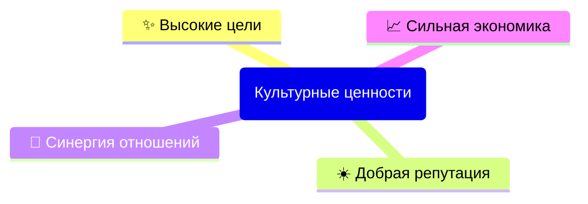

# Сетевой этикет GIC DAO

- [ВВЕДЕНИЕ](#введение)
- [ИНДИВИДУАЛЬНАЯ КОММУНИКАЦИЯ](#индивидуальная-коммуникация)
- [ГРУППОВАЯ КОММУНИКАЦИЯ](#групповая-коммуникация)

## ВВЕДЕНИЕ

Уважаемые владельцы токенов GIC DAO!

GIC DAO – это глобальное сообщество. 
Наше разнообразие места жительства, пола, возраста, культуры жизненного и профессионального опыта ценно, и поэтому для совместной работы нам требуются честность, уважение, эмпатия и доброта к другим членам DAO. 
В сети GIC есть участники, не имеющие высокого технического образования или опыта работы с высокими технологиями. 
В то время как другие участники сети обладают знаниями о сетевых и транспортных протоколах, среди нас есть новички, которые не знакомы с этими аспектами. 
Чтобы быстро вовлечь новых участников в культуру GIC, необходимо определить минимальный набор правил поведения, которые мы примем и будем придерживаться. 

В инклюзивной и открытой культуре существуют процессы для решения проблем по мере их возникновения. 
Вне зависимости от того, каким образом каждый участник получает доступ в GIC, эти правила требуют правильной интерпретации и коммуникации, а также представлению себя в GIC DAO. 
В GIC все участники могут безопасно предлагать новые идеи и вдохновлять других, независимо от: 
- происхождения; 
- семейного положения;
- пола; 
- самовыражения гендерной идентичности; 
- семейного положения; 
- сексуальной ориентации; 
- родного языка; 
- возраста;
- способности; 
- расы и/или этнической принадлежности; 
- национального происхождения; 
- социально-экономического статуса; 
- религии; 
- географического положения;  
- любого другого аспекта отличительности.

Сетевой этикет — это руководство по принципам, чтобы помочь вести нашу Миссию честно, добросовестно и с общим пониманием цели. 
Открытость, сотрудничество, вежливость и взаимопомощь являются ключевыми аспектами нашей работы. 
Наш Форум — это место для критических дискуссий и обучения, где можно обсудить все темы и услышать любую критику. 
Обучение будет иметь место только в том случае, если окружающая среда будет логичной, вдумчивой, справедливой и доброй. 
Именно поэтому мы настаиваем на том, чтобы вы соблюдали все правила Сетикета. 

Поддерживая это руководство мы стремимся создать общепринятые правила сетевого этикета для всех участников GIC DAO, чтобы обеспечить вежливое, продуктивное и уважительное взаимодействие между всеми участниками. 
Знание и соблюдение этих рекомендаций помогут нам сотрудничать более эффективно и создать приятную среду для сотрудничества и общения. 
Правила кодекса Сетикета применяются ко всем сообщениям на Форуме, включая Предложения любых комитетов, а так же применяются всякий раз, когда вы участвуете в онлайн и офлайн-пространствах в роли участника GIC DAO.

### Главные принципы

- Корпоративная культура создается Духовным менеджментом. 
- Правила рабочих процедур, в том числе рабочие регламенты, меняются через регулярные командные встречи. 
- Межличностные отношения, в том числе процессы адаптации и наставничества, фасилитируются стратегическими сессиями. 
- Неправомерные действия нарушающие Сетикет могут привести к ограничению ваших привилегий в GIC DAO. 
- Любая ошибка должна быть исправлена, любое достижение признано. 

### Культурные ценности организации

Наши ценности — это фундаментальные убеждения, которые определяют наши действия и отношения друг к другу. 
Они помогают нам определить, что важно для нас в целом и то, как мы будем работать. 
Каждое сделанное Предложение рассматривается само по себе, и наши основные ценности определяются культурой, которую мы создаем своими действиями.
Каждая цель ясно очерчена и имеет желаемые результаты. 
Каждая роль имеет четко очерченный круг обязанностей, принятие лидера группой и понятную модель компетенций.
Каждый процесс описывает правила игры и межличностные отношения. 

#### Высокие цели

Мы достигаем высоких целей благодаря: 
- Сопричастности к достижению Миссии ДАО. 
  - Основываясь на принципе внешней оправданности и внутренней красоты, мы наделяем цели носителем трансцендентного смысла. 
- Непрерывному персональному самосовершенствованию: 
  - Развиваясь через рискованные поступки мы выбираем курс развития ДАО через создание уникальных разработок. 
  - Стремясь вести себя итеративно, через циклическую работу, мы гарантируем результаты своего вклада в ДАО, уточняя Предложения по улучшению продуктов. 
- Осмысленности совершаемых действий. 
  - За труд разработки и изобретения полагаются исключительные права и личностная ответственность.
  - Каждый член ДАО регулярно делится своими мыслями планами и обратной свяью. 

#### Добрая репутация

Мы достигаем доброй репутации благодаря: 
- Наши намерения не причинять вреда. 
  - Мы хотим избегать действий, которые создадут риск, юридический или иной, для людей, животных или окружающей среды. 
  - Мы готовы отступить от любых действий, чтобы взглянуть на более широкий контекст и смягчить любые потенциальные негативные последствия Предложений. 
  - Мы стремимся продемонстрировать умственную проницательность, понимание и способность выносить верные суждения посредством наших взглядов и опыта. 
  - Мы стремимся к прозорливости, осознаем то, что мы сделали, и то, что мы делаем, чтобы постоянно быть в курсе о лучших решениях. 
- Оперативное персонализированное качественное гибкое сотрудничество. 
  - Мы кастомизируем обслуживание под каждого принятого клиента, разрабатывая узко-направленный функционал.  
  - Мы отдаем предпочтение использованию открытого протокола взамен проприетарных закрытых форматов реализации ПО, гарантирующего ничего лишнего: никаких заглушек или бэкдоров.
  - Мы считаем, что клиент не всегда прав, но наши партнёры должны остаться довольны.
- Восприятие обратной связи.
  - Мы стремимся быстро и качественно исправлять возникающие ошибки через ежедневное изучение результатов нашей работы.

#### Синергия отношений

Мы достигаем синергии отношений благодаря: 
- С философской и практической точки зрения наши действия по-умолчанию открыты, а не блокируются.
  - Мы верим, что радикальная бескомпромиссная искренность через соблюдение прозрачных процессов позволят нам делать выбор самых рациональных избираемых решений. 
  - Мы не осуждаем иное мнение на личностных качествах, но оцениваем на способностях, потенциале и стремлениях. 
  - Мы вправе безопасно обменяться знанием о процессах работы с другим членом ДАО. 
  - Мы придерживаемся определения, согласно которому данные, код или контент, и как и прочие знания, должны считаться открытыми всем членам ДАО, чтобы каждый из нас мог свободно использовать, повторно использовать и распространять их, тем самым обеспечивая совместимость между различными пулами контекстов. 
- Организации самоуправляемости рабочих команд. 
  - Свободный союз важнее команды. Команда важнее индивидуальности. Поэтому мы делаем что лучше для себя и для группы.
  - Мы рассматриваем наши различия как сильные стороны и поэтому принимаем коллективное принятие выбора. 
  - Мы защищаем наше разнообразие (местонахождения, пола, культуры, расы, возраста, жизненного опыта и т.п.) и продвигаем нашу инклюзивность с помощью данного кодекса.
  - Договариваемся сразу с коллективом, малыми группами, а не с людьми в отдельности. 
  - Чем больше времени мы проводим оффлайн без транзакций подтверждающих историй от подтвержденного доверенного лица, тем сильнее снижается доверие.
- Работаем на собственную пользу своего личного счёта. 
  - Больше веселья. Больше денег.
  - Мы обучаем каждого члена ДАО, поддерживаем стабильный напряженный ритм деятельности и мобильность в любых сферах работы.

#### Сильная экономика

Мы достигаем сильной экономики благодаря: 
- Стремлению к богатству ДАО.
  - Мы выражаем инновации как нечто новое, что повышает ценность, направленное на повышение эффективности и результативности какого-либо продукта, услуги или процесса.
  - Мы создаем надежные решения, которые просты, красивы, прикольны, законченны удобны и работают у большинства.
  - Мы стараемся не зависеть только от монопольного источника.
  - Мы оплачиваем за продвижение Миссии.
- Предложение наилучшей цены в соотношении стоимости к ценности спроса.
  - Мы тарифицируем работающие изделия.
  - Мы экономим на издержках, удерживая максимум внутри своего контура.
  - Каждый, кто не привносит в работу ДАО какую-либо ценность или воспринимается как угроза общим интересам, подлежит скорому понижению рейтинга доверия, что неминуемо влечет к удалению из нее.

### Конфликт персоны

Когда кто-то нарушает Сетикет мы следуем этому процессу.
Если вы обижены или чувствуете себя некомфортно, то, пожалуйста, начните с приватного разговора с участником, который вас обидел, если вы чувствуете, что можете это сделать, и желательно в спокойной обстановке, где вы чувствуете себя наиболее комфортно. Объясните им, что то, что они сказали или сделали, оскорбило вас и что это неуместно в сети GIC.
Если вы не можете поговорить с кем-то наедине, попросите кого-нибудь из сообщества присутствовать при разговоре. 
Не знаете у кого спросить? Обратитесь к Куратору. 
Если проблема связана с одной из Sub-DAO, обратитесь к Стратегам из Main DAO.
Если кто-то подойдет к вам и скажет, что вы что-то сделали или сказали оскорбительно, выслушайте его. 
Постарайтесь понять их точку зрения. 
В этот момент легко обидеться или занять оборонительную позицию, но большинство людей действительно ценят честную попытку выслушать и понять. 
Мы верим, что вы придете к пониманию.
Возможно, вы не сможете напрямую поговорить с человеком, который вас обидел, даже в присутствии кого-то еще. 
Возможно, вы чувствуете дисбаланс сил или что-то еще, мешающее диалогу. 
Если да, то обсудите о проблеме на Форуме. 
Участники Форума вероятно попросят встретиться с вами и другим человеком, чтобы обсудить этот вопрос. 
Если вы согласны встретиться с другим человеком тогда у вас также может быть кто-то из сообщества, чтобы поддержать вас на собрании. 

Членская команда может также привлекать других, если считает это целесообразным.
Если вы не хотите встречаться с человеком, члены команды могут встретиться с ним, а затем снова с вами, чтобы узнать, какое решение может быть достигнуто.
Если кто-то отказывается вести себя подобающим образом, это лицо может быть исключено из совещаний DAO. 
Членская группа определит шаги, которые будут предприняты. Шаги всегда будут включать в себя общение, обучение и спокойный поэтапный подход. 
Если это произойдет, то DAO может решить публично рассказать об этом, если это кажется уместным, но это, конечно, не обязательно. 
Это процесс. Это займет время. Потерпи. 
Конфликт дает нам возможность учиться и расти. 
Мы все должны стремиться исследовать наши собственные действия и реакции в духе щедрости, доброй воли и эволюции.

Неуместно сначала высказывать свое недовольство во внешних социальных сетях. 
Точно так же неуместно публично жаловаться на людей без предварительного изучения процесса. 
Если вы это сделаете, вы можете затруднить или сделать невозможным работу нашего процесса, подрывая доверие в ДАО.

### Руководство по чтению Сетикета

В данном руководстве по сетевому этикету мы разделили справочный материал на три раздела:
1. [**Индивидуальная коммуникация**](#индивидуальная-коммуникация), включающая личную переписку, почту и приватные (личные) чаты и звонки в мессенджерах. 
2. [**Групповая коммуникация**](#групповая-коммуникация), включающая списки новостной рассылки и каналы публичных информационных сервисов.  

## ИНДИВИДУАЛЬНАЯ КОММУНИКАЦИЯ

Всеобщие правила вежливости и уважения в диалоге должны соблюдаться в любой ситуации, особенно в текстовых каналах, где невозможно воспринимать язык тела и тон голоса, которые часто служат ключевыми сигналами в прочих формах коммуникаций.  
Для эффективного индивидуального общения важно соблюдать следующие правила и рекомендации:

**Будьте вежливы и толерантны:**  
Выражайте свои мысли и мнения с уважением к собеседнику. 
Используйте понятный и ясный язык, избегая грубости, оскорблений и угроз в своих сообщениях. 
Не вводите в заблуждение и не пишите пассивно-агрессивные комментарии, такие как: 
- троллинг;
- оскорбительные или унизительные комментарии;
- личные атаки;
- атаки на идентичности (культурную, гендерную, политические и т.п.); 
- атаки на суверенитет.

**Уважайте авторские права:**  
При использовании материалов других людей убедитесь, что вы соблюдаете их авторские права или цитируете их. 
Укажите источник, если ваш собеседник не понимает контекст. 

**Используйте шифрование:**  
Используйте шифрование для защиты конфиденциальности и безопасности своих сообщений. 
Помните, что адреса почты, веб-клиенты и любые приложения могут быть взломаны и прослушиваться скрытым образом. 

**Принимайте инициативу в принятии ответственности:**  
Олицетворяйте ценности Миссии. 
Ориентируйтесь на все сообщество, а не только для индивидуумов. 
Злонамеренно не используйте продажу или аренду токенов GIC для голосования. 

**Используйте личную электронную почту:**  
При обмене личной информацией с другими людьми используйте личные средства коммуникации такие как электронную почту и мессенджер для обеспечения конфиденциальности и приватности без уведомления вашего комитета. 

**Не изменяйте контекст сообщений:**  
Если вы пересылаете или публикуете полученное ранее сообщение, не изменяйте его формулировку или контекст. 
Оставляйте ссылку на оригинал сообщения. 

**Запрашивайте разрешение для репоста:**  
Если личное сообщение будет переслано в публичную группу, спросите сначала разрешение у отправителя. 
Вы можете сократить сообщение и процитировать только необходимые части, но убедитесь, что контекст не был изменен. 

**Избегайте цепных писем:**  
Не отправляйте "письма счастья" и не участвуйте в цепных рассылках. 

**Будьте разумны:**  
Будьте внимательны к тому, что вы отправляете. 
Не реагируйте остро на провокации, помните, что разумный и терпеливый подход к коммуникации на основе Сетикета помогает избежать недоразумений. 

**Проверяйте тему сообщения:**  
Перед ответом на сообщение внимательно прочитайте всю предыдущую переписку. 
Иногда человек, просивший вас о помощи или объяснениях, может отправить последующее сообщение, в котором он отказывается от этой просьбы. 
Убедитесь также, что сообщение, на которое вы отвечаете, адресовано именно вам. 

**Используйте достоверную контактную информацию:**  
Подписывайте свои сообщения своей подлинной контактной информацией. 
Убедитесь, что адресаты знают, кому они отправляют сообщение. 

**Учитывайте часовые пояса и время:**  
Помните, что люди, с которыми вы общаетесь, могут находиться в разных часовых поясах. 
Дайте им время для ответа, учитывая их возможность быть доступными онлайн. 

**Проверяйте все адреса и тему:**  
Перед началом долгой или личной беседы убедитесь, что все адреса указаны правильно и что вы понимаете контекст сообщения. 
Не включайте в ответ несвязанные с темой материалы. 

**Знайте, к кому обращаться за помощью:**  
В рамках ДАО у вас будут ресурсы и сообщество, готовое вам помочь. 
Знайте, что вам следует обратиться к Куратору в случае получения сомнительной или незаконной информации.

**Учитывайте различия в культуре и языке:**  
Помните, что получатель вашего сообщения может иметь другую культуру, язык, интеллектуальное развитие и чувство юмора. 
Учитывайте это и будьте особенно осторожны со сарказмом. 
Уважайте различные мнения, точки зрения и опыт. 
Объясняйте незнакомые идиомы и учитывайте различия в форматах дат и других измерений. 

**Используйте форматирование текста:**  
Используйте смешанный регистр, правильную пунктуацию и символы для выделения важных частей сообщения, однако не перегружайте текст излишним форматированием. 
Если необходимо, укажите эмоциональный акцент с помощью жирного текста. 
При разговоре через мессенджер, пишите как если бы вы писали официальное письмо.  
Это поможет сделать ваше сообщение более читабельным и профессиональным. 

**Используйте эмодзи умеренно:**  
В текстовых сообщениях часто отсутствуют нюансы интонации, поэтому эмодзи могут помочь передать эмоциональный контекст. 
Однако не злоупотребляйте ими и помните, что текст разговора важнее наличия в нем эмоций.

**Отправляйте эмоциональные ответы после ночного обдумывания:**  
Если вы испытываете сильные эмоции по поводу сообщения, не пытайтесь сразу ответить. 
Лучше прождите ночь и рассмотрите свой ответ с утра. 

**Соблюдайте стандарты кодирования и форматирования:**  
Не используйте управляющие символы или вложения, отличные от UTF-8. 
Будьте аккуратны с вложениями MIME. 
При отправке зашифрованных сообщений убедитесь, что получатель способен их расшифровать. 

**Ограничьте длину строки и используйте тематические заголовки:**  
Старайтесь писать сообщения, которые можно прочитать не более чем за одну минуту. 
Не заполняйте экран до краев, оставьте некоторый запас места. 
Ограничьте длину строки сообщения до менее 80 символов и используйте возврат каретки. 
Сообщение всегда должно иметь тематический заголовок, отражающий основное содержание сообщения. 
Это поможет другому человеку легче читать и обрабатывать ваше сообщение. 

**Указывайте конец сообщения:**  
В конце сообщения используйте знак конца предложения, чтобы указать, что вы закончили мысль.  
Это поможет собеседнику понять, что он может начинать печатать. 
Избегайте оставлять сообщение без знака, так как это может сигнализировать, что вы еще не закончили свою мысль. 

**Уважайте приватность и конфиденциальность:**  
Соблюдайте конфиденциальность и не раскрывайте персональную информацию других людей без их согласия. 
Также категорически запрещена публикация или угроза публикации информации, которая может идентифицировать личность человека («доксинг») в Интернете. 

**Будьте терпеливы и уважительны:**  
Отвечайте с терпением и пониманием. 
Если вы не согласны с мнением или взглядами собеседника, выражайте свои аргументы вежливо и конструктивно. 

**Избегайте рекламы и спама:**  
В целом, отправка рекламы не считается этичным поведением, хотя некоторые Sub-DAO могут приветствовать рекламные сообщения. 
Однако рассылка рекламы в каждый комитет может привести к потере вашего рейтинга.
Не размещайте нежелательную рекламу, особенно коммерческого характера, и не отправляйте спам-сообщения (незапрошенные сообщения вне темы).
Соблюдайте правила и ограничения, связанные с распространением информации в рамках Хартии. 

**Избегайте циклов пересылки:**  
При использовании функции пересылки сообщений остерегайтесь создания петель пересылки, которые могут привести к бесконечному циклу пересылки сообщений. 

**Прощайтесь и дожидайтесь завершения:**  
Всегда прощайтесь или используйте другие формы завершения разговора и подождите, пока другой человек закончит общение. 
Помните, что общение зависит от пропускной способности сети и физических задержках сигнала, поэтому ожидание вежливого завершения остается важным. 

**Цените время собеседника:**  
Ограничьте использование голосовых и видеосообщений только в экстренных случаях, предпочитая функции текстового общения. 
Учитывайте, что текстовый канал является наиболее удобным и экономит время собеседника.
В самых критических случаях используйте прямые звонки. 

**Уважайте чужое высказывание:**  
Помните, что ваша мысль прерывает мысль другого человека. 
Дождитесь, когда ваш собеседник закончит высказываться, прежде чем начинать свой ответ. 

**Будьте осторожны с незнакомцами:**  
Избегайте разговоров с незнакомыми людьми вне Сети в целях безопасности и сохранения приватности. 

**Возможные проблемы связи:**  
Помните, что существуют различные причины, по которым сообщение может быть непрочитанным или не получить быстрый ответ. 
Не думайте, что это всегда связано с неполадками или недоступностью. 
Не все версии разговоров совместимы между членами GIC DAO. 
Уведомляйте заранее, что вы уезжаете в отпуск или будете без связи. 

**Отвечайте на сообщения:**  
Стройте конструктивную обратную связь. 
Если прочитать сообщение и оставить его без ответа, такой подход невежестен для получателя. 
Получатель может простить такое один или два раза, но ожидайте от него игнорирование или бан. 

**Соблюдайте эффективность и ясность:**  
Излагайте понятные сообщения. 
Если вы набираете медленно или делаете частые опечатки, это может привести к непониманию собеседника. 
Старайтесь быть понятными и уважайте его время.

**Остерегайтесь параллельных разговоров:**  
Если у вас идет более одного разговора одновременно, будьте внимательны и следите за каждым из них, чтобы не перепутать сообщения или не упустить важные детали.

**Своевременные ответы:**  
Отвечайте на сообщения своевременно, желательно до конца следующего рабочего дня. 
Это поможет поддерживать активный диалог и не заставит другого человека ждать слишком долго. 

**Непредвзято отвечайте на жалобы:**  
Если вам поступают жалобы или недовольство, отвечайте на них непредвзято и конструктивно.  
Старайтесь разрешить конфликт и найти решение, учитывая интересы обеих сторон. 

**Используйте понятные имена файлов:**  
Для передаваемых файлов постарайтесь сделать понятные имена файлов, уникальные и в англоязычной форме с небольшим количеством символов. 
Используйте соглашения для расширений файлов: _.txt_ для простого текста; _.pdf_ для документа и прочие файлы в соответствии с их MIME типами. 
Помните что передача _Blob_ файлов нежелательна. 
Передача исполняемых файлов _.exe_ (Windows) или _.bin_ (*nix) не гарантируется. 

## ГРУППОВАЯ КОММУНИКАЦИЯ

Групповая коммуникация включает общение с большим количеством людей одновременно, будь то через рассылку, группу новостей или прочие общедоступные каналы.  
Для эффективной групповой коммуникации важно соблюдать следующие правила и рекомендации:

**Применяйте правила индивидуальной коммуникации:**  
Правила вежливости и уважения, применяемые в индивидуальной коммуникации, также применяются в групповых разговорах.

**Учитывайте культуру группы:**  
Прочитайте предыдущие сообщения в дискуссии в группе за несколько предыдущих недель или даже месяцев, чтобы понять культуру и нормы поведения внутри группы. 
Это поможет вам лучше понять аудиторию и адаптировать свои сообщения под ее культуру. 

**Фокусируйтесь на решении проблемы, а не на обвинении людей:**  
Избегайте обвинений участников в неправильной работе системы или проблемах, с которыми вы столкнулись.

**Проверьте информацию перед публикацией:**  
Перед отправкой сообщения убедитесь, что информация, которую вы публикуете, является достоверной и актуальной. 
Согласуйте публикацию с другими участниками, если она затрагивает широкую аудиторию. 

**Публичное или личное домогательство:**  
Преследование или повторные нежелательные контакты, включая неконсенсуальное сексуальное внимание, сексуализированный язык или образы или какие-либо другие непристойные предложения запрещены. 

**Публикация чужой личной информации:**  
Запрещено публиковать лично идентифицирующую информацию, такую как физический адрес или адрес электронной почты и т.п., без их явного разрешения от идентифицирующего участника. 

**Высказывания ненависти:**  
Запрещена пропаганда насилия или ненависти по отношению к людям на основе таких характеристик: 
- раса
- этническое происхождение
- национальность
- каста
- религия
- инвалидность
- болезнь
- возраст
- сексуальная ориентация
- гендер или гендерная идентичность.

**Совершение любых незаконных действий:**  
Запрещены незаконные действия, включающие содействие незаконной деятельности к участникам на их территории. 

**Подстрекательство или угрозы насилия:**  
Запрещено поощрение, прославление или подстрекательство к насилию против кого-либо в связи с экстремизмом, терроризмом или торговлей людьми, прямо или косвенно, или призыв к причинению вреда себе. 

**Будьте внимательны и уважительны к другим:**  
Признавайте их право на собственное мнение и уважайте разнообразие взглядов. 
Откройтесь для новых идей и признавайте возможность ошибиться. 
Ведите себя так, чтобы ваше поведение не ущемляло других. 
И помните, что ваше общение и взаимодействие оказывают сильное влияние на окружающих. 

**Будьте конструктивны:**  
Примите ответственность за свои эмоции и совершенные ошибки. 
Если кто-то сообщает о том, что его чувства были задеты вашими словами или действиями, проявите внимание, выслушайте его, искренне извинитесь и постарайтесь изменить свое поведение впредь. 

**Будьте ясны и профессиональны:**  
Возможно, возникнут дискуссии о приемлемой форме критики. 
Важно говорить четко, когда мы не согласны и видим необходимость улучшений. 
Мы не должны скрывать правду, даже если она может быть трудной для нас и других. 
Соблюдайте уважение при высказывании критики, даже если кажется, что вас не слушают. 
Важно честно и прямо общаться, сохраняя уважительное отношение. 
Одновременно будьте благодарны за возможность услышать разные точки зрения от других. 
Даже если вы не согласны с ними, выслушайте их. 
Наше уважение к людям не зависит от согласия с их убеждениями. 

**Будьте инклюзивны:**  
Активно ищите различные точки зрения, так как разнообразие мнений способствует инновациям, даже если это вызывает некоторое неудобство. 
Поощряйте все голоса и помогайте выслушивать новые идеи. 
Если вы замечаете, что перевесите обсуждение, особенно важно уступить место другим и позволить им присоединиться к дискуссии. 
Помните, что доминирование в группе отнимает у других участников время. 
Стремитесь предоставить разнообразные возможности для участия и вклада. 
Активно включайте всех во взаимодействие, уважайте и облегчайте участие людей, вне зависимости от их местоположения, языковых способностей, культурных различий, часовых поясов или проблем, с которыми они сталкиваются. 
Обдумайте, как можно облегчить альтернативные способы внести свой вклад или участия. 

**Выберите молчание:**  
Иногда в ходе разговора мы можем ощущать необходимость промолчать, будь то из-за нашего эмоционального состояния, чтобы избежать сказанного, что может быть неуместным, или из-за чувствительной для нас темы. 
Если вы не хотите обсуждать определенный вопрос или это личная тема, сообщите об этом другим, чтобы избежать нежелательных разговоров. 
Уважайте и молчание других, если они сообщают, что не хотят обсуждать определенные темы. 

**Будьте осознанными:**  
Важно задавать себе вопрос: как мои действия и слова могут повлиять на чувства других людей? 
Учитывайте, что неприемлемая нагота, неадекватное употребление алкоголя, нежелательный физический контакт, сексуальные образы, а также оскорбления на основе религии, расы, сексуальной ориентации или культуры могут оказать отрицательное воздействие на окружающих. 
Помните, что у других может быть отличное от вашего отношение к этим вопросам, и они, возможно, не желают вас обидеть. 
Если вы ощущаете, что поведение кого-то нарушает ваши границы, может быть разумно обсудить это с ними, чтобы они лучше понимали его влияние на вас. 

**Не предполагайте, что все такие же, как вы:**  
Важно осознавать, что другие люди могут иметь отличные от вас взгляды и предпочтения. 
Если ваше поведение вызывает у кого-то дискомфорт или вы испытываете дискомфорт из-за поведения других, используйте это как возможность для личного роста. 
Общайтесь с окружающими четко и уважительно, проявляйте терпение в слушании и учтите различия, чтобы постоянно развиваться как личность. 

**Понимайте разные точки зрения:**  
Конфликты и разногласия нормальны и являются частью любого человеческого общества. 
Будучи совершенно новой организацией, GIC DAO еще не знает ответов на все вопросы. 
Ожидается, члены ДАО будут применять наши ценности при создании и изменении инструментов разрешения конфликтов. 
Не ставьте своей главной целью "победу" в каждом споре или разногласии. 
Более конструктивная задача - быть открытым к идеям, которые могут улучшить наши собственные. 
Постарайтесь быть примером инклюзивного мышления, где "победа" означает, что разнообразные точки зрения обогащают и укрепляют нашу работу. 
Помните, что вы можете не знать всей истории. 
Важно слушать других. 

**Признавайте и учитывайте наши сходства и различия:**  
Мы представлены разнообразием культур и социальных слоев. 
Культурные различия могут затрагивать все аспекты жизни: от религиозных обрядов до личных привычек и стиля одежды. 
Ведите себя уважительно к людям с разными культурными особенностями, взглядами и убеждениями. 
Работайте над преодолением собственных предвзятых взглядов, предубеждений и дискриминации. 
Постарайтесь видеть потребности других с их точки зрения. 
Используйте предпочтительные имена и местоимения, а также подходящий тон голоса. 
Уважайте частную жизнь и конфиденциальность людей. 
Будьте открыты для обучения, обучайте других и стремитесь к личному развитию. 

**Будьте примером для других:**  
Когда вы согласовываете свои действия со своими словами, вы становитесь лидером, которому хотят следовать другие. 
Ваши поступки оказывают влияние на поведение и реакции окружающих, и это имеет ценное значение для достижения целей нашей организации. 
Возьмите на себя инициативу в создании инклюзивной атмосферы, а также поддержите других в принятии ответственности за собственное включающее поведение. 

**Принимайте в действие антикоррупционные законы:**  
Наш Кодекс определяет антикоррупционные законы в соответствие с общим поведением всех субъектов нашей Сети, и также подразумевает, что противоположное поведение недопустимо. 
Если вы считаете поведение участника преступлением, то вы можете сообщить об этом компетентным органам через Куратора. 

**Насилие и угрозы насилием:**  
Никакое насилие или угрозы насилием не допускаются, будь то онлайн или офлайн. 
Это включает подстрекательство к насилию в отношении любого человека, в том числе побуждение к физическому вреду. 

**Личные нападки:**  
Конфликты могут возникать, но никогда не должны переходить в личные нападки. 
Оскорбления, унижение или принижение других недопустимы. 
Не следует нападать на кого-то из-за его мнений, убеждений или идей. 
Важно откровенно выражать свое несогласие и стремиться к улучшению, но обсуждения должны быть уважительными и профессиональными, сосредотачиваясь на рассматриваемой теме. 

**Неприемлемое поведение на общих встречах:**  
Постоянные нарушения порядка на мероприятиях, форумах или встречах, включая переговоры и презентации, абсолютно неприемлемы. 
Это включает следующее:
- Перекрикивание говорящих. 
- Употребление чрезмерного количества алкоголя или наркотиков, а также принуждение других к этому. 
- Пренебрежительные комментарии в адрес тех, кто воздерживается от алкоголя или других веществ, подталкивание людей к употреблению алкоголя, обсуждение их воздержания или предпочтений с другими или принуждение их к употреблению алкоголя – физически или посредством насмешек. 
- Негативные комментарии по поводу выбора других людей. 
- Неуместная нагота. 
- Пренебрежительное отношение к диетическим предпочтениям людей. 
- Дискриминация веганов и представителей других философских и религиозных убеждений. 
- Влияние на неприемлемое поведение. 
Влияющее на такую деятельность или руководствующее ею будет рассматриваться так же строго, как и само неприемлемое поведение, и будут применены соответствующие меры и последствия.

**Финансовые советы:**  
Обсуждение цены токена или другого актива или предоставление любого вида финансовых советов неприемлемо. 

**Будьте осведомлены о публичности сообщений:**    
Помните, что ваши сообщения могут быть видны большой аудитории, включая коллег не входящих в ДАО.  
Будьте внимательны к содержанию своих сообщений, учитывая их архивацию и будущую доступность для множества людей. 

**Отделяйте личное мнение от позиции DAO:**  
Учитывайте, что вы говорите от своего имени, если не указано иное. 
Помните, что ваши высказывания не обязательно представляют официальную позицию GIC DAO, если это не было явно утверждено Уставом. 

**Соблюдайте экономию ресурсов:**  
Помните, что публикация сообщений, новостей и ресурсов потребляет системные и человеческие ресурсы. 
Учитывайте возможные ограничения и плату за публикацию, которые могут быть связаны с использованием ресурсов сообщества. 
Технологии позволяют почти каждому быть издателем, но не все сопровождающие публикации являются компетентными. 

**Сообщения должны быть краткими и по существу:**  
Пишите сообщения, которые ясно и кратко выражают вашу мысль. 
Избегайте отправки сообщений, не относящихся к теме, и излишнего указывания на ошибки других людей в наборе текста или правописании. 

**Соблюдайте правила группы для строк темы:**  
Убедитесь, что тема соответствуют правилам и требованиям группы, в которой вы публикуете свое сообщение. 

**Избегайте подделок и спуфинга:**  
Не вступайте в флейм или спуфинг, такое поведение не является приемлемым и может привести к негативным последствиям. 

**Будьте осмотрительны с рекламой:**  
Избегайте навязчивой рекламы, особенно если она не соответствует теме и интересам группы.  
Нежелательная и несоответствующая реклама может вызвать негативную реакцию и повлиять на вашу репутацию. 

**Ссылайтесь на контекст оригинального сообщения:**  
Если вы отвечаете на предыдущее сообщение или публикацию, убедитесь, что вы резюмируете контекст оригинала и оставляете ссылку на оригинал. 
Однако не включайте полностью весь текст оригинала, чтобы избежать дубликата информации. 

**Публикуйтесь под своим именем:**  
Убедитесь, что вы публикуете сообщения под своим именем (никнеймом), чтобы обеспечить правильное понимание информации о вас и возможность последующего контакта с вами. 

**Будьте осторожны с ответами на сообщения:**  
Если у вас нет уверенности в своем ответе или комментарии на сообщения, лучше напишите прямое сообщение вместо публичного ответа всем. 
Это поможет избежать неправильных или неинформативных ответов. 

**Не полагайтесь полностью на квитанции о доставке сообщения:**  
Квитанции о доставке и уведомления о не доставке сообщений не всегда являются надежными во всех программных системах. 
Не полагайтесь исключительно на эти уведомления при формировании своего мнения. 

**Извинитесь за свои ошибки и удалите личное сообщение в группе:**  
Если ваше личное сообщение по ошибке попало в публичную группу, сразу же извинитесь перед человеком и всей группой, а затем попытайтесь удалить сообщение. 
Если удаление не удалось, обратитесь к Куратору для помощи. 

**Разрешайте разногласия в личной переписке:**  
Если у вас возникли разногласия с одним человеком, продолжайте общаться с ним в личной переписке, а не продолжайте публичные дискуссии в группе. 
Если обсуждаемые вопросы могут быть интересны группе, вы можете подвести итоги в одном сообщении для всех участников позже. 

**Избегайте флеймовых войн и провокаций:**  
Не участвуйте в флеймовых войнах и не отвечайте на провокационный материал. 
Если вас провоцируют, сообщите об этом куратору, чтобы он принял соответствующие меры с Уставом и правилами Сетикета. 

**Избегайте бесполезных ссылок и контента:**  
Не отправляйте ссылки на сообщения или публикации, содержание которых не имеет ценности или бессмысленно. 
Публикуйте только полезный и информативный контент. 

**Будьте осторожны с использованием нестандартных шрифтов и MIME типов:**  
Не используйте нестандартные шрифты или другие MIME типы, которые могут отображаться неправильно в разных системах, браузерах или не отображаться вовсе. 

**Уважайте разнообразие культур и взглядов:**  
Группы новостей и списки рассылки объединяют людей с различными интересами, религиями и культурами. 
Избегайте оскорблений, особенно в случае, если точка зрения группы противоречит вашей. 
Сексуальные и расовые оскорбления также могут иметь юридические последствия в разных юрисдикциях. 

**Нежелательное сексуальное внимание или физический контакт:**  
Вы имеете право сообщать другим людям, когда их внимание или поведение вызывают у вас дискомфорт. 
Нежелательное сексуальное внимание и нежелательный физический контакт недопустимы. 
Это включает в себя: 
- сексуализированные комментарии; 
- шутки; 
- сексуальные изображения; 
- текст сообщения или презентации; 
- неуместные прикосновения без разрешения, ощупывание или касание к чувствительным областям, таким как его волосы, беременный живот, устройство для передвижения (инвалидное кресло, скутер и т. д.) или татуировки; 
- физическая блокировка; 
- запугивание; 
- физический контакт или имитация физического контакта без согласия.

**Уничижительный язык:**  
Все члены DAO, участники и лидеры, обязуются действовать и взаимодействовать таким образом, чтобы способствовать созданию свободного от домогательства от всех, открытого, гостеприимного, разнообразного, инклюзивного, эффективного и здорового сообщества для нас самих, друг друга и планеты. 
Оскорбительные или вредные выражения, связанные c: 
- Видимые или невидимых недостатков;
- Семейное положение;
- Половые характеристики;
- Телосложение;
- Этническая принадлежность;
- Возраст;
- Уровень опыта;
- Образование;
- Внешний вид;
- Гендерная идентичность или самовыражение;
- Гендерная идентичность;
- Сексуальная ориентация и идентичность;
- Родной язык;
- Способность и самовыражение;
- Расовая и/или этническая принадлежность;
- Каста;
- Национальность и происхождение;
- Социально-экономический статус;
- Религия;
- Географическое положение;
- Еда (диетическая/веганская и пр.);
- Другие атрибуты.
Если вы не уверены, является ли слово уничижительным, не используйте его. Когда вас попросят остановиться, прекратите рассматриваемое поведение.

**Настройте фильтрацию нежелательного контента:**  
Настраивайте свое программное обеспечение для фильтрации нежелательного контента, такого как NSFW (не подходящий для работы) или другого контента, который может вызывать неприятие. 
Учтите, что ваша культура и восприятие могут отличаться от других участников Сети. 

**Отказывайтесь от подписки, если больше не планируете посещать канал:**  
Если вы больше не заинтересованы в участии в определенном канале или группе, отпишитесь от него. 
Это позволит вам сохранить ваш рейтинг и избежать получения нежелательных уведомлений. 

**Помните о неотменяемости сообщений:**  
Обычно невозможно отменить сообщение после его отправки. 
Даже куратор не сможет вернуть удаленное сообщение. 
Будьте внимательны и убедитесь, что сообщение соответствует вашим намерениям перед его отправкой. 

**Избегайте использования автоответов:**  
Функция автоответа может быть полезной, но во внутренних коммуникациях она может быть раздражающей. 
Избегайте использования автоответов. 

**Не отправляйте большие файлы в публичные каналы:**  
Избегайте отправки больших файлов в публичные каналы рассылки или группы новостей. 
Вместо этого используйте ссылки на файлы или документы. 
Позаботьтесь о том, что такие ссылки доступны всем участникам группы. 

**Избегайте кросс-постинга:**  
Не отправляйте одни и те же сообщения и новости в несколько публичных каналов рассылки. 
Однако, если вы являетесь автором, вы можете отправить сообщение в несколько приватных каналов. 

**Предоставляйте контекст вопроса:**  
Если вы задаете вопрос, убедитесь, что предоставляете полный контекст, чтобы другие участники поняли, о чем идет речь. 
Прикрепляйте ссылки на источники, где вы уже искали ответы. 
Резюмируйте информацию, а не просто копируйте целые сообщения.

**Уважайте приватность:**  
Некоторые списки рассылки являются частными и не предназначены для незваных сообщений. 
Не отправляйте почту в такие списки без приглашения и не раскрывайте информацию из частных сообществ более широкой аудитории. 

**Сосредоточьтесь на проблеме, а не на личностях:**  
Если вы вовлечены в спор, сосредоточьтесь на обсуждении проблемы, а не на личностях участников. 
Избегайте личных нападок и концентрируйтесь на конструктивном обсуждении. 

**Прочитайте текущие обсуждения перед публикацией ответов:**  
Перед публикацией ответа прочитайте текущие обсуждения (в треде), чтобы не повторяться. 
Избегайте отправки невразумительных сообщений типа "Я согласен" или "Тоже самое", если ваше сообщение не добавляет новой информации. 
Вместо этого используйте возможности оценки, такие как лайк или дизлайк, чтобы выразить свою позицию. 

**Отправляйте личные сообщения, когда ответ только для одного человека:**  
Если ваш ответ предназначен только для одного человека, отправьте личное сообщение. 
Помните, что публичные сообщения могут быть доступны широкой аудитории, и не все заинтересованы в личных ответах. 

**Ограничьте распространение новостей:**  
Если статья или новость предназначена только для ограниченного круга людей, ограничьте ее распространение. 
Например, установите параметры географической локации, чтобы она была доступна только для читателей из определенного региона. 

**Используйте хештеги и категории для групповой классификации:**  
Если вы считаете, что статья будет интересна нескольким группам Sub-DAO, используйте подходящие хештеги или категории, описывающие их сферы интересов. 
В целом, упоминание пяти-шести групп будет достаточно. 

**Проверьте справочные источники перед заданием вопроса:**  
Перед тем, как задать вопрос, рекомендуется проверить справочные источники, такие как руководства, вики или справочные файлы. 
Если вам нужна помощь, сначала обратитесь к личной коммуникации. Задавайте вопросы в групповых коммуникациях только в случае, если никто не может помочь. 

**Редактируйте сообщение при обнаружении ошибки:**  
Если вы обнаружите ошибку в своем сообщении, отредактируйте его как можно скорее, чтобы исправить ошибку. 

**Не удаляйте чужие статьи и ссылки:**  
Не пытайтесь удалить чужие статьи или ссылки на другие ресурсы, оставляя только свои собственные материалы.

**Повторно опубликуйте, если сообщение не отображается:**  
Если вы опубликовали сообщение и оно не отобразилось сразу, попробуйте повторно опубликовать его через некоторое время. 

**Учтите, что люди оценивают материалы по-разному:**  
В некоторых группах могут быть участники, которые приветствуют материалы, которые в других случаях могут быть сомнительными. 
Однако нет гарантии, что все читатели группы будут оценивать материал так же, как вы. 

**Используйте функцию "спойлер":**  
Если вы хотите скрыть содержание контента, используйте функцию "спойлер". 
Добавьте уведомление о спойлере в заголовок сообщения. 

**Повторное использование кричащих букв:**  
Например, ВСЕ В ЗАГЛАВНЫХ БУКВАХ или чрезмерное использование восклицательных знаков!!!. 

**Избегайте подделки контента:**  
Подделка новостных статей и другого контента не одобряется. 
Используйте программное обеспечение с функцией фингерпринтинга и шифрования, которое поможет защитить вас от подделки контента. 

**Рассмотрите правила анонимности:**  
В некоторых Sub-DAO принимаются сообщения через анонимные серверы, в то время как в других это не приветствуется. 
В Main DAO все публикации новостей должны быть деанонимизированы.

**Ожидайте задержки при публикации:**  
При публикации сообщения ожидайте небольшую задержку перед его показом. 
Куратор может отложить публикацию статьи до тех пор, пока она не будет соответствовать Уставу и Сетикету. 

**Не ввязывайтесь в флеймовые войны:**  
Избегайте участия в флеймовых войнах и не реагируйте на разжигательный материал. 
Не публикуйте и не отвечайте на провокационные сообщения. 

**Регулярно обновляйте контент в группах новостей:**  
Группы новостей должны регулярно обновлять контент, уставы и принципы. 

**Уважайте права и собственность:**  
Помните, что все работы и услуги принадлежат кому-то. 
Существуют люди, которые оплачивают счета и следят за работоспособностью Сети. 

**Обратитесь к Куратору при возникновении проблем:**  
Если у вас возникли проблемы с какой-либо программно-информационной службой или если у вас достаточно навыков, вы можете попытаться решить проблему самостоятельно, проверив конфигурации файлов, работоспособность программного обеспечения и сетевые подключения или обратиться к Куратору. 
Не провоцируйте агрессию по отношению к поставщику услуг или разработчику и не афишируйте свой негатив по этому. 

**Учтите безопасность и аутентификацию:**  
Помните, что если вы не уверены в безопасности и аутентификации используемых технологий, любая информация, которую вы отправляете через Сеть, может быть подделана, украдена или проигнорирована. 

**Нежелательное поведение на чужих ресурсах:**  
Обычно неприемлемо использовать чужие сайты для размещения контента GIC DAO, за исключением тех случаев, когда это разрешено Main DAO или вашим Sub-DAO. 
При открытии своей информационной службы, сайта или маркетплейса обязательно проконсультируйтесь с Куратором, чтобы узнать, какие местные законы действуют. 

**Ограничьте приветствия в коммуникациях:**  
Необязательно приветствовать каждого отдельно на канале или в комнате. 
Одного _gm_ или _Привет_ будет достаточно. 
Использование автоматических приветствий через клиент не является приемлемым поведением. 

**Предупредите перед отправкой большого объема информации:**  
Если вы собираетесь отправить большое количество информации, предупредите участников. 
Если все согласны на получение такой информации, вы можете отправить ее. 
Однако отправка нежелательной информации без предупреждения считается невежливым поведением в любых программных клиентах. 

**Не навязывайте общение:**  
Не предполагайте, что люди, которых вы не знаете, захотят общаться с вами. 
Если вы чувствуете необходимость отправить личные сообщения людям, которых вы не знаете, будьте готовы принять факт, что они могут быть заняты или просто не заинтересованы в общении с вами. 

**Соблюдайте правила своей группы:**  
Следуйте правилам и политикам своей группы, комитета или Sub-DAO. 
Так как Интернет охватывает весь мир, помните, что информационные услуги могут отражать культуру и стиль жизни, отличающиеся от вашего сообщества. 
Материалы, которые вам могут показаться оскорбительными, могут быть приемлемыми для других.       
Будьте открытыми и готовыми к разнообразию мнений.
Ищите руководство от Куратора для вводных материалов, которые помогут вам лучше понять и соблюдать правила группы и Устав DAO.

**Уважайте личную информацию:**  
Не приставайте к другим участниками за получением их личной информации, такой как пол, возраст или местоположение. 
После того, как вы познакомились с другим участниками, эти вопросы могут быть более уместными, но многие люди стесняются давать эту информацию незнакомым людям. 
Поэтому ограничьтесь только теми данными, которые они сами оставили в своих профилях или контактах. 

**Уважайте псевдонимы и никнеймы:**  
Если пользователь использует псевдоним, уважайте его желание называться так. 
Даже если вы и этот человек близкие друзья, вежливо использовать его псевдоним. 
Не используйте настоящее имя этого человека без его личного разрешения. 

**Предлагайте уникальное содержание:**  
При предоставлении информации убедитесь, что она имеет уникальное предложение и добавляет ценность. 
Избегайте создания информационного мусора, который просто ссылается на другие ресурсы в Интернете. 

**Не указывайте на другие сайты без запроса:**  
Не указывайте на другие веб-сайты без предварительного запроса или разрешения.

**Техническое обслуживание информационной службы:**  
Помните, что создание информационной службы включает в себя не только разработку и реализацию контента, но и техническое обслуживание.

**Подходящий контент для поддержки:**  
Убедитесь, что размещаемый вами контент соответствует целям и Миссии GIC DAO. 

**Тестируйте приложения и обеспечивайте совместимость:**  
Тестируйте свои приложения с помощью различных инструментов и убедитесь, что они совместимы с различными клиентами и интерфейсами. 
Не предполагайте, что все работает, если вы тестировали только с одним клиентом. 
Учтите, что есть члены ДАО, которые могут не иметь возможности использовать только графический пользовательский интерфейс.

**Обеспечьте последовательность и единообразие:**  
Обеспечьте последовательное представление вашей информации и убедитесь, что внешний вид (UI) и пользовательский опыт (UX) остаются неизменными во всех ваших приложениях, таких как браузеры.

**Сохраняйте долговечность информации:**  
Будьте внимательны к долговечности вашей информации. 
Максимально точно датируйте материалы, которые зависят от времени, и будьте бдительны в отношении сохранения этой информации в хорошем состоянии. 

**Учитывайте ограничения экспорта:**  
Помните, что ограничения экспорта форматов могут различаться от приложения к приложению.

**Уведомляйте о планах по использованию информации:**  
Расскажите пользователям, что вы планируете делать с любой информацией, которую вы собираете от них, например, отзывы или данные. 
Вам нужно предупредить людей, если вы планируете опубликовать их высказывания или делать их доступными другим пользователям. 
Дайте им максимум два рабочего дня для ответа после их прочтения. 
Пассивность ответа после этого срока считается за согласие. 

**Уведомите куратора о политике пользователя:**  
Убедитесь, что ваша политика в отношении информационно-программных служб, такие как сайты, блоги или маркетплейсы, известны Куратору. 

**Публикуйте новости не в час пик:**  
Рассмотрите возможность распределения нагрузки информации на сайт избегая «часа пик». 
Пробуйте публиковать в систему в непиковое время. 

**Отчетность и правоприменение:**
Каждый участник сообщества обязан поощрять использование Сетикета сообществу, обращать внимание на членов сообщества, которые приближаются к нарушению или нарушают Сетикет (при условии, что это не ставит их личную безопасность под угрозу) и сообщать кураторам платформе о нарушениях. 
Конечная ответственность за обеспечение соблюдения Сетикета сообщества на каждой платформе лежит на Кураторах платформы. 

---

Как и в случае со всеми вещами с открытым исходным кодом, наша работа по Сетикету продолжает развиваться. 
Время от времени мы будем вносить изменения и обновления в текст Сетикета. 
При каждом таком обновлении текст будет применен ко всем пространствам GIC DAO.
Нам потребуется время и готовность сообщества воплотить задуманные изменения.
