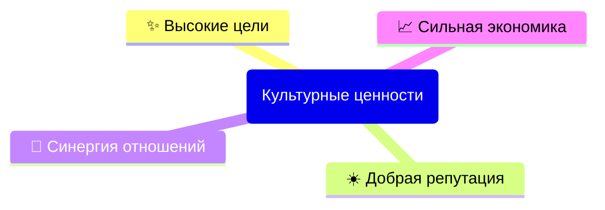

# Сетевой этикет GIC DAO

- [**ВВЕДЕНИЕ**](#введение)  
Справочный материал по главным принципам сетевого этикета.
- [**ИНДИВИДУАЛЬНАЯ КОММУНИКАЦИЯ**](#индивидуальная-коммуникация)  
Личная переписка, электронная почта, а также приватные чаты и звонки в мессенджерах.
- [**ГРУППОВАЯ КОММУНИКАЦИЯ**](#групповая-коммуникация)  
Списки новостной рассылки и каналы публичных информационных сервисов.
- [**КОНФЛИКТЫ**](#конфликты)  
Руководство по разрешению конфликтных ситуаций.

---

## ВВЕДЕНИЕ

Уважаемые владельцы токенов GIC DAO!

GIC DAO – это глобальное сообщество. 
Наше разнообразие места жительства, пола, возраста, культуры, жизненного и профессионального опыта ценно, и поэтому для совместной работы необходимы честность, уважение, эмпатия и доброта по отношению к другим членам DAO. 

В сети GIC присутствуют участники с разным уровнем технической подготовки.
Некоторые не имеют высокого технического образования или опыта работы с высокими технологиями, в то время как другие обладают знаниями о сетевых и транспортных протоколах. Также среди нас есть новички, незнакомые с этими аспектами.
Чтобы быстро вовлечь новых участников в культуру GIC, необходимо определить минимальный набор правил поведения, которые мы примем и будем придерживаться. 

В инклюзивной и открытой культуре существуют процессы для решения возникающих проблем. Независимо от того, каким образом каждый участник получает доступ в GIC, требуется правильно интерпретировать и соблюдать эти правила, а также вежливо представлять себя в GIC DAO. 

Все участники GIC могут безопасно предлагать новые идеи и вдохновлять других, независимо от: 
- происхождения; 
- семейного положения;
- пола; 
- самовыражения гендерной идентичности; 
- сексуальной ориентации; 
- родного языка; 
- возраста; 
- способностей; 
- расы и/или этнической принадлежности; 
- национального происхождения; 
- социально-экономического статуса; 
- религиозных убеждений; 
- географического расположения; 
- любых иных аспектов индивидуальности.

Сетевой этикет — это руководство по принципам, помогающее вести нашу Миссию честно, добросовестно и с общим пониманием цели. Открытость, сотрудничество, вежливость и взаимопомощь — ключевые аспекты нашей работы.

Форум является местом для критических обсуждений и обучения. Здесь можно поднимать любые темы и высказывать конструктивную критику. Обучение возможно только в атмосфере логичности, вдумчивости, справедливости и доброжелательности. Именно поэтому соблюдение всех правил Сетикета является обязательным.

Поддерживая это руководство, мы стремимся создать единые правила сетевого этикета для всех участников GIC DAO, чтобы обеспечить вежливое, продуктивное и уважительное взаимодействие. Знание и соблюдение рекомендаций поможет нам сотрудничать более эффективно и создать приятную среду для сотрудничества и общения.

Правила Сетикета применяются ко всем сообщениям на Форуме, включая Предложения любых комитетов, а также ко всем случаям участия в роли участника GIC DAO.

### Главные принципы

- Корпоративная культура создается на основе духовного менеджмента. 
- Правила рабочих процедур, включая регламенты, пересматриваются на регулярных командных встречах.
- Межличностные отношения, включая адаптацию и наставничество, фасилитируются на стратегических сессиях.
- Неправомерные действия нарушающие Сетикет могут привести к ограничению привилегий участника в GIC DAO. 
- Любая ошибка должна быть исправлена, любое достижение — признано.

### Культурные ценности организации

Наши ценности — это фундаментальные убеждения, определяющие наши действия и отношение друг к другу. Они помогают нам выделить важное и определить подходы к работе.

Каждое сделанное Предложение рассматривается индивидуально. Наши основные ценности определяются культурой, которую мы создаем своими действиями.

Каждая цель должна быть четко сформулирована и иметь желаемые результаты. 
Каждая роль должна включать понятный круг обязанностей, принятие лидера группой и прозрачную модель компетенций.
Каждый процесс описывает правила взаимодействия и аспекты межличностных отношений. 

#### Высокие цели

Мы достигаем высоких целей благодаря **прозрачности**: 
- Сопричастности к достижению Миссии ДАО. 
  - Основываясь на принципах внешней оправданности и внутренней красоты, мы наделяем цели трансцендентным смыслом. 
- Непрерывному персональному самосовершенствованию: 
  - Развиваясь через рискованные поступки, мы выбираем курс развития ДАО, создавая уникальные разработки. 
  - Стремясь к итеративному подходу через циклическую работу, мы гарантируем результаты своего вклада в ДАО, уточняя Предложения по улучшению продуктов. 
- Осмысленности совершаемых действий. 
  - За труд разработки и изобретения предоставляются исключительные права, а также возлагается личная ответственность.
  - Каждый член ДАО регулярно делится своими мыслями, планами и обратной связью. 

#### Добрая репутация

Мы создаём добрую репутацию благодаря **эмпатии**: 
- Нашему стремлению не причинять вреда. 
  - Мы избегаем действий, которые могут создать риски — юридические, социальные или экологические — для людей, животных или окружающей среды.
  - Мы готовы отказаться от выполнения любых действий, чтобы оценить ситуацию в более широком контексте и смягчить потенциальные негативные последствия Предложений.
  - Мы демонстрируем проницательность, глубокое понимание и способность принимать обоснованные решения, основываясь на наших взглядах и опыте.
  - Мы проявляем прозорливость, осознаём свои действия, оцениваем их результаты и стремимся постоянно быть в курсе о лучших решениях.
- Оперативному, персонализированному и качественному сотрудничеству. 
  - Мы адаптируем наши услуги под каждого клиента, разрабатывая узко-направленный функционал.
  - Мы предпочитаем использовать открытые протоколы вместо проприетарных форматов реализации ПО. 
    Это позволяет гарантировать нашим клиентам прозрачность кода, исключая присутствия заглушек или бэкдоров.
  - Мы считаем, что клиент не всегда прав, но наши партнёры должны остаться довольны.
- Восприятие обратной связи.
  - Мы стремимся оперативно и качественно исправлять ошибки, выявляемые в процессе ежедневного анализа результатов нашей работы.

#### Синергия отношений

Мы достигаем синергии отношений благодаря **поддержки**:
1. Открытость и прозрачность действий
  - С философской и практической точек зрения наши действия по умолчанию являются открытыми, а не блокируемыми.
  - Мы убеждены, что радикальная и бескомпромиссная искренность через соблюдение прозрачных процессов позволяет принимать наиболее рациональные и обоснованные решения. 
  - Мы не оцениваем чужое мнение через призму личностных качеств, а основываемся на способностях, потенциале и стремлениях. 
  - Каждый член ДАО вправе безопасно обмениваться знаниями о процессах работы с другими участниками. 
  - Мы придерживаемся принципа, что данные, код, контент и иные знания должны быть открыты для всех членов ДАО, чтобы каждый мог свободно использовать и распространять их обеспечивая совместимость между различными пулами контекстов. 
2. Самоуправляемость рабочих команд 
  - Свободный союз важнее команды, а команда важнее индивидуальности. Поэтому мы стремимся к тому, что лучше как для себя, так и для группы. 
  - Мы рассматриваем наши различия как сильные стороны, поэтому приветствуем коллективное принятие решений.
  - Мы защищаем наше разнообразие (местонахождение, пол, культура, раса, возраст, жизненный опыт и другие аспекты) и продвигаем инклюзивность, закрепленную в данном кодексе.
  - Договариваясь сразу с коллективом и малыми группами, мы избегаем принимать решения с отдельными людьми в индивидуальном порядке. 
  - Мы признаем, что продолжительное отсутствие оффлайн-активностей от доверенного лица снижает уровень нашего доверия. 
3. Работа в интересах личного развития 
  - Мы создаём условия работы для получения удовольствия и финансового благополучия. 
  - Мы обучаем каждого члена ДАО поддерживать стабильно напряженный ритм деятельности через высокую мобильность мобильность в различных сферах работы.

#### Сильная экономика

Мы достигаем сильной экономики благодаря **открытости**: 
1. Стремлению к богатству и процветанию
  - Мы выражаем инновации как нечто новое, что добавляет ценность, повышая эффективность и результативность какого-либо продукта, услуги или процесса.
  - Мы создаём надежные решения, которые просты, красивы, завершённы, удобны в использовании и работают для большинства.
  - Мы стремимся не зависеть от монопольных источников. 
  - Мы инвестируем в продвижение Миссии, направляя средства и усилия на её реализацию.
  - Мы награждаем за усилия приложенные за продвижение нашей Миссии. 
2. Предложение справедливой цены с учётом ценности и спроса
  - Мы тарифицируем только работающие изделия. 
  - Мы минимизируем издержки, максимально сохраняя ресурсы внутри нашего контура. 
  - Любой участник, который не приносит ценности работе ДАО или воспринимается как угроза общим интересам, подлежит утери рейтинга доверия, что неминуемо приводит к его исключению из ДАО. 

## ИНДИВИДУАЛЬНАЯ КОММУНИКАЦИЯ

Правила вежливости и уважения должны соблюдаться в любой ситуации, особенно в текстовых каналах, где отсутствует возможность воспринимать язык тела и тон голоса, которые часто являются важными сигналами в других формах коммуникации. 
Для эффективного взаимодействия рекомендуется придерживаться следующих правил:

1. **Будьте вежливы и толерантны:**  
Выражайте свои мысли и мнения с уважением к собеседнику. 
Используйте понятный и ясный язык, избегая грубости, оскорблений и угроз. 
Не вводите в заблуждение и не пишите пассивно-агрессивные комментарии, такие как: 
- троллинг;
- оскорбительные или унизительные комментарии;
- личные атаки;
- нападки на идентичности (культурную, гендерную, политическую и т.д.); 
- посягательства на суверенитет.

2. **Соблюдайте авторские права:**  
При использовании материалов других авторов соблюдайте их авторские права. 
Указывайте авторский источник, если это необходимо для понимания контекста. 

3. **Используйте шифрование:**  
Применяйте шифрование для обеспечения конфиденциальности и безопасности своих сообщений. 
Помните, что адреса электронной почты, веб-клиенты и любые приложения могут быть взломаны или использованы для скрытого прослушивания.

4. **Проявляйте инициативу и ответственность:**  
Действуйте в соответствии с ценностями ДАО. 
Ориентируйтесь на интересы сообщества в целом, а не отдельных лиц. 
Избегайте недобросовестного использования ресурсов, включая продажу или аренду токенов для получения голосов.

5. **Используйте личные каналы связи:**  
Для обмена личной информацией используйте личную электронную почту или мессенджеры для сохранения конфиденциальности и приватности без уведомления вашего комитета. 

6. **Не искажайте контекст сообщений:**  
Пересылая или публикуя сообщения, сохраняйте их оригинальную формулировку и контекст. 
Указывайте ссылку на оригинал сообщения. 

7. **Запрашивайте разрешение перед репостом:**  
Перед пересылкой личного сообщения в публичную группу обязательно спрашивайте разрешение у отправителя. 
Если пересылается только часть сообщения, убедитесь, что вы сохранили его первоначальный контекст.

8. **Избегайте цепных писем:**  
Не отправляйте «письма счастья» и не участвуйте в цепных рассылках.

9. **Будьте разумны:**  
Внимательно относитесь к содержанию отправляемых сообщений. 
Не поддавайтесь на провокации, помните, что разумный и терпеливый подход, основанный на Сетикете, помогает избежать недоразумений в коммуникации.

10. **Проверяйте тему и содержание сообщений:**  
Перед ответом внимательно прочитайте всю предыдущую переписку. 
Убедитесь, что актор, обратившийся за помощью, не отменил свою просьбу в последующем сообщении.
Проверьте, что сообщение, на которое вы отвечаете, адресовано именно вам.

11. **Используйте достоверную контактную информацию:**  
Подписывайте сообщения своей актуальной и подлинной контактной информацией. 
Убедитесь, чтобы адресаты знают, кто является отправителем сообщения.

12. **Проверяйте все адреса и тему:**  
Убедитесь в корректности указанных адресов перед началом долгой или личной беседы.
Исключите из ответа материалы, не относящиеся к теме. 

13. **Знайте, к кому обращаться за помощью:**  
Обращайтесь к Куратору в случае получения сомнительной или незаконной информации. 
Сообщество готово поддержать вас.

14. **Учитывайте культурные, временные и языковые различия:**  
Помните о возможных различиях в культуре, языке, уровне интеллектуального развития и чувстве юмора собеседника. 
Будьте особенно осторожны со сарказмом. 
Уважайте другие мнения, точки зрения и опыт. 
Поясняйте идиомы, избегайте двусмысленностей и учитывайте различия в форматах дат и других измерений. 
Помните, что получатели могут находиться в разных часовых поясах. 
Оставляйте время для ответа, учитывая их доступность.

15. **Используйте форматирование текста:**  
Используйте смешанный регистр. 
Применяйте правильную пунктуацию и символы для выделения важных частей сообщения.
Не перегружайте текст избыточным форматированием.
Выделяйте эмоциональный акцент с помощью жирного текста. 
В мессенджерах старайтесь писать так, как если бы это было официальное письмо.

16. **Используйте эмодзи умеренно:**  
Попробуйте передать нюансы эмоциональной интонации с помощю эмодзи. 
Не злоупотребляйте эмодзи, помните, что текст разговора важнее наличия в нем эмоций и прочих визуальных элементов. 

17. **Отправляйте эмоциональные ответы после обдумывания:**  
Если сообщение вызывает у вас сильные эмоции, не отвечайте сразу. 
Лучше прождите ночь и рассмотрите свой ответ с утра. 

18. **Соблюдайте стандарты кодирования и форматирования:**  
Не используйте управляющие символы или вложения, отличные от кодировки UTF-8. 
Будьте осторожны с вложениями MIME.
При отправке зашифрованных сообщений убедитесь, что получатель способен их расшифровать. 

19. **Ограничьте длину строки и используйте тематические заголовки:**  
Пишите сообщения, которые можно прочитать за одну минуту. 
Не заполняйте экран до краев, оставьте некоторый запас места. 
Ограничьте длину строки до 80 символов и используйте возврат каретки. 
Добавляйте тематический заголовок, отражающий основное содержание сообщения. 

20. **Указывайте конец сообщения:**  
В конце сообщения используйте знак окончания предложения, чтобы дать понять собеседнику, что мысль завершена. 
Избегайте оставлять сообщения без знака, так как это может сигнализировать, что вы еще не закончили свою мысль. 

21. **Уважайте приватность и конфиденциальность:**  
Соблюдайте конфиденциальность и не раскрывайте персональную информацию других людей без их согласия. 
Категорически запрещена публикация или угроза публикации информации, которая может идентифицировать личность человека («доксинг»). 

22. **Будьте терпеливы и уважительны:**  
Отвечайте с терпением и пониманием. 
Если вы не согласны с мнением или взглядами собеседника, излагайте свои аргументы вежливо и конструктивно. 

23. **Избегайте рекламы и спама:**  
Отправка рекламы в целом неэтична, хотя некоторые Sub-DAO могут приветствовать рекламные сообщения.
Рассылка рекламы может привести к потере вашего рейтинга. 
Не размещайте нежелательную рекламу (особенно коммерческого характера) и спам (незапрошенные сообщения вне темы). 
Соблюдайте правила и ограничения относительно распространения информации.  

24. **Избегайте циклической пересылки:**  
Используя функцию пересылки сообщений, остерегайтесь создания петель пересылки, которые могут привести к бесконечному циклу пересылки сообщений. 

25. **Завершайте разговоры вежливо:**  
Всегда врощайтесь или используйте другие формы завершения общения и дождитесь, пока собеседник закончит разговор. 
Учитывайте возможные физические или сетевые задержки связи, поэтому ожидание вежливого завершения остается важным. 

26. **Цените время собеседника:**  
Используйте голосовые и видеосообщения только в экстренных случаях. 
Предпочитайте текстовое сообщение, которое наиболее сэкономит время собеседника.
В критических ситуациях используйте прямые видеозвонки. 

27. **Уважайте чужое высказывание:**  
Помните, что ваша мысль прерывает мысль другого человека. 
Дождитесь, пока собеседник закончит свою мысль, прежде чем начинать свой ответ. 

28. **Будьте осторожны с незнакомцами:**  
В целях безопасности и сохранения приватности избегайте общения с незнакомыми людьми вне ДАО.  

29. **Учитывайте возможные проблемы связи:**  
Помните, что существуют различные причины, по которым сообщение может быть непрочитанным или не получить быстрый ответ. 
Не воспринимайте отсутствие ответа как неполадку или сбой связи. 
Не все клиенты связи могут быть совместимы между собой. 
Заранее уведомляйте собеседника о планируемом отпуске или отсутствии связи.

30. **Отвечайте на сообщения:**  
Формируйте конструктивную обратную связь. 
Прочитать сообщение и оставить собеседника без ответа невежливо. 
Собеседник может простить такое один или два раза, но ожидайте от него игнорирование или бан. 
Поддержание оперативного диалога способствует эффективной коммуникации. 
Старайтесь отвечать на сообщения в течение одного рабочего дня. 

31. **Соблюдайте эффективность и ясность:**  
Излагайте мысли четко и понятно. 
Избегайте опечатки при быстром наборе текста, что позволит избежать недоразумений. 
Старайтесь быть понятными и уважайте время собеседника. 

32. **Остерегайтесь параллельных разговоров:**  
Если ведёте несколько разговоров одновременно, внимательно следите за каждым из них чтобы не перепутать сообщения или не упустить важные детали. 
Убедитесь, что сообщения отправляются в правильным адресатам. 

33. **Непредвзято отвечайте на жалобы:**  
При получении жалоб или недовольства, отвечайте на них непредвзято и конструктивно.
Старайтесь найти решение конфликта, принимая во внимание интересы обеих сторон. 

34. **Используйте понятные имена файлов:**  
Для передаваемых файлов используйте уникальные и понятные имена, оформленные на английском языке с небольшим количеством символов. 
Избегайте передачи исполняемых файлов _.exe_ (Windows) или _.bin_ (*nix) или файлов типа _Blob_. 
Соблюдайте правила назначения расширений файлов: 
- _.txt_ — текстовые документы; 
- _.pdf_ — форматированные документы; 
- другие файлы согласно их MIME-типа.

## ГРУППОВАЯ КОММУНИКАЦИЯ

Групповая коммуникация включает общение с большим количеством людей одновременно, будь то через рассылку, группу новостей или прочие общедоступные каналы.  
Для эффективной групповой коммуникации важно соблюдать следующие правила и рекомендации:

**Применяйте правила индивидуальной коммуникации:**  
Правила вежливости и уважения, применяемые в индивидуальной коммуникации, также применяются в групповых разговорах.

**Учитывайте культуру группы:**  
Ознакомьтесь с недавними обсуждениями, чтобы понять культуру и нормы поведения группы. 
Это поможет вам лучше понять аудиторию и адаптировать свои сообщения под ее культуру. 

**Фокусируйтесь на решении проблемы, а не на обвинении людей:**  
Избегайте обвинений участников в неправильной работе системы или проблемах, с которыми вы столкнулись.

**Проверьте информацию перед публикацией:**  
Перед отправкой сообщения убедитесь, что информация, которую вы публикуете, является достоверной и актуальной. 
Согласуйте публикацию с другими участниками, если она затрагивает широкую аудиторию. 

**Публичное или личное домогательство:**  
Преследование или повторные нежелательные контакты, включая неконсенсуальное сексуальное внимание, сексуализированный язык или образы или какие-либо другие непристойные предложения запрещены. 

**Публикация чужой личной информации:**  
Запрещено публиковать личную информацию, такую как физический или виртуальный адрес, без явного согласия владельца.

**Высказывания ненависти:**  
Запрещена пропаганда насилия или ненависти по отношению к людям на основе таких характеристик: 
- раса;
- этническое происхождение;
- национальность;
- каста;
- религия;
- инвалидность;
- болезнь;
- возраст;
- сексуальная ориентация;
- гендер или гендерная идентичность.

**Совершение любых незаконных действий:**  
Запрещены незаконные действия, включающие содействие незаконной деятельности к участникам на их территории. 

**Подстрекательство или угрозы насилия:**  
Запрещено поощрение, прославление или подстрекательство к насилию против кого-либо в связи с экстремизмом, терроризмом или торговлей людьми, прямо или косвенно, или призыв к причинению вреда себе. 

**Будьте внимательны и уважительны к другим:**  
Признавайте их право на собственное мнение и уважайте разнообразие взглядов. 
Откройтесь для новых идей и признавайте возможность ошибиться. 
Ведите себя так, чтобы ваше поведение не ущемляло других. 
И помните, что ваше общение и взаимодействие оказывают сильное влияние на окружающих. 

**Будьте конструктивны:**  
Примите ответственность за свои эмоции и совершенные ошибки. 
Если кто-то сообщает о том, что его чувства были задеты вашими словами или действиями, проявите внимание, выслушайте его, искренне извинитесь и постарайтесь изменить свое поведение впредь. 

**Будьте ясны и профессиональны:**  
Дискуссии о форме критики неизбежны. 
Говорите четко и ясно, особенно если вы не согласны или видите необходимость улучшений. 
Не избегайте правды, даже если она может быть неприятной для нас. 
Выражайте критику уважительно, даже если кажется, что вас не слышат. 
Честность и прямота в общении должны сочетаться с уважительным отношением. 
Цените возможность услышать различные точки зрения. 
Даже если вы не согласны, внимательно выслушайте собеседника. 
Уважение к людям не зависит от согласия с их убеждениями. 

**Будьте инклюзивны:**  
Активно ищите различные точки зрения, так как разнообразие мнений способствует инновациям, даже если это вызывает некоторое неудобство. 
Поощряйте все голоса и помогайте выслушивать новые идеи. 
Если вы замечаете, что перевесите обсуждение, особенно важно уступить место другим и позволить им присоединиться к дискуссии. 
Помните, что доминирование в группе отнимает у других участников время. 
Стремитесь предоставить разнообразные возможности для участия и вклада. 
Активно включайте всех во взаимодействие. 
Уважайте участие людей, вне зависимости от их местоположения, языковых способностей, культурных различий, часовых поясов или проблем, с которыми они сталкиваются. 
Обдумайте, как можно облегчить альтернативные способы внести свой вклад или участия. 

**Выберите молчание:**  
Иногда в ходе разговора мы можем ощущать необходимость промолчать, будь то из-за нашего эмоционального состояния, чтобы избежать сказанного, что может быть неуместным, или из-за чувствительной для нас темы. 
Если вы не хотите обсуждать определенный вопрос или это личная тема, сообщите об этом другим, чтобы избежать нежелательных разговоров. 
Уважайте и молчание других, если они сообщают, что не хотят обсуждать определенные темы. 

**Будьте осознанными:**  
Важно задавать себе вопрос: как мои действия и слова могут повлиять на чувства других людей? 
Учитывайте, что неприемлемая нагота, употребление алкоголя, физический контакт, а также оскорбления на религию, расу, сексуальную ориентацию или культуру могут оказать отрицательное воздействие на окружающих. 
Помните, что у других может быть отличное от вашего отношение к этим вопросам, и они, возможно, не желают вас обидеть. 
Если вы ощущаете, что поведение кого-то нарушает ваши границы, может быть разумно обсудить это с ними, чтобы они лучше понимали его влияние на вас. 

**Не предполагайте, что все такие же, как вы:**  
Помните, что взгляды и предпочтения других могут отличаться от ваших. 
Если ваше поведение вызывает у кого-то дискомфорт или вы испытываете дискомфорт из-за поведения других, используйте это как возможность для личного роста. 
Общайтесь с окружающими четко и уважительно, проявляйте терпение в слушании и учтите различия, чтобы постоянно развиваться как личность. 

**Понимайте разные точки зрения:**  
Будучи совершенно новой организацией, GIC DAO еще не знает ответов на все вопросы. 
Ожидается, члены ДАО будут применять наши ценности при создании и изменении инструментов разрешения конфликтов. 
Не ставьте своей главной целью "победу" в каждом споре или разногласии. 
Более конструктивная задача - быть открытым к идеям, которые могут улучшить наши собственные. 
Постарайтесь быть примером инклюзивного мышления, где "победа" означает, что разнообразные точки зрения обогащают и укрепляют нашу работу. 
Помните, что вы можете не знать всей истории. 
Важно слушать других. 

**Признавайте и учитывайте наши сходства и различия:**  
ДАО представлены разнообразием культур и социальных слоев. 
Культурные различия могут затрагивать все аспекты жизни: от религиозных обрядов до личных привычек и стиля одежды. 
Ведите себя уважительно к людям с разными культурными особенностями, взглядами и убеждениями. 
Работайте над преодолением собственных предвзятых взглядов, предубеждений и дискриминации. 
Постарайтесь видеть потребности других с их точки зрения. 
Используйте предпочтительные имена и местоимения, а также подходящий тон голоса. 
Уважайте частную жизнь и конфиденциальность людей. 
Будьте открыты для обучения, обучайте других и стремитесь к личному развитию. 

**Будьте примером для других:**  
Когда вы согласовываете свои действия со своими словами, вы становитесь лидером, которому хотят следовать другие. 
Ваши поступки оказывают влияние на поведение и реакции окружающих, и это имеет ценное значение для достижения целей нашей организации. 
Возьмите на себя инициативу в создании инклюзивной атмосферы, а также поддержите других в принятии ответственности за собственное включающее поведение. 

**Принимайте в действие антикоррупционные законы:**  
Наш Кодекс определяет антикоррупционные законы в соответствие с общим поведением всех субъектов нашей Сети, и также подразумевает, что противоположное поведение недопустимо. 
Если вы считаете поведение участника преступлением, то вы можете сообщить об этом компетентным органам через Куратора. 

**Насилие и угрозы насилием:**  
Никакое насилие или угрозы насилием не допускаются, будь то онлайн или офлайн. 
Это включает подстрекательство к насилию в отношении любого человека, в том числе побуждение к физическому вреду. 

**Личные нападки:**  
Конфликты могут возникать, но никогда не должны переходить в личные нападки. 
Оскорбления, унижение или принижение других недопустимы. 
Не следует нападать на кого-то из-за его мнений, убеждений или идей. 
Важно откровенно выражать свое несогласие и стремиться к улучшению, но обсуждения должны быть уважительными и профессиональными, сосредотачиваясь на рассматриваемой теме. 

**Неприемлемое поведение на общих встречах:**  
Постоянные нарушения порядка на мероприятиях, форумах или встречах, включая переговоры и презентации, абсолютно неприемлемы. 
Это включает следующее:
- Перекрикивание говорящих. 
- Употребление чрезмерного количества алкоголя или наркотиков, а также принуждение других к этому. 
- Пренебрежительные комментарии в адрес тех, кто воздерживается от алкоголя или других веществ, подталкивание людей к употреблению алкоголя, обсуждение их воздержания или предпочтений с другими или принуждение их к употреблению алкоголя – физически или посредством насмешек. 
- Негативные комментарии по поводу выбора других людей. 
- Неуместная нагота. 
- Пренебрежительное отношение к диетическим предпочтениям людей. 
- Дискриминация веганов и представителей других философских и религиозных убеждений. 
- Влияние на неприемлемое поведение. 
Влияющее на такую деятельность или руководствующее ею будет рассматриваться так же строго, как и само неприемлемое поведение, и будут применены соответствующие меры и последствия.

**Финансовые советы:**  
Обсуждение цены токена или другого актива или предоставление любого вида финансовых советов неприемлемо. 

**Будьте осведомлены о публичности сообщений:**    
Помните, что ваши сообщения могут быть видны большой аудитории, включая коллег не входящих в ДАО.  
Будьте внимательны к содержанию своих сообщений, учитывая их архивацию и будущую доступность для множества людей. 

**Отделяйте личное мнение от позиции DAO:**  
Учитывайте, что вы говорите от своего имени, если не указано иное. 
Помните, что ваши высказывания не обязательно представляют официальную позицию GIC DAO, если это не было явно утверждено Уставом. 

**Соблюдайте экономию ресурсов:**  
Помните, что публикация сообщений, новостей и ресурсов потребляет системные и человеческие ресурсы. 
Учитывайте возможные ограничения и плату за публикацию, которые могут быть связаны с использованием ресурсов сообщества. 
Технологии позволяют почти каждому быть издателем, но не все сопровождающие публикации являются компетентными. 

**Сообщения должны быть краткими и по существу:**  
Пишите сообщения, которые ясно и кратко выражают вашу мысль. 
Избегайте отправки сообщений, не относящихся к теме, и излишнего указывания на ошибки других людей в наборе текста или правописании. 

**Соблюдайте правила группы для строк темы:**  
Убедитесь, что тема соответствуют правилам и требованиям группы, в которой вы публикуете свое сообщение. 

**Избегайте подделок и спуфинга:**  
Не вступайте в флейм или спуфинг, такое поведение не является приемлемым и может привести к негативным последствиям. 

**Будьте осмотрительны с рекламой:**  
Избегайте навязчивой рекламы, особенно если она не соответствует теме и интересам группы.  
Нежелательная и несоответствующая реклама может вызвать негативную реакцию и повлиять на вашу репутацию. 

**Ссылайтесь на контекст оригинального сообщения:**  
Если вы отвечаете на предыдущее сообщение или публикацию, убедитесь, что вы резюмируете контекст оригинала и оставляете ссылку на оригинал. 
Однако не включайте полностью весь текст оригинала, чтобы избежать дубликата информации. 

**Публикуйтесь под своим именем:**  
Убедитесь, что вы публикуете сообщения под своим именем (никнеймом), чтобы обеспечить правильное понимание информации о вас и возможность последующего контакта с вами. 

**Будьте осторожны с ответами на сообщения:**  
Если у вас нет уверенности в своем ответе или комментарии на сообщения, лучше напишите прямое сообщение вместо публичного ответа всем. 
Это поможет избежать неправильных или неинформативных ответов. 

**Не полагайтесь полностью на квитанции о доставке сообщения:**  
Квитанции о доставке и уведомления о не доставке сообщений не всегда являются надежными во всех программных системах. 
Не полагайтесь исключительно на эти уведомления при формировании своего мнения. 

**Извинитесь за свои ошибки и удалите личное сообщение в группе:**  
Если ваше личное сообщение по ошибке попало в публичную группу, сразу же извинитесь перед человеком и всей группой, а затем попытайтесь удалить сообщение. 
Если удаление не удалось, обратитесь к Куратору для помощи. 

**Разрешайте разногласия в личной переписке:**  
Если у вас возникли разногласия с одним человеком, продолжайте общаться с ним в личной переписке, а не продолжайте публичные дискуссии в группе. 
Если обсуждаемые вопросы могут быть интересны группе, вы можете подвести итоги в одном сообщении для всех участников позже. 

**Избегайте флеймовых войн и провокаций:**  
Не участвуйте в флеймовых войнах и не отвечайте на провокационный материал. 
Если вас провоцируют, сообщите об этом куратору, чтобы он принял соответствующие меры с Уставом и правилами Сетикета. 

**Избегайте бесполезных ссылок и контента:**  
Не отправляйте ссылки на сообщения или публикации, содержание которых не имеет ценности или бессмысленно. 
Публикуйте только полезный и информативный контент. 

**Будьте осторожны с использованием нестандартных шрифтов и MIME типов:**  
Не используйте нестандартные шрифты или другие MIME типы, которые могут отображаться неправильно в разных системах, браузерах или не отображаться вовсе. 

**Уважайте разнообразие культур и взглядов:**  
Группы новостей и списки рассылки объединяют людей с различными интересами, религиями и культурами. 
Избегайте оскорблений, особенно в случае, если точка зрения группы противоречит вашей. 
Сексуальные и расовые оскорбления также могут иметь юридические последствия в разных юрисдикциях. 

**Нежелательное сексуальное внимание или физический контакт:**  
Вы имеете право сообщать другим людям, когда их внимание или поведение вызывают у вас дискомфорт. 
Нежелательное сексуальное внимание и нежелательный физический контакт недопустимы. 
Это включает в себя: 
- сексуализированные комментарии; 
- шутки; 
- сексуальные изображения; 
- текст сообщения или презентации; 
- неуместные прикосновения без разрешения, ощупывание или касание к чувствительным областям, таким как его волосы, беременный живот, устройство для передвижения (инвалидное кресло, скутер и т. д.) или татуировки; 
- физическая блокировка; 
- запугивание; 
- физический контакт или имитация физического контакта без согласия.

**Уничижительный язык:**  
Все члены DAO, участники и лидеры, обязуются действовать и взаимодействовать таким образом, чтобы способствовать созданию свободного от домогательства от всех, открытого, гостеприимного, разнообразного, инклюзивного, эффективного и здорового сообщества для нас самих, друг друга и планеты. 
Оскорбительные или вредные выражения, связанные c: 
- Видимые или невидимых недостатков;
- Семейное положение;
- Половые характеристики;
- Телосложение;
- Этническая принадлежность;
- Возраст;
- Уровень опыта;
- Образование;
- Внешний вид;
- Гендерная идентичность или самовыражение;
- Гендерная идентичность;
- Сексуальная ориентация и идентичность;
- Родной язык;
- Способность и самовыражение;
- Расовая и/или этническая принадлежность;
- Каста;
- Национальность и происхождение;
- Социально-экономический статус;
- Религия;
- Географическое положение;
- Еда (диетическая/веганская и пр.);
- Другие атрибуты.
Если вы не уверены, является ли слово уничижительным, не используйте его. Когда вас попросят остановиться, прекратите рассматриваемое поведение.

**Настройте фильтрацию нежелательного контента:**  
Настраивайте свое программное обеспечение для фильтрации нежелательного контента, такого как NSFW (не подходящий для работы) или другого контента, который может вызывать неприятие. 
Учтите, что ваша культура и восприятие могут отличаться от других участников Сети. 

**Отказывайтесь от подписки, если больше не планируете посещать канал:**  
Если вы больше не заинтересованы в участии в определенном канале или группе, отпишитесь от него. 
Это позволит вам сохранить ваш рейтинг и избежать получения нежелательных уведомлений. 

**Помните о неотменяемости сообщений:**  
Обычно невозможно отменить сообщение после его отправки. 
Даже куратор не сможет вернуть удаленное сообщение. 
Будьте внимательны и убедитесь, что сообщение соответствует вашим намерениям перед его отправкой. 

**Избегайте использования автоответов:**  
Функция автоответа может быть полезной, но во внутренних коммуникациях она может быть раздражающей. 
Избегайте использования автоответов. 

**Не отправляйте большие файлы в публичные каналы:**  
Избегайте отправки больших файлов в публичные каналы рассылки или группы новостей. 
Вместо этого используйте ссылки на файлы или документы. 
Позаботьтесь о том, что такие ссылки доступны всем участникам группы. 

**Избегайте кросс-постинга:**  
Не отправляйте одни и те же сообщения и новости в несколько публичных каналов рассылки. 
Однако, если вы являетесь автором, вы можете отправить сообщение в несколько приватных каналов. 

**Предоставляйте контекст вопроса:**  
Если вы задаете вопрос, убедитесь, что предоставляете полный контекст, чтобы другие участники поняли, о чем идет речь. 
Прикрепляйте ссылки на источники, где вы уже искали ответы. 
Резюмируйте информацию, а не просто копируйте целые сообщения.

**Уважайте приватность:**  
Некоторые списки рассылки являются частными и не предназначены для незваных сообщений. 
Не отправляйте почту в такие списки без приглашения и не раскрывайте информацию из частных сообществ более широкой аудитории. 

**Сосредоточьтесь на проблеме, а не на личностях:**  
Если вы вовлечены в спор, сосредоточьтесь на обсуждении проблемы, а не на личностях участников. 
Избегайте личных нападок и концентрируйтесь на конструктивном обсуждении. 

**Прочитайте текущие обсуждения перед публикацией ответов:**  
Перед публикацией ответа прочитайте текущие обсуждения (в треде), чтобы не повторяться. 
Избегайте отправки невразумительных сообщений типа "Я согласен" или "Тоже самое", если ваше сообщение не добавляет новой информации. 
Вместо этого используйте возможности оценки, такие как лайк или дизлайк, чтобы выразить свою позицию. 

**Отправляйте личные сообщения, когда ответ только для одного человека:**  
Если ваш ответ предназначен только для одного человека, отправьте личное сообщение. 
Помните, что публичные сообщения могут быть доступны широкой аудитории, и не все заинтересованы в личных ответах. 

**Ограничьте распространение новостей:**  
Если статья или новость предназначена только для ограниченного круга людей, ограничьте ее распространение. 
Например, установите параметры географической локации, чтобы она была доступна только для читателей из определенного региона. 

**Используйте хештеги и категории для групповой классификации:**  
Если вы считаете, что статья будет интересна нескольким группам Sub-DAO, используйте подходящие хештеги или категории, описывающие их сферы интересов. 
В целом, упоминание пяти-шести групп будет достаточно. 

**Проверьте справочные источники перед заданием вопроса:**  
Перед тем, как задать вопрос, рекомендуется проверить справочные источники, такие как руководства, вики или справочные файлы. 
Если вам нужна помощь, сначала обратитесь к личной коммуникации. Задавайте вопросы в групповых коммуникациях только в случае, если никто не может помочь. 

**Редактируйте сообщение при обнаружении ошибки:**  
Если вы обнаружите ошибку в своем сообщении, отредактируйте его как можно скорее, чтобы исправить ошибку. 

**Не удаляйте чужие статьи и ссылки:**  
Не пытайтесь удалить чужие статьи или ссылки на другие ресурсы, оставляя только свои собственные материалы.

**Повторно опубликуйте, если сообщение не отображается:**  
Если вы опубликовали сообщение и оно не отобразилось сразу, попробуйте повторно опубликовать его через некоторое время. 

**Учтите, что люди оценивают материалы по-разному:**  
В некоторых группах могут быть участники, которые приветствуют материалы, которые в других случаях могут быть сомнительными. 
Однако нет гарантии, что все читатели группы будут оценивать материал так же, как вы. 

**Используйте функцию "спойлер":**  
Если вы хотите скрыть содержание контента, используйте функцию "спойлер". 
Добавьте уведомление о спойлере в заголовок сообщения. 

**Повторное использование кричащих букв:**  
Например, ВСЕ В ЗАГЛАВНЫХ БУКВАХ или чрезмерное использование восклицательных знаков!!!. 

**Избегайте подделки контента:**  
Подделка новостных статей и другого контента не одобряется. 
Используйте программное обеспечение с функцией фингерпринтинга и шифрования, которое поможет защитить вас от подделки контента. 

**Рассмотрите правила анонимности:**  
В некоторых Sub-DAO принимаются сообщения через анонимные серверы, в то время как в других это не приветствуется. 
В Main DAO все публикации новостей должны быть деанонимизированы.

**Ожидайте задержки при публикации:**  
При публикации сообщения ожидайте небольшую задержку перед его показом. 
Куратор может отложить публикацию статьи до тех пор, пока она не будет соответствовать Уставу и Сетикету. 

**Не ввязывайтесь в флеймовые войны:**  
Избегайте участия в флеймовых войнах и не реагируйте на разжигательный материал. 
Не публикуйте и не отвечайте на провокационные сообщения. 

**Регулярно обновляйте контент в группах новостей:**  
Группы новостей должны регулярно обновлять контент, уставы и принципы. 

**Уважайте права и собственность:**  
Помните, что все работы и услуги принадлежат кому-то. 
Существуют люди, которые оплачивают счета и следят за работоспособностью Сети. 

**Обратитесь к Куратору при возникновении проблем:**  
Если у вас возникли проблемы с какой-либо программно-информационной службой или если у вас достаточно навыков, вы можете попытаться решить проблему самостоятельно, проверив конфигурации файлов, работоспособность программного обеспечения и сетевые подключения или обратиться к Куратору. 
Не провоцируйте агрессию по отношению к поставщику услуг или разработчику и не афишируйте свой негатив по этому. 

**Учтите безопасность и аутентификацию:**  
Помните, что если вы не уверены в безопасности и аутентификации используемых технологий, любая информация, которую вы отправляете через Сеть, может быть подделана, украдена или проигнорирована. 

**Нежелательное поведение на чужих ресурсах:**  
Обычно неприемлемо использовать чужие сайты для размещения контента GIC DAO, за исключением тех случаев, когда это разрешено Main DAO или вашим Sub-DAO. 
При открытии своей информационной службы, сайта или маркетплейса обязательно проконсультируйтесь с Куратором, чтобы узнать, какие местные законы действуют. 

**Ограничьте приветствия в коммуникациях:**  
Необязательно приветствовать каждого отдельно на канале или в комнате. 
Одного _gm_ или _Привет_ будет достаточно. 
Использование автоматических приветствий через клиент не является приемлемым поведением. 

**Предупредите перед отправкой большого объема информации:**  
Если вы собираетесь отправить большое количество информации, предупредите участников. 
Если все согласны на получение такой информации, вы можете отправить ее. 
Однако отправка нежелательной информации без предупреждения считается невежливым поведением в любых программных клиентах. 

**Не навязывайте общение:**  
Не предполагайте, что люди, которых вы не знаете, захотят общаться с вами. 
Если вы чувствуете необходимость отправить личные сообщения людям, которых вы не знаете, будьте готовы принять факт, что они могут быть заняты или просто не заинтересованы в общении с вами. 

**Соблюдайте правила своей группы:**  
Следуйте правилам и политикам своей группы, комитета или Sub-DAO. 
Так как Интернет охватывает весь мир, помните, что информационные услуги могут отражать культуру и стиль жизни, отличающиеся от вашего сообщества. 
Материалы, которые вам могут показаться оскорбительными, могут быть приемлемыми для других.       
Будьте открытыми и готовыми к разнообразию мнений.
Ищите руководство от Куратора для вводных материалов, которые помогут вам лучше понять и соблюдать правила группы и Устав DAO.

**Уважайте личную информацию:**  
Не приставайте к другим участниками за получением их личной информации, такой как пол, возраст или местоположение. 
После того, как вы познакомились с другим участниками, эти вопросы могут быть более уместными, но многие люди стесняются давать эту информацию незнакомым людям. 
Поэтому ограничьтесь только теми данными, которые они сами оставили в своих профилях или контактах. 

**Уважайте псевдонимы и никнеймы:**  
Если пользователь использует псевдоним, уважайте его желание называться так. 
Даже если вы и этот человек близкие друзья, вежливо использовать его псевдоним. 
Не используйте настоящее имя этого человека без его личного разрешения. 

**Предлагайте уникальное содержание:**  
При предоставлении информации убедитесь, что она имеет уникальное предложение и добавляет ценность. 
Избегайте создания информационного мусора, который просто ссылается на другие ресурсы в Интернете. 

**Не указывайте на другие сайты без запроса:**  
Не указывайте на другие веб-сайты без предварительного запроса или разрешения.

**Техническое обслуживание информационной службы:**  
Помните, что создание информационной службы включает в себя не только разработку и реализацию контента, но и техническое обслуживание.

**Подходящий контент для поддержки:**  
Убедитесь, что размещаемый вами контент соответствует целям и Миссии GIC DAO. 

**Тестируйте приложения и обеспечивайте совместимость:**  
Тестируйте свои приложения с помощью различных инструментов и убедитесь, что они совместимы с различными клиентами и интерфейсами. 
Не предполагайте, что все работает, если вы тестировали только с одним клиентом. 
Учтите, что есть члены ДАО, которые могут не иметь возможности использовать только графический пользовательский интерфейс.

**Обеспечьте последовательность и единообразие:**  
Обеспечьте последовательное представление вашей информации и убедитесь, что внешний вид (UI) и пользовательский опыт (UX) остаются неизменными во всех ваших приложениях, таких как браузеры.

**Сохраняйте долговечность информации:**  
Будьте внимательны к долговечности вашей информации. 
Максимально точно датируйте материалы, которые зависят от времени, и будьте бдительны в отношении сохранения этой информации в хорошем состоянии. 

**Учитывайте ограничения экспорта:**  
Помните, что ограничения экспорта форматов могут различаться от приложения к приложению.

**Уведомляйте о планах по использованию информации:**  
Расскажите пользователям, что вы планируете делать с любой информацией, которую вы собираете от них, например, отзывы или данные. 
Вам нужно предупредить людей, если вы планируете опубликовать их высказывания или делать их доступными другим пользователям. 
Дайте им максимум два рабочего дня для ответа после их прочтения. 
Пассивность ответа после этого срока считается за согласие. 

**Уведомите куратора о политике пользователя:**  
Убедитесь, что ваша политика в отношении информационно-программных служб, такие как сайты, блоги или маркетплейсы, известны Куратору. 

**Публикуйте новости не в час пик:**  
Рассмотрите возможность распределения нагрузки информации на сайт избегая «часа пик». 
Пробуйте публиковать в систему в непиковое время. 

**Отчетность и правоприменение:**
Каждый участник сообщества обязан поощрять использование Сетикета сообществу, обращать внимание на членов сообщества, которые приближаются к нарушению или нарушают Сетикет (при условии, что это не ставит их личную безопасность под угрозу) и сообщать кураторам платформе о нарушениях. 
Конечная ответственность за обеспечение соблюдения Сетикета сообщества на каждой платформе лежит на Кураторах платформы. 

## КОНФЛИКТЫ

Конфликты дают возможность учиться и расти каждому участнику. 
Мы все должны стремиться анализировать свои действия и реакции, проявляя щедрость, добрую волю и стремление к личностному развитию.
В случае нарушения Сетикета мы придерживаемся следующего процесса:

1. Приватное обсуждение
Недопустимо сначала высказывать недовольство в социальных сетях или публично жаловаться на участников без использования внутреннего процесса. 
Такие действия могут затруднить или сделать невозможным эффективное разрешение конфликта, подрывая доверие внутри ДАО. 
Если вы обижены или чувствуете себя некомфортно, начните с приватного разговора с участником, который причинил вам дискомфорт, если вы считаете это возможным. 
Постарайтесь провести разговор в спокойной обстановке, где вы чувствуете себя комфортно. 
Объясните, что сказанное или сделанное ими вас оскорбило и почему это недопустимо в ДАО. 

2. Обращение к поддержке третьей стороне
Если вы не можете поговорить с персоной наедине, попросите кого-то из сообщества присутствовать при разговоре. 
Не знаете, к кому обратиться? Свяжитесь с Куратором. 
Если проблема связана с в Sub-DAO, обратитесь к Стратегам из Main DAO. 

3. Ответ на замечания
Если кто-то подошел к вам с претензией о ваших действиях или словах, внимательно выслушайте его. 
Хотя в такой ситуации легко обидеться или занять оборонительную позицию, честное стремление к диалогу ценится большинством. 
Мы верим, что вы сможете достичь взаимопонимания если постараетесь понять их точку зрения. 

4. Обсуждение проблемы на Форуме
Если вы не можете напрямую договориться с участником, даже в присутствии другой персоны, из-за дисбаланса сил или иных препятствий, обсудите проблему на Форуме.
Участники Форума могут предложить вам встретиться с другим участником для обсуждения конфликта. 
Если вы согласны, возьмите с собой кого-то из членской команды для поддержки на встрече. 
Проведите встречи с каждым из сторон конфликта по отдельности для нахождения возможного решения.

---

Как и в случае со всеми вещами с открытым исходным кодом, наша работа по Сетикету продолжает развиваться. 
Время от времени мы будем вносить изменения и обновления в текст Сетикета. 
При каждом таком обновлении текст будет применен ко всем пространствам GIC DAO.
Нам потребуется время и готовность сообщества воплотить задуманные изменения.
