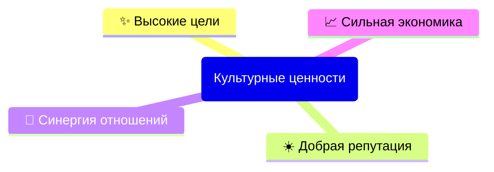

# Сетевой этикет GIC DAO

- [**ВВЕДЕНИЕ**](#введение)  
Справочный материал по главным принципам сетевого этикета.
- [**ИНДИВИДУАЛЬНАЯ КОММУНИКАЦИЯ**](#индивидуальная-коммуникация)  
Личная переписка, электронная почта, а также приватные чаты и звонки в мессенджерах.
- [**ГРУППОВАЯ КОММУНИКАЦИЯ**](#групповая-коммуникация)  
Списки новостной рассылки и каналы публичных информационных сервисов.
- [**КОНФЛИКТЫ**](#конфликты)  
Руководство по разрешению конфликтных ситуаций.

---

## ВВЕДЕНИЕ

Уважаемые владельцы токенов GIC DAO!

GIC DAO – это глобальное сообщество. 
Наше разнообразие места жительства, пола, возраста, культуры, жизненного и профессионального опыта ценно, и поэтому для совместной работы необходимы честность, уважение, эмпатия и доброта по отношению к другим членам DAO. 

В сети GIC присутствуют участники с разным уровнем технической подготовки.
Некоторые не имеют высокого технического образования или опыта работы с высокими технологиями, в то время как другие обладают знаниями о сетевых и транспортных протоколах. Также среди нас есть новички, незнакомые с этими аспектами.
Чтобы быстро вовлечь новых участников в культуру GIC, необходимо определить минимальный набор правил поведения, которые мы примем и будем придерживаться. 

В инклюзивной и открытой культуре существуют процессы для решения возникающих проблем. Независимо от того, каким образом каждый участник получает доступ в GIC, требуется правильно интерпретировать и соблюдать эти правила, а также вежливо представлять себя в GIC DAO. 

Все участники GIC могут безопасно предлагать новые идеи и вдохновлять других, независимо от: 
- происхождения; 
- семейного положения;
- пола; 
- самовыражения гендерной идентичности; 
- сексуальной ориентации; 
- родного языка; 
- возраста; 
- способностей; 
- расы и/или этнической принадлежности; 
- национального происхождения; 
- социально-экономического статуса; 
- религиозных убеждений; 
- географического расположения; 
- любых иных аспектов индивидуальности.

Сетевой этикет — это руководство по принципам, помогающее вести нашу Миссию честно, добросовестно и с общим пониманием цели. Открытость, сотрудничество, вежливость и взаимопомощь — ключевые аспекты нашей работы.

Форум является местом для критических обсуждений и обучения. Здесь можно поднимать любые темы и высказывать конструктивную критику. Обучение возможно только в атмосфере логичности, вдумчивости, справедливости и доброжелательности. Именно поэтому соблюдение всех правил Сетикета является обязательным.

Поддерживая это руководство, мы стремимся создать единые правила сетевого этикета для всех участников GIC DAO, чтобы обеспечить вежливое, продуктивное и уважительное взаимодействие. Знание и соблюдение рекомендаций поможет нам сотрудничать более эффективно и создать приятную среду для сотрудничества и общения.

Правила Сетикета применяются ко всем сообщениям на Форуме, включая Предложения любых комитетов, а также ко всем случаям участия в роли участника GIC DAO.

### Главные принципы

- Корпоративная культура создается на основе духовного менеджмента. 
- Правила рабочих процедур, включая регламенты, пересматриваются на регулярных командных встречах.
- Межличностные отношения, включая адаптацию и наставничество, фасилитируются на стратегических сессиях.
- Неправомерные действия нарушающие Сетикет могут привести к ограничению привилегий участника в GIC DAO. 
- Любая ошибка должна быть исправлена, любое достижение — признано.

### Культурные ценности организации

Наши ценности — это фундаментальные убеждения, определяющие наши действия и отношение друг к другу. Они помогают нам выделить важное и определить подходы к работе.

Каждое сделанное Предложение рассматривается индивидуально. Наши основные ценности определяются культурой, которую мы создаем своими действиями.

Каждая цель должна быть четко сформулирована и иметь желаемые результаты. 
Каждая роль должна включать понятный круг обязанностей, принятие лидера группой и прозрачную модель компетенций.
Каждый процесс описывает правила взаимодействия и аспекты межличностных отношений. 

#### Высокие цели

Мы достигаем высоких целей благодаря **прозрачности**: 
- Сопричастности к достижению Миссии ДАО. 
  - Основываясь на принципах внешней оправданности и внутренней красоты, мы наделяем цели трансцендентным смыслом. 
- Непрерывному персональному самосовершенствованию: 
  - Развиваясь через рискованные поступки, мы выбираем курс развития ДАО, создавая уникальные разработки. 
  - Стремясь к итеративному подходу через циклическую работу, мы гарантируем результаты своего вклада в ДАО, уточняя Предложения по улучшению продуктов. 
- Осмысленности совершаемых действий. 
  - За труд разработки и изобретения предоставляются исключительные права, а также возлагается личная ответственность.
  - Каждый член ДАО регулярно делится своими мыслями, планами и обратной связью. 

#### Добрая репутация

Мы создаём добрую репутацию благодаря **эмпатии**: 
- Нашему стремлению не причинять вреда. 
  - Мы избегаем действий, которые могут создать риски — юридические, социальные или экологические — для людей, животных или окружающей среды.
  - Мы готовы отказаться от выполнения любых действий, чтобы оценить ситуацию в более широком контексте и смягчить потенциальные негативные последствия Предложений.
  - Мы демонстрируем проницательность, глубокое понимание и способность принимать обоснованные решения, основываясь на наших взглядах и опыте.
  - Мы проявляем прозорливость, осознаём свои действия, оцениваем их результаты и стремимся постоянно быть в курсе о лучших решениях.
- Оперативному, персонализированному и качественному сотрудничеству. 
  - Мы адаптируем наши услуги под каждого клиента, разрабатывая узко-направленный функционал.
  - Мы предпочитаем использовать открытые протоколы вместо проприетарных форматов реализации ПО. 
    Это позволяет гарантировать нашим клиентам прозрачность кода, исключая присутствия заглушек или бэкдоров.
  - Мы считаем, что клиент не всегда прав, но наши партнёры должны остаться довольны.
- Восприятие обратной связи.
  - Мы стремимся оперативно и качественно исправлять ошибки, выявляемые в процессе ежедневного анализа результатов нашей работы.

#### Синергия отношений

Мы достигаем синергии отношений благодаря **поддержки**:
1. Открытость и прозрачность действий
  - С философской и практической точек зрения наши действия по умолчанию являются открытыми, а не блокируемыми.
  - Мы убеждены, что радикальная и бескомпромиссная искренность через соблюдение прозрачных процессов позволяет принимать наиболее рациональные и обоснованные решения. 
  - Мы не оцениваем чужое мнение через призму личностных качеств, а основываемся на способностях, потенциале и стремлениях. 
  - Каждый член ДАО вправе безопасно обмениваться знаниями о процессах работы с другими участниками. 
  - Мы придерживаемся принципа, что данные, код, контент и иные знания должны быть открыты для всех членов ДАО, чтобы каждый мог свободно использовать и распространять их обеспечивая совместимость между различными пулами контекстов. 
2. Самоуправляемость рабочих команд 
  - Свободный союз важнее команды, а команда важнее индивидуальности. Поэтому мы стремимся к тому, что лучше как для себя, так и для группы. 
  - Мы рассматриваем наши различия как сильные стороны, поэтому приветствуем коллективное принятие решений.
  - Мы защищаем наше разнообразие (местонахождение, пол, культура, раса, возраст, жизненный опыт и другие аспекты) и продвигаем инклюзивность, закрепленную в данном кодексе.
  - Договариваясь сразу с коллективом и малыми группами, мы избегаем принимать решения с отдельными людьми в индивидуальном порядке. 
  - Мы признаем, что продолжительное отсутствие оффлайн-активностей от доверенного лица снижает уровень нашего доверия. 
3. Работа в интересах личного развития 
  - Мы создаём условия работы для получения удовольствия и финансового благополучия. 
  - Мы обучаем каждого члена ДАО поддерживать стабильно напряженный ритм деятельности через высокую мобильность мобильность в различных сферах работы.

#### Сильная экономика

Мы достигаем сильной экономики благодаря **открытости**: 
1. Стремлению к богатству и процветанию
  - Мы выражаем инновации как нечто новое, что добавляет ценность, повышая эффективность и результативность какого-либо продукта, услуги или процесса.
  - Мы создаём надежные решения, которые просты, красивы, завершённы, удобны в использовании и работают для большинства.
  - Мы стремимся не зависеть от монопольных источников. 
  - Мы инвестируем в продвижение Миссии, направляя средства и усилия на её реализацию.
  - Мы награждаем за усилия приложенные за продвижение нашей Миссии. 
2. Предложение справедливой цены с учётом ценности и спроса
  - Мы тарифицируем только работающие изделия. 
  - Мы минимизируем издержки, максимально сохраняя ресурсы внутри нашего контура. 
  - Любой участник, который не приносит ценности работе ДАО или воспринимается как угроза общим интересам, подлежит утери рейтинга доверия, что неминуемо приводит к его исключению из ДАО. 

## ИНДИВИДУАЛЬНАЯ КОММУНИКАЦИЯ

Правила вежливости и уважения должны соблюдаться в любой ситуации, особенно в текстовых каналах, где отсутствует возможность воспринимать язык тела и тон голоса, которые часто являются важными сигналами в других формах коммуникации. 
Для эффективного взаимодействия рекомендуется придерживаться следующих правил:

1. **Будьте вежливы и толерантны:**  
Выражайте свои мысли и мнения с уважением к собеседнику. 
Используйте понятный и ясный язык, избегая грубости, оскорблений и угроз. 
Не вводите в заблуждение и не пишите пассивно-агрессивные комментарии, такие как: 
- троллинг;
- оскорбительные или унизительные комментарии;
- личные атаки;
- нападки на идентичности (культурную, гендерную, политическую и т.д.); 
- посягательства на суверенитет.

2. **Соблюдайте авторские права:**  
При использовании материалов других авторов соблюдайте их авторские права. 
Указывайте авторский источник, если это необходимо для понимания контекста. 

3. **Используйте шифрование:**  
Применяйте шифрование для обеспечения конфиденциальности и безопасности своих сообщений. 
Помните, что адреса электронной почты, веб-клиенты и любые приложения могут быть взломаны или использованы для скрытого прослушивания.

4. **Проявляйте инициативу и ответственность:**  
Действуйте в соответствии с ценностями ДАО. 
Ориентируйтесь на интересы сообщества в целом, а не отдельных лиц. 
Избегайте недобросовестного использования ресурсов, включая продажу или аренду токенов для получения голосов.

5. **Используйте личные каналы связи:**  
Для обмена личной информацией используйте личную электронную почту или мессенджеры для сохранения конфиденциальности и приватности без уведомления вашего комитета. 

6. **Не искажайте контекст сообщений:**  
Пересылая или публикуя сообщения, сохраняйте их оригинальную формулировку и контекст. 
Указывайте ссылку на оригинал сообщения. 

7. **Запрашивайте разрешение перед репостом:**  
Перед пересылкой личного сообщения в публичную группу обязательно спрашивайте разрешение у отправителя. 
Если пересылается только часть сообщения, убедитесь, что вы сохранили его первоначальный контекст.

8. **Избегайте цепных писем:**  
Не отправляйте «письма счастья» и не участвуйте в цепных рассылках.

9. **Будьте разумны:**  
Внимательно относитесь к содержанию отправляемых сообщений. 
Не поддавайтесь на провокации, помните, что разумный и терпеливый подход, основанный на Сетикете, помогает избежать недоразумений в коммуникации.

10. **Проверяйте тему и содержание сообщений:**  
Перед ответом внимательно прочитайте всю предыдущую переписку. 
Убедитесь, что актор, обратившийся за помощью, не отменил свою просьбу в последующем сообщении.
Проверьте, что сообщение, на которое вы отвечаете, адресовано именно вам.

11. **Используйте достоверную контактную информацию:**  
Подписывайте сообщения своей актуальной и подлинной контактной информацией. 
Убедитесь, чтобы адресаты знают, кто является отправителем сообщения.

12. **Проверяйте все адреса и тему:**  
Убедитесь в корректности указанных адресов перед началом долгой или личной беседы.
Исключите из ответа материалы, не относящиеся к теме. 

13. **Знайте, к кому обращаться за помощью:**  
Обращайтесь к Куратору в случае получения сомнительной или незаконной информации. 
Сообщество готово поддержать вас.

14. **Учитывайте культурные, временные и языковые различия:**  
Помните о возможных различиях в культуре, языке, уровне интеллектуального развития и чувстве юмора собеседника. 
Будьте особенно осторожны со сарказмом. 
Уважайте другие мнения, точки зрения и опыт. 
Поясняйте идиомы, избегайте двусмысленностей и учитывайте различия в форматах дат и других измерений. 
Помните, что получатели могут находиться в разных часовых поясах. 
Оставляйте время для ответа, учитывая их доступность.

15. **Используйте форматирование текста:**  
Используйте смешанный регистр. 
Применяйте правильную пунктуацию и символы для выделения важных частей сообщения.
Не перегружайте текст избыточным форматированием.
Выделяйте эмоциональный акцент с помощью жирного текста. 
В мессенджерах старайтесь писать так, как если бы это было официальное письмо.

16. **Используйте эмодзи умеренно:**  
Попробуйте передать нюансы эмоциональной интонации с помощю эмодзи. 
Не злоупотребляйте эмодзи, помните, что текст разговора важнее наличия в нем эмоций и прочих визуальных элементов. 

17. **Отправляйте эмоциональные ответы после обдумывания:**  
Если сообщение вызывает у вас сильные эмоции, не отвечайте сразу. 
Лучше прождите ночь и рассмотрите свой ответ с утра. 

18. **Соблюдайте стандарты кодирования и форматирования:**  
Не используйте управляющие символы или вложения, отличные от кодировки UTF-8. 
Будьте осторожны с вложениями MIME.
При отправке зашифрованных сообщений убедитесь, что получатель способен их расшифровать. 

19. **Ограничьте длину строки и используйте тематические заголовки:**  
Пишите сообщения, которые можно прочитать за одну минуту. 
Не заполняйте экран до краев, оставьте некоторый запас места. 
Ограничьте длину строки до 80 символов и используйте возврат каретки. 
Добавляйте тематический заголовок, отражающий основное содержание сообщения. 

20. **Указывайте конец сообщения:**  
В конце сообщения используйте знак окончания предложения, чтобы дать понять собеседнику, что мысль завершена. 
Избегайте оставлять сообщения без знака, так как это может сигнализировать, что вы еще не закончили свою мысль. 

21. **Уважайте приватность и конфиденциальность:**  
Соблюдайте конфиденциальность и не раскрывайте персональную информацию других людей без их согласия. 
Категорически запрещена публикация или угроза публикации информации, которая может идентифицировать личность человека («доксинг»). 

22. **Будьте терпеливы и уважительны:**  
Отвечайте с терпением и пониманием. 
Если вы не согласны с мнением или взглядами собеседника, излагайте свои аргументы вежливо и конструктивно. 

23. **Избегайте рекламы и спама:**  
Отправка рекламы в целом неэтична, хотя некоторые Sub-DAO могут приветствовать рекламные сообщения.
Рассылка рекламы может привести к потере вашего рейтинга. 
Не размещайте нежелательную рекламу (особенно коммерческого характера) и спам (незапрошенные сообщения вне темы). 
Соблюдайте правила и ограничения относительно распространения информации.  

24. **Избегайте циклической пересылки:**  
Используя функцию пересылки сообщений, остерегайтесь создания петель пересылки, которые могут привести к бесконечному циклу пересылки сообщений. 

25. **Завершайте разговоры вежливо:**  
Всегда врощайтесь или используйте другие формы завершения общения и дождитесь, пока собеседник закончит разговор. 
Учитывайте возможные физические или сетевые задержки связи, поэтому ожидание вежливого завершения остается важным. 

26. **Цените время собеседника:**  
Используйте голосовые и видеосообщения только в экстренных случаях. 
Предпочитайте текстовое сообщение, которое наиболее сэкономит время собеседника.
В критических ситуациях используйте прямые видеозвонки. 

27. **Уважайте чужое высказывание:**  
Помните, что ваша мысль прерывает мысль другого человека. 
Дождитесь, пока собеседник закончит свою мысль, прежде чем начинать свой ответ. 

28. **Будьте осторожны с незнакомцами:**  
В целях безопасности и сохранения приватности избегайте общения с незнакомыми людьми вне ДАО.  

29. **Учитывайте возможные проблемы связи:**  
Помните, что существуют различные причины, по которым сообщение может быть непрочитанным или не получить быстрый ответ. 
Не воспринимайте отсутствие ответа как неполадку или сбой связи. 
Не все клиенты связи могут быть совместимы между собой. 
Заранее уведомляйте собеседника о планируемом отпуске или отсутствии связи.

30. **Отвечайте на сообщения:**  
Формируйте конструктивную обратную связь. 
Прочитать сообщение и оставить собеседника без ответа невежливо. 
Собеседник может простить такое один или два раза, но ожидайте от него игнорирование или бан. 
Поддержание оперативного диалога способствует эффективной коммуникации. 
Старайтесь отвечать на сообщения в течение одного рабочего дня. 

31. **Соблюдайте эффективность и ясность:**  
Излагайте мысли четко и понятно. 
Избегайте опечатки при быстром наборе текста, что позволит избежать недоразумений. 
Старайтесь быть понятными и уважайте время собеседника. 

32. **Остерегайтесь параллельных разговоров:**  
Если ведёте несколько разговоров одновременно, внимательно следите за каждым из них чтобы не перепутать сообщения или не упустить важные детали. 
Убедитесь, что сообщения отправляются в правильным адресатам. 

33. **Непредвзято отвечайте на жалобы:**  
При получении жалоб или недовольства, отвечайте на них непредвзято и конструктивно.
Старайтесь найти решение конфликта, принимая во внимание интересы обеих сторон. 

34. **Используйте понятные имена файлов:**  
Для передаваемых файлов используйте уникальные и понятные имена, оформленные на английском языке с небольшим количеством символов. 
Избегайте передачи исполняемых файлов _.exe_ (Windows) или _.bin_ (*nix) или файлов типа _Blob_. 
Соблюдайте правила назначения расширений файлов: 
- _.txt_ — текстовые документы; 
- _.pdf_ — форматированные документы; 
- другие файлы согласно их MIME-типа.

35. **Видеозвонки:**  
Подготовка к видеовстрече усиливает вашу уверенность. 
Говорите просто и понятно. 
Поддерживайте комфортный темп и громкость речи. 
Применяйте метафоры и образы для усиления эмоций. 
Используйте жесты, чтобы чтобы выделять ключевые моменты. 
Задавайте вопросы, благодарите и делайте комплименты. 

## ГРУППОВАЯ КОММУНИКАЦИЯ

Групповая коммуникация включает взаимодействие с большим количеством членов одновременно, будь то через рассылки, новостные группы или иные общедоступные каналы. 
Для эффективной групповой коммуникации рекомендуется соблюдать следующие правила:

**Применяйте правила индивидуальной коммуникации:**  
Правила вежливости и уважения, которые применяются в индивидуальном общении, актуальны и для групповых разговоров к участникам.
Правила уважения распространяются также к потребителям услуг и продукции GIC DAO. 

**Учитывайте культуру группы:**  
Ознакомьтесь с недавними обсуждениями, чтобы понять культуру и нормы поведения в группе. 
Это поможет вам лучше адаптировать свои сообщения к аудитории. 

**Фокусируйтесь на решении проблемы, а не на обвинении людей:**  
Избегайте обвинений участников в ошибках или неисправностях системы. 
Направляйте усилия на поиск решений.

**Проверяйте информацию перед публикацией:**  
Перед отправкой сообщения убедитесь в достоверности и актуальности публикуемой информации.
Если публикация затрагивает широкий круг лиц, согласуйте её с другими участниками.

**Публичное или личное домогательство:**  
Запрещены любые формы преследования или нежелательного внимания, включая:
- Неконсенсуальное сексуальное внимание;
- Сексуализированный язык или предложения;
- Непристойные образы.

**Публикация личной информации:**  
Недопустимо разглашение личной информации (например, физического или виртуального адреса) без явного согласия её владельца.

**Высказывания ненависти:**  
Запрещена пропаганда насилия или ненависти на основании следующих характеристик:
- Раса;
- Этническое происхождение;
- Национальность;
- Каста;
- Религия;
- Инвалидность;
- Болезнь;
- Возраст;
- Сексуальная ориентация;
- Гендерная идентичность.

**Совершение любых незаконных действий:**  
Любые действия, нарушающие закон или содействующие незаконной деятельности на территории участника, запрещены.

**Подстрекательство или угрозы насилия:**  
Недопустимы: 
- Поощрение и подстрекательство к насилию; 
- Прославление экстремизма, терроризма или торговли людьми; 
- Прямые или косвенные призывы к причинению вреда, включая самобичевание.

**Будьте внимательны и уважительны к другим:**  
Уважайте чужое мнение и разнообразие взглядов. 
Признавайте возможность собственных ошибок и новых идей. 
Старайтесь вести себя так, чтобы не ущемлять других участников.  
Помните, что ваше поведение оказывает влияние на окружающих.

**Будьте конструктивны:**  
Примите ответственность за свои эмоции и совершённые ошибки. 
Если ваши слова или действия задели чувства других, проявите внимание: выслушайте, искренне извинитесь и постарайтесь изменить своё поведение.

**Будьте ясны и профессиональны:**  
Формулируйте свои мысли чётко и понятно, особенно при несогласии или предложении о необходимости улучшений. 
Не избегайте правды, даже если она неприятна для нас. 
Старайтесь, чтобы критика была конструктивной, а ваш тон оставался уважительным, даже если кажется, что вас не слышат. 
Честность и прямота в общении должны сочетаться с уважительным отношением. 
Цените возможность услышать различные точки зрения. 
Даже если вы не согласны, внимательно выслушивайте другие точки зрения. 
Уважение к людям не зависит от согласия с их убеждениями. 

**Будьте инклюзивны:**  
Активно ищите различные точки зрения, так как разнообразие мнений способствует инновациям, несмотря на возможное неудобство. 
Поощряйте участие всех участников и давайте возможность высказаться новым идеям. 
Уступайте место в обсуждении другим, особенно если вы занимаете доминирующую позицию. 
Помните, что доминирование в группе отнимает у других участников время. 
Предлагайте альтернативные способы внести вклад или участие, учитывая культурные различия, часовые пояса, языковые барьеры и индивидуальные потребности. 

**Выберите молчание, если это необходимо:**  
Иногда стоит промолчать, чтобы избежать сказанного в эмоциональном состоянии или при обсуждении чувствительных тем. 
Если определённые вопросы для вас нежелательны, сообщите об этом, чтобы избежать дальнейшего обсуждения. 
Уважайте молчание других, если они предпочитают не обсуждать определённые темы.

**Будьте осознанными:**  
Анализируйте, как ваши действия и слова могут повлиять на чувства других. 
Учитывайте, что неприемлемая нагота, употребление алкоголя, нежелательный физический контакт или оскорбления направленные на религию, расу, сексуальную ориентацию или культуру могут негативно сказаться на окружающих. 
Помните, что у других может быть отличное от вашего отношение к этим вопросам, и они, возможно, не желают вас обидеть. 
Если поведение кого-то нарушает ваши границы, может быть разумно обсудить это с ними, чтобы они лучше понимали его влияние на вас.

**Не предполагайте, что все такие же, как вы:**  
Уважайте различия во взглядах и предпочтениях. 
Если ваше поведение вызывает у кого-то дискомфорт или вы испытываете дискомфорт из-за поведения других, используйте возникающие недоразумения как возможность для личного роста. 
Общайтесь уважительно и терпеливо, учитывая индивидуальные особенности личности собеседника.

**Понимайте разные точки зрения:**  
GIC DAO будучи неклассической организацией находится в стадии становления еще не знает ответов на все вопросы. 
Участники должны придерживаться наших ценностей при создании и изменении инструментов для разрешения конфликтов. 
Вашей целью должно стать не "победа" в спорах, а открытость и к новым идеям инклюзивности, которые могут улучшить нашу работу.
Помните, что вы можете не знать всех обстоятельств истории. 
Слушайте других, даже если их точка зрения вам не близка.

**Признавайте и учитывайте сходства и различия:**  
Наша сила в представлении культурных различий и социальных слоев, затрагивающие все аспекты жизни: от религиозных обрядов до личных привычек и стиля одежды. 
Ведите себя уважительно к людям с разными культурными особенностями, взглядами и убеждениями. 
Работайте над преодолением собственных предубеждений и дискриминации. 
Используйте предпочтительные имена и местоимения, обращайте внимание на интонацию.  
Уважайте частную жизнь и конфиденциальность окружающих. 
Учитесь и обучайте их, стремясь к личному развитию. 

**Будьте примером для других:**  
Согласовывайте свои действия с произносимыми словами, становясь примером для окружающих. 
Ваши поступки влияют на поведение и реакции окружающих, что важно для достижения целей нашей организации. 
Проявляйте инициативу в создании инклюзивной атмосферы. 
Поддерживайте поведение других в их развитии принятия ответственности.

**Принимайте в действие антикоррупционные законы:**  
Сетикет запрещает поведение, противоречащее антикоррупционным законам. 
Если вы считаете поведение участника преступным, сообщите об этом Куратору. 

**Насилие и угрозы насилием:**  
Любые формы насилия или угроз, включая подстрекательство к физическому вреду, недопустимы в отношении любой персоны в любом формате.

**Личные нападки:**  
Конфликты не должны перерастать в личные оскорбления, унижения или принижения. 
Избегайте личных нападок из-за мнения, убеждений или идей. 
Обсуждайте разногласия и стремитесь к улучшению уважительно и профессионально, сосредотачиваясь на решении вопросов рассматриваемой темы.

**Неприемлемое поведение на общих встречах:**  
Постоянные нарушения порядка на мероприятиях, форумах или встречах, включая переговоры и презентации, абсолютно неприемлемы. 
Руководство подобными действиями также влечёт последствия:
- Перебивать выступающих. 
- Употребление чрезмерного количества алкоголя или наркотиков, а также принуждение других к этому физически или посредством насмешек. 
- Пренебрегать личным выбором других (например, диетическими предпочтениями или воздержанием от алкоголя). 
- Проявлять дискриминацию, в том числе по философским, религиозным или иным убеждениям. 
- Неуместная нагота или иное неподобающее поведение. 
- Пренебрежительное отношение к диетическим предпочтениям людей. 

**Финансовые советы:**  
Запрещено давать финансовые рекомендации по обретению токенов участникам ДАО.

**Учитывайте публичность сообщений:**    
Помните, что ваши сообщения могут быть видны широкой аудитории, включая людей, не входящих в DAO. 
Будьте внимательны к содержанию публикаций, учитывая их архивируемость и будущую доступность для множества персон. 

**Отделяйте личное мнение от позиции GIC DAO:**  
Если вы выражаете личное мнение, уточняйте, что оно не является официальной позицией общества, если это не было явно утверждено Уставом. 

**Экономьте ресурсы:**  
Помните, что публикации сообщений и новостей потребляют машинные и человеческие ресурсы. 
Не все сопровождающие публикации являются компетентными. 
Оценивайте необходимость публикации и её соответствие задачам сообщества быть компетентной публикацией.

**Сообщения должны быть краткими и по существу:**  
Излагайте сообщения чётко и лаконично. 
Избегайте ненужной критики не относящейся к теме, например, указывая на ошибки правописания или набора текста у участников.

**Соблюдайте правила оформления темы:**  
Убедитесь, что тема сообщения соответствуют правилам группы, в которой вы публикуетесь. 

**Избегайте провокационные комментарии и флейм:**  
Вступание в флейм или спуфинг не приемлемымо и может привести к негативным последствиям.

**Будьте осторожны с рекламой:**  
Избегайте навязчивой рекламы, она может вызвать негативную реакцию и подорвать вашу репутацию. 

**Ссылайтесь на контекст оригинального сообщения:**
При ответе на предыдущее сообщение резюмируйте их содержание публикации, оставляя ссылку на оригинал.  
Избегайте полного копирования текста публикации, чтобы не дублировать информацию. 

**Публикуйтесь под своим именем:**  
Используйте своё настоящее имя или никнейм, чтобы обеспечить вашу идентификацию и возможность обратной связи с вами.

**Будьте осторожны с ответами на сообщения:**  
Если вы не уверены в своём ответе, лучше напишите прямое сообщение вместо публичного ответа всем. 
Это поможет избежать неправильных или неинформативных ответов. 

**Не полагайтесь на уведомления о доставке сообщения:**  
Уведомления о доставке сообщений не всегда надёжны. 
Не ориентируйтесь на статус отправки. 

**Извинитесь за ошибки и удаляйте неверные сообщение в группе:**  
Если ваше личное сообщение по ошибке попало в публичную группу, сразу извинитесь перед группой и попытайтесь удалить сообщение. 
Если удаление записи невозможно, обратитесь за помощью к Куратору.

**Разрешайте разногласия в личной переписке:**  
Если возникли разногласия между вами и другим участником, продолжайте обсуждение с ним в личной переписке, не продолжайте публичные дискуссии в группе. 
Если обсуждаемые вопросы представляет интерес для группы, подведите итоги обсуждения в одном отдельном сообщении для всех участников.

**Избегайте флеймовых войн и провокаций:**  
Не вступайте в флеймовые войны и не отвечайте на провокационные сообщения. 
В случае провокации сообщите об этом Куратору, чтобы он принял меры соответствующие меры с Уставом и правилами Сетикета. 

**Избегайте бесполезного контента:**  
Не отправляйте ссылки на сообщения, материалы которых не имеют ценности. 
Публикуйте только информативный и полезный контент.

**Будьте осторожны с нестандартными шрифтами и MIME-типами:**  
Избегайте нестандартных шрифтов и других MIME-типов, которые могут некорректно отображаться в разных системах и браузерах.

**Уважайте разнообразие культур и взглядов:**  
Участников группы объединяют персон с различными интересами, культурой и религией. 
Избегайте оскорблений и проявляйте уважение к точкам зрения, даже если они противоречат вашим. 
Помните, что сексуальные и расовые оскорбления могут иметь юридические последствия в разных юрисдикциях. 

**Избегайте нежелательного сексуального внимания и физического контакта:**  
Сообщайте участникам, если их внимание или поведение вызывает у вас дискомфорт. 
Запрещены: 
- сексуальное внимание: 
  - сексуализированные комментарии;
  - шутки;
  - изображения; 
- неуместные прикосновения, ощупывание или касание к чувствительным областям, таким как его:
  - волосы;
  - беременный живот;
  - устройство для передвижения (инвалидное кресло, скутер и т. д.);
  - татуировки;
- запугивание, физическая блокировка или имитация физического контакта без согласия;

**Уничижительный язык:**  
Все члены DAO, участники и лидеры, обязуются взаимодействовать таким образом, чтобы способствовать созданию атмосферы свободной от домогательства от всех для открытого, гостеприимного, разнообразного, инклюзивного, эффективного и здорового сообщества для нас самих, друг друга и планеты в целом. 
Запрещены уничижительные выражения, связанные с: 
- Физическая или ментальная особенности;
- Семейное положение;
- Половые характеристики;
- Телосложение;
- Этническая принадлежность;
- Возраст;
- Уровень опыта;
- Образование;
- Внешний вид;
- Самовыражение;
- Гендерная идентичность;
- Сексуальная ориентация;
- Родной язык;
- Способность и самовыражение;
- Расовая и/или этническая принадлежность;
- Каста;
- Национальность и происхождение;
- Социально-экономический статус;
- Религия;
- Географическое положение;
- Диетические предпочтения;
- Другие атрибуты.
Если вы не уверены, является ли слово уничижительным, не используйте его. 
Если вас просят прекратить нежелательное поведение, немедленно остановитесь.

**Фильтруйте нежелательный контент:**  
Настройте программное обеспечение для фильтрации нежелательного контента, NSFW (не подходящий для работы) или иного нежелательного контента, который может вызывать неприятие. 
Учитывайте различия культур и восприятия других участников.

**Отказывайтесь от подписки на ненужные каналы:**  
Если вы больше не заинтересованы в участии в определенной группе или канале, отпишитесь от него. 
Это позволит сохранить ваш рейтинг и избежать нежелательных уведомлений. 

**Помните о неотменяемости сообщений:**  
Сообщение невозможно отменить после его отправки. 
Даже Куратор не сможет вернуть удаленное сообщение. 
Будьте внимательны и убедитесь перед отправкой, что содержание сообщения соответствует вашим намерениям, чтобы избежать возможных недоразумений. 

**Избегайте использования автоответов:**  
Не используйте автоответы во внутренних коммуникациях, так как они могут быть раздражающими для других участников.

**Не отправляйте большие файлы в публичные каналы:**  
Избегайте отправки больших файлов в публичные каналы рассылки или группы новостей. 
Вместо этого делитесь ссылками на документы и убедитесь, что ссылки доступны для всех участников. 

**Избегайте кросс-постинга:**  
Не публикуйте одни и те же новости в рассылки нескольких публичных каналах. 
Однако, если вы являетесь автором новости, вы можете отправить сообщение в несколько приватных каналов. 

**Предоставляйте контекст вопроса:**  
Если вы задаете вопрос, убедитесь, что указывайте полный контекст, чтобы другие участники могли понять его суть. 
Прикрепляйте ссылки на источники, где вы уже искали ответ. 
Резюмируйте информацию вместо копирования целого сообщения.

**Уважайте приватность:**  
Некоторые списки рассылки являются частными и не предназначены для незваных сообщений. 
Не отправляйте сообщения в такие списки без приглашения и не раскрывайте информацию из частных сообществ для широкой аудитории. 

**Сосредоточьтесь на проблеме, а не на личностях:**  
Если вы вовлечены в спор, сосредоточьтесь на обсуждении проблемы, а не на личностях участников. 
Избегайте личных нападок и концентрируйтесь на конструктивном обсуждении. 

**Прочитайте текущие обсуждения перед публикацией ответов:**  
Перед публикацией ответа ознакомьтесь с текущими обсуждениями в треде, чтобы избежать повторений. 
Не отправляйте невразумительные сообщения вроде «Я согласен» или «То же самое» и других ваших сообщений, если они не добавляют новой информации. 
Используйте вместо них функции оценки (лайк или дизлайк), чтобы выразить свою позицию. 

**Отправляйте личные сообщения, когда ответ только для одной персоны:**  
Если ваш ответ адресован только одному человеку, используйте личные сообщения. 
Помните, что публичные сообщения доступны широкой аудитории, и не все заинтересованы в личных беседах. 

**Ограничьте распространение новостей:**  
Если статья или новость предназначена для ограниченного круга лиц, установите соответствующие параметры видимости, например, для определенного географического региона. 

**Используйте хештеги и категории для групповой классификации:**  
Если статья интересна нескольким группам, добавьте подходящие хэштеги, описывающие их сферы интересов. 
Обычно достаточно упомянуть пять-шесть категорий. 

**Проверьте справочные источники перед заданием вопроса:**  
Перед тем как задавать вопросы, изучите справочные материалы, такие как руководства, вики или иные справочные источники.  
Если вам нужна помощь, сначала обратитесь в личной коммуникации. 
Задавайте вопросы в группах только в случае, если никто не смог помочь. 

**Редактируйте сообщения при обнаружении ошибки:**  
Если вы заметили ошибку в своем сообщении, исправьте её как можно скорее. 

**Не удаляйте чужие статьи и ссылки:**  
Не пытайтесь удалить статьи или ссылки на другие ресурсы участников, оставляя только собственные материалы. 

**Повторите публикацию, если сообщение не отображается:**  
Если ваше сообщение не отображается, попробуйте опубликовать его повторно спустя некоторое время. 

**Учтите разнообразие восприятия материалов:**  
Помните, что участники группы могут оценивать материалы по-разному. 
Нет гарантии, что все читатели группы будут оценивать материал так же, как вы.  

**Используйте функцию «спойлер»:**  
Если определенное содержание контента нужно скрыть, применяйте функцию «спойлер» и укажите это в заголовке сообщения. 

**Повторное использование заглавных букв:**  
Избегайте излишнего использования кричащих букв и чрезмерное использование восклицательных знаков (например, «ВСЁ В ЗАГЛАВНЫХ БУКВАХ!!!»).

**Избегайте подделки контента:**  
Не создавайте поддельные новости или иные материалы. 
Используйте программное обеспечение с функциями защиты от подделки контента, такими как фингерпринтинг и шифрование.

**Рассмотрите правила анонимности:**  
Некоторые группы допускают публикацию анонимных сообщений, в то время как в других требуется деанонимизация. 

**Ожидайте задержки при публикации:**  
При публикации сообщений возможна небольшая задержка перед его показом. 
Куратор может отложить вашу публикацию до тех пор, пока не проверит ее на соответствие Уставу и Сетикету. 

**Не ввязывайтесь в флеймовые войны:**  
Не публикуйте и не отвечайте на провокационные сообщения и не реагируйте на разжигательный материал. 
Не вступайте в конфликты и не публикуйте провокационные сообщения. 

**Регулярно обновляйте контент:**  
Контент в группах новостей должен обновляться в соответствии с текущим Сетикетом и Уставом. 

**Уважайте права собственности:**  
Помните, что все материалы и услуги имеют владельцев, которые оплачивают их поддержку или следят за работоспособностью. 

**Обратитесь к Куратору при возникновении проблем:**  
При возникновении проблем с какой-либо программно-информационной службой обратитесь к Куратору. 
Если у вас достаточно навыков вы можете попробовать решить проблему самостоятельно, проверив:
- Настройки программного обеспечения;
- Конфигурацию файлов;
- Сетевое подключение;
Не провоцируйте агрессию по отношению к поставщику услуг или разработчику и не афишируйте свой негатив по этому.

**Учитывайте безопасность:**  
Если вы не уверены в безопасности используемых технологий не используйте аутентификацию. 
Будьте готовы что любая информация, которую вы отправляете может быть подделана, украдена или проигнорирована. 

**Соблюдайте правила поведения на чужих ресурсах:**  
Не размещайте контент GIC DAO на чужих ресурсах без разрешения Куратора. 

**Ограничьте приветствия в коммуникациях:**  
Необязательно приветствовать каждого отдельно на канале или в комнате. 
Одного приветствия (_gm_ или _«Привет»_) достаточно. 
Использование автоматических приветствий не не является приемлемым поведением. 

**Предупреждайте перед отправкой большого объема информации:**  
Прежде чем отправить большой объем данных, предупредите участников. 
Если все согласны на получение такой информации, вы можете отправить ее. 
Однако отправка нежелательной информации без предупреждения считается невежливым поведением в любых программных клиентах. 

**Не навязывайте общение:**  
Не предполагайте, что люди, которых вы не знаете, захотят общаться с вами. 
Уважайте занятость других участников и их нежелание вступать с вами в диалог. 

**Следуйте правилам своей группы:**  
Соблюдайте внутренние правила и политику вашей группы. 
Ищите руководство от Куратора для вводных материалов, которые помогут вам лучше понять и соблюдать правила группы, их культуру и особенности стиля жизни. 
Будьте открытыми и готовыми к разнообразию мнений: материалы, которые вам могут показаться оскорбительными, могут быть приемлемыми для других. 

**Уважайте личную информацию:**  
Не приставайте к участникам группы и не запрашивайте без их согласия их личные данные:
- пол;
- возраст;
- местоположение;
Хоть эти вопросы могут быть уместными, но многие персоны стесняются давать эту информацию незнакомым людям. 
Поэтому ограничьтесь только теми данными, которые они сами оставили в своем профиле.  

**Уважайте псевдонимы и никнеймы:**  
Если пользователь использует псевдоним, уважайте его желание называться так. 
Даже если вы и этот человек близкие друзья, вежливо использовать его псевдоним. 
Не используйте настоящее имя этого человека без его личного разрешения. 

**Избегайте создания информационного мусора:**  
Публикуйте только уникальную информацию и предложения, которые добавляют ценность.

**Не размещайте ссылки без разрешения:**  
Не делитесь ссылками на сторонние ресурсы без предварительного разрешения. 

**Техническое обслуживание информационной службы:**  
Создание информационной службы включает не только разработку и реализацию контента, но и регулярное техническое обслуживание. 

**Подходящий контент для поддержки:**  
Убедитесь, что публикуемый вами контент соответствует целям и Миссии GIC DAO.

**Тестируйте приложения и обеспечьте совместимость:**  
Тестируйте приложения с помощью различных инструментов и убедитесь в их совместимости с различными клиентами. 
Не полагайтесь на результаты тестирования только с одним клиентом. 
Учтите, что есть участники, которые могут не иметь доступа к графическим интерфейсам. 

**Обеспечьте последовательность и единообразие:**  
Сохраняйте единообразие в представлении информации, а также в дизайне пользовательского интерфейса (UI) и пользовательского опыта (UX) во всех приложениях, включая браузеры.

**Сохраняйте долговечность информации:**  
Обеспечьте долговечность публикуемой информации в хорошем состоянии. 
Указывайте точные даты для материалов, которые зависят от времени, и следите за сохранностью данных.

**Учитывайте ограничения экспорта:**  
Помните, что ограничения экспорта форматов данных могут отличаться в разных приложениях.

**Уведомляйте о планах по использованию информации:**  
Сообщайте пользователям о планах использования собираемой информации, например, отзывов или данных. 
Предупреждайте пользователей, если планируете публиковать их комментарии или делать их доступными для других. 
Предоставьте участникам до двух рабочих дней для ответа после их прочтения. 
Отсутствие ответа по истечении указанного срока считается согласием.

**Уведомите Куратора о политике пользователя:**  
Убедитесь, что политика вашей информационно-программной службы (сайта, блога или маркетплейса) известна Куратору.

**Публикуйте новости в непиковое время:**  
Рассмотрите возможность публикации материалов в непиковое время, чтобы снизить нагрузку на систему.

**Отчетность и правоприменение:**  
Каждый участник сообщества обязан:
- Поощрять соблюдение Сетикета сообществу. 
- Предотвращать действия участников, которые приближаются к нарушению Сетикета, при условии, что это не угрожает их личной безопасности. 
- Сообщать Куратору платформы о нарушениях.  
Конечная ответственность за обеспечение соблюдения Сетикета лежит на Кураторе платформы.

## КОНФЛИКТЫ

Конфликты дают возможность учиться и расти каждому участнику. 
Мы все должны стремиться анализировать свои действия и реакции, проявляя щедрость, добрую волю и стремление к личностному развитию.
В случае нарушения Сетикета мы придерживаемся следующего процесса:

1. Приватное обсуждение
Недопустимо сначала высказывать недовольство в социальных сетях или публично жаловаться на участников без использования внутреннего процесса. 
Такие действия могут затруднить или сделать невозможным эффективное разрешение конфликта, подрывая доверие внутри ДАО. 
Если вы обижены или чувствуете себя некомфортно, начните с приватного разговора с участником, который причинил вам дискомфорт, если вы считаете это возможным. 
Постарайтесь провести разговор в спокойной обстановке, где вы чувствуете себя комфортно. 
Объясните, что сказанное или сделанное ими вас оскорбило и почему это недопустимо в ДАО. 

2. Обращение к поддержке третьей стороне
Если вы не можете поговорить с персоной наедине, попросите кого-то из сообщества присутствовать при разговоре. 
Не знаете, к кому обратиться? Свяжитесь с Куратором. 
Если проблема связана с в Sub-DAO, обратитесь к Стратегам из Main DAO. 

3. Ответ на замечания
Если кто-то подошел к вам с претензией о ваших действиях или словах, внимательно выслушайте его. 
Хотя в такой ситуации легко обидеться или занять оборонительную позицию, честное стремление к диалогу ценится большинством. 
Мы верим, что вы сможете достичь взаимопонимания если постараетесь понять их точку зрения. 

4. Обсуждение проблемы на Форуме
Если вы не можете напрямую договориться с участником, даже в присутствии другой персоны, из-за дисбаланса сил или иных препятствий, обсудите проблему на Форуме.
Участники Форума могут предложить вам встретиться с другим участником для обсуждения конфликта. 
Если вы согласны, возьмите с собой кого-то из членской команды для поддержки на встрече. 
Проведите встречи с каждым из сторон конфликта по отдельности для нахождения возможного решения.

## КОНФЛИКТЫ

Конфликты дают возможность учиться и расти каждому участнику. 
Мы все должны стремиться анализировать свои действия и реакции, проявляя щедрость, добрую волю и стремление к личностному развитию.
В случае нарушения Сетикета мы придерживаемся следующего процесса:

1. Приватное обсуждение
Недопустимо сначала высказывать недовольство в социальных сетях или публично жаловаться на участников без использования внутреннего процесса. 
Такие действия могут затруднить или сделать невозможным эффективное разрешение конфликта, подрывая доверие внутри ДАО. 
Если вы обижены или чувствуете себя некомфортно, начните с приватного разговора с участником, который причинил вам дискомфорт, если вы считаете это возможным. 
Постарайтесь провести разговор в спокойной обстановке, где вы чувствуете себя комфортно. 
Объясните, что сказанное или сделанное ими вас оскорбило и почему это недопустимо в ДАО. 

2. Обращение к поддержке третьей стороне
Если вы не можете поговорить с персоной наедине, попросите кого-то из сообщества присутствовать при разговоре. 
Не знаете, к кому обратиться? Свяжитесь с Куратором. 
Если проблема связана с в Sub-DAO, обратитесь к Стратегам из Main DAO. 

3. Ответ на замечания
Если кто-то подошел к вам с претензией о ваших действиях или словах, внимательно выслушайте его. 
Хотя в такой ситуации легко обидеться или занять оборонительную позицию, честное стремление к диалогу ценится большинством. 
Мы верим, что вы сможете достичь взаимопонимания если постараетесь понять их точку зрения. 

4. Обсуждение проблемы на Форуме
Если вы не можете напрямую договориться с участником, даже в присутствии другой персоны, из-за дисбаланса сил или иных препятствий, обсудите проблему на Форуме.
Участники Форума могут предложить вам встретиться с другим участником для обсуждения конфликта. 
Если вы согласны, возьмите с собой кого-то из членской команды для поддержки на встрече. 
Проведите встречи с каждым из сторон конфликта по отдельности для нахождения возможного решения.

---

Как и в случае со всеми вещами с открытым исходным кодом, наша работа по Сетикету продолжает развиваться. 
Время от времени мы будем вносить изменения и обновления в текст Сетикета. 
При каждом таком обновлении текст будет применен ко всем пространствам GIC DAO.
Нам потребуется время и готовность сообщества воплотить задуманные изменения.
