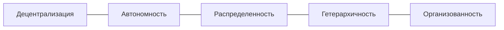
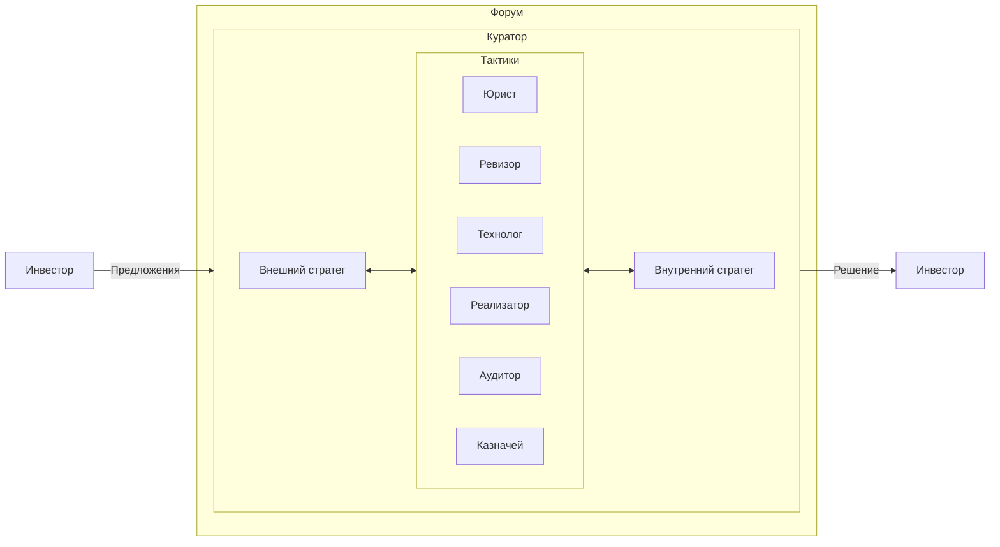

# GIC DAO

> {:height="256":loading="lazy"}  
> Мы создаем децентрализованную платформу, основанную на открытых стандартах. 
> Наша платформа позволяет совершать P2P сделки напрямую, используя умные контракты для автоматизации и обеспечения безопасности всей цепочки транзакций. 
> Мы используем распределенную и гетерархическую структуру DAO, что позволяет избежать необходимости вмешательства государства в качестве арбитра при возникновении споров. 
> Попробуй облегчить жизнь с ботификацией!

## Преимущества и особенности организации

### Децентрализация
Организация основана на принципе децентрализованности, обеспечивая членам полный контроль над своими данными и решениями. 
Каждый член организации хранит полную историю транзакций в DAO и может проследить темы общения между участниками.
Децентрализация заключается в управлении через гибкую привязку участника через участие в Предложениях, которые прямо или косвенно управляют GIC DAO. 

### Автономность
Организация действует в автономном режиме на основе утвержденных правил, переведеных на программный язык умных контрактов. 
Члены организации принимают решения и действуют независимо в соответствии с установленной [миссией DAO](https://gotointeractive.com/manifest) и [правил сетикета](https://gotointeractive.com/netiquette). 
Автономность общества заключается автоматическом выполнении определенных действий без необходимости посредников через Смарт-контракты 
(программный код, определяющий правила управления, развернутое на блокчейне) на 
Off-Chain (любое действие или ввод данных, которое не записывается на блокчейн, где развернут смарт-контракт (или его версия), для того чтобы иметь проверяемые и невозможные к изменению записи) 
или On-Chain (Относится к любому действию или вводу данных, который записывается на блокчейне или другом типе распределенного реестра, где развернут смарт-контракт (или его версия), для того чтобы иметь проверяемые и невозможные к изменению записи). 

### Распределенность
Организация функционирует на принципе распределенности, сотрудничая и взаимодействуя между членами DAO без наличия административного центра. 
Члены организации разнесены между разными регионами, имеют разную культуру и работают в других организациях и Sub-DAO.

### Гетерархичность
Организация оперирует на принципе гетерархичности, где взаимодействие и принятие решений осуществляются горизонтально, без жесткой иерархической структуры или вертикального подчинения внешним центрам управления.

### Организованность
Контроль над организацией обеспечивает Куратор.

## Продукты организации

### Мои договоры

> {:height="256":loading="lazy"}  
> Открытые договоренности, принятые частным образом.

Забудьте о проблемах хранения договоров на компьютере или в неконтролируемых облачных сервисах - наше приложение предлагает удобное и безопасное решение! Храните свои договоры всегда под рукой в своем любимом браузере и найдите "тот самый договор" легко и быстро с реактивным клиентом для удобного семантического поиска.

- [Google Play](https://play.google.com/store/apps/details?id=ru.baskovsky.archive.twa)
- [PWA](https://archive.gotointeractive.com)
- [GitHub Discussion](https://github.com/orgs/gotois/discussions)

## Члены организации

### Куратор

* _В разработке_.  
 Коммуникатор отвечает за обеспечение эффективной *коммуникации* внутри организации: HR, координации деятельности всех членов и взаимодействие с участниками внутри DAO в рамках сетикета.
 > Исполняет роль переговорщика. Отвечает за корпоративную культуру. Обеспечивает эффективную коммуникацию и сотрудничество внутри комитетов и между сотрудниками. Занимается управлением конфликтами.  

### Стратеги

* Внешний стратег - Денис Сергеевич Басковский[^1].
 Внешние административные операции: аналитика и внешняя коммуникация (планирование, координация, организация и контроль операций) рекламы, PR, GR. 
 > {:loading="lazy"}  
 > Если вы не управляете своим цифровым двойником, значит кто-то это делает за вас.  
* Внутренний стратег - [отправить заявку на вакансию внутреннего стратега](mailto:support@gotointeractive.com?subject=Рассмотрение вакансии внутреннего стратега).  
 Внутренние административные операции: аналитика и внутренняя коммуникация (планирование, координация, организация и контроль операций Sub-DAOs), включая управление ресурсами и обеспечение эффективности работы Sub-DAO.
 > Исполняет роль вдохновителя. Автономно управляет организацией изнутри, координирует и обеспечивает деятельность между членами команды Тактиков. Поддерживает высокий уровень морали и сплоченности команд. 
 
### Тактики

- Идеалист/(_Юрист_) - [отправить заявку на вакансию тактика по юридическим операциям](mailto:v-secretary@mail.ru?subject=Рассмотрение вакансии тактика-идеалиста).  
 *Юридические операции*: занимается выполнением задач, связанных с юридическими аспектами DAO, включая обеспечение соблюдения правовых норм и регуляций, а так же интеллектуальной собственности.
 > Выполняет роль администратора.
- Оценщик/(_Ревизор_) - [отправить заявку на вакансию тактика по бухгалтерским операциям](mailto:v-secretary@mail.ru?subject=Рассмотрение вакансии тактика-оценщика).  
 *Бухгалтерские операции*: анализ финансовой информации, составление учета и отчетности, бюджетирования и обеспечение финансовой прозрачности DAO.
 > Занимается анализом, оценкой и мониторингом результатов деятельности. 
- Специалист/(_Технолог_) - [отправить заявку на вакансию тактика по техническим операциям](mailto:v-secretary@mail.ru?subject=Рассмотрение вакансии тактика-специалиста).  
 *Технические операции*: выполнение конкретных технических операций в соответствии с потребностями и требованиями DAO, сохраняет техническую экспертизу, знания и навыки в продуктах организации.
 > Отвечает за область экспертизы в рамках продукта, предоставлять консультации и занимается обучением других своей команды, определяя философию и стиль разработки.  
- Реализатор/(_Комерсант_) - [отправить заявку на вакансию тактика по коммерческим операциям](mailto:v-secretary@mail.ru?subject=Рассмотрение вакансии тактика-реализатора).  
 *Коммерческие операции*: планирование, разработка и реализация коммерческих операций и их сроками таких как закупка, сбыт и товарообмен внутри DAO.
 > Член команды, отвечающий за выполнение задач и достижение целей. Занимается планированием, а также управлением ресурсами и сроками. Реализацией маркетинговых стратегий (комплекст маркетинга), направленных на продвижение и позиционировании продуктов и услуг на рынке, исследует рынок и конкурентов, и генерирует новые идеи для роста DAO. 
- Исполнитель/(_Аудитор_) - [отправить заявку на вакансию тактика по обеспечению безопасности операций](mailto:v-secretary@mail.ru?subject=Рассмотрение вакансии тактика-исполнителя).  
 *Операции по обеспечению безопасности*: обеспечение безопасности участников DAO, включая меры по защите от угроз и обеспечение безопасности операций, оценки стратегии и тактики. 
 > Фокусируется на деталях, контроле качества и завершении проектов. Занимается отладкой, гарантирует высокое качество продуктов. Мыслит о принятых правильных решениях.  
- Технолог/(_Казначей_) - [отправить заявку на вакансию тактика по финансовым операциям](mailto:v-secretary@mail.ru?subject=Рассмотрение вакансии тактика-технолога).  
 *Финансовые операции*: разработка и применением технологических стратегий в области финансовых операций, включая управление токенами, стратегии финансовой монетизации и управление DAO-экономикой.
 > Отвечает за архитектуру, финансовую стратегию и инфраструктуру обеспечивая отточенные процессы. Создает и выполняет стратегию финансовой монетизации. Ценовой аудит сделок. Анализ выполнения сделки (План/Факт). Рекомендации на будущее. Сопровождение сделки.  
- Инвестор  
 *Инвестиционные операции*: привлечение дополнительных средств.
 > Внешний комитет, не исполняющий задач, но инвестировавший в ДАО для получения прибыли в качестве дивидендов.  

---

[^1]: Денис Сергеевич Басковский: [Персональный блог](https://baskovsky.ru), [GitHub](https://github.com/qertis), [LinkedIn](https://www.linkedin.com/in/baskovsky/).
