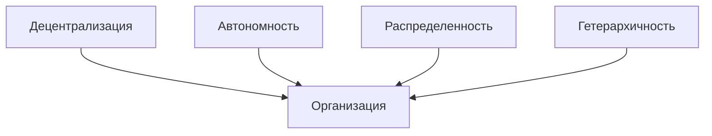
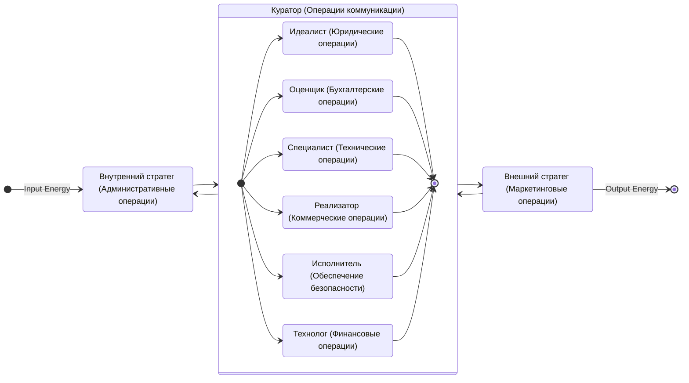

# goto Interactive Communications

> {:height="256":loading="lazy"}  
> Мы создаем децентрализованную платформу, основанную на открытых стандартах. Наша платформа позволяет совершать P2P сделки напрямую, используя умные контракты для автоматизации и обеспечения безопасности всей цепочки транзакций. Мы используем распределенную и гетерархическую структуру DAO, что позволяет избежать необходимости вмешательства государства в качестве арбитра при возникновении споров.

## Преимущества и особенности организации

### Децентрализация
Организация основана на принципе децентрализованности, обеспечивая членам полный контроль над своими данными и решениями. 
Каждый член организации хранит полную историю транзакций в DAO и может проследить темы общения между участниками.

### Автономность
Организация действует в автономном режиме на основе утвержденных правил, переведеных на программный язык умных контрактов. 
Члены организации принимают решения и действуют независимо в соответствии с установленной [миссией DAO](https://gotointeractive.com/manifest) и [правил сетикета](https://gotointeractive.com/netiquette).

### Распределенность
Организация функционирует на принципе распределенности, сотрудничая и взаимодействуя между членами DAO. 
Члены организации разнесены между разными регионами, имеют разную культуру и работают в других организациях и Sub-DAO.

### Гетерархичность
Организация оперирует на принципе гетерархичности, где взаимодействие и принятие решений осуществляются горизонтально, без жесткой иерархической структуры или вертикального подчинения внешним центрам управления. 
Контроль над организацией обеспечивает Куратор DAO. 

## Продукты организации

### Мои договоры

> {:height="256":loading="lazy"}  
> Открытые договоренности, принятые частным образом.

Забудьте о проблемах хранения договоров на компьютере или в неконтролируемых облачных сервисах - наше приложение предлагает удобное и безопасное решение! Храните свои договоры всегда под рукой в своем любимом браузере и найдите "тот самый договор" легко и быстро с реактивным клиентом для удобного семантического поиска.

- [Google Play](https://play.google.com/store/apps/details?id=ru.baskovsky.archive.twa)
- [PWA](https://archive.gotointeractive.com)

### ProstoDiary

> Попробуй облегчить жизнь с ботификацией.

Представьте, что у вас есть надежный помощник, который освобождает вас от рутины, советует правильные решения и оптимизирует вашу жизнь, помогая вам раскрыть свой потенциал. ProstoDiary - это ваш личный виртуальный секретарь, созданный для вашего комфорта, достижения счастья и успеха в жизни.

Наш подход основан на безопасной обработке личных данных в цифровой среде, где только вы имеете полный контроль над своей цифровой идентичностью. Мы знаем, что каждый пользователь сети неизбежно оставляет свою цифровую тень. Однако, с ProstoDiary все данные о вашем цифровом профиле остаются в вашем контроле, в хранилище, которым только вы управляете.

Наш виртуальный секретарь использует цифрового двойника вашей личности, помогая вам сэкономить время и лучше ориентироваться в хаосе вашей жизни. Взаимодействуя с другими виртуальными ассистентами, он берет на себя рутинные задачи, такие как поиск, сравнение, покупка, логистика и возвраты. ProstoDiary гарантирует конфиденциальность информации о вас и о себе, обеспечивая безопасные и защищенные сделки.

- [Презентация](https://docs.google.com/presentation/d/e/2PACX-1vTHiAsdaKnOFPi5cUs0zmg3hu4kA-rLwDknLODqwke_HV2r1Rs6u6q3addJA5Gp7qkKQqp2FqiJYkJ7/pub?start=false&loop=false&delayms=30000)
- [Web](https://prosto-diary.gotointeractive.com)

## Члены организации

> Машина процесса деятельности (GIC DAO Processes)

### Куратор

* Куратор - коммуникатор _в разработке_.  
 Коммуникатор отвечает за обеспечение эффективной коммуникации внутри организации: HR, координации деятельности всех членов и взаимодействие с участниками внутри DAO в рамках сетикета.

### Стратеги 

* Внешний стратег - Денис Сергеевич Басковский[^1].
 Маркетинговые операции: занимается разработкой и реализацией маркетинговых стратегий, направленных на продвижение и позиционировании продуктов и услуг на рынке, исследует рынок и конкурентов, и генерирует новые идеи для роста DAO. 
 > {:loading="lazy"}  
 > Если вы не управляете своим цифровым двойником, значит кто-то это делает за вас.  
* Внутренний стратег - [отправить заявку на вакансию внутреннего стратега](mailto:support@gotointeractive.com?subject=Рассмотрение вакансии внутреннего стратега).  
 Административные операции: планирование, координацию, организацию и контроль внутренних операций DAO, включая управление ресурсами и обеспечение эффективности работы Sub-DAO.
 
### Тактики

* Идеалист - [отправить заявку на вакансию тактика по юридическим операциям](mailto:support@gotointeractive.com?subject=Рассмотрение вакансии тактика-идеалиста).  
 Юридические операции: занимается выполнением задач, связанных с юридическими аспектами DAO, включая обеспечение соблюдения правовых норм и регуляций.
* Оценщик - [отправить заявку на вакансию тактика по бухгалтерским операциям](mailto:support@gotointeractive.com?subject=Рассмотрение вакансии тактика-оценщика).  
 Бухгалтерские операции: анализ финансовой информации, составление учета и отчетности, бюджетирования и обеспечение финансовой прозрачности DAO.
* Специалист - [отправить заявку на вакансию тактика по техническим операциям](mailto:support@gotointeractive.com?subject=Рассмотрение вакансии тактика-специалиста).  
 Технические операции: выполнение конкретных технических операций в соответствии с потребностями и требованиями DAO, сохраняет техническую экспертизу, знания и навыки в продуктах организации.
* Реализатор - [отправить заявку на вакансию тактика по коммерческим операциям](mailto:support@gotointeractive.com?subject=Рассмотрение вакансии тактика-реализатора).  
 Коммерческие операции: планирование, разработка и реализация коммерческих операций и их сроками таких как закупка, сбыт и товарообмен внутри DAO.
* Исполнитель - [отправить заявку на вакансию тактика по обеспечению безопасности операций](mailto:support@gotointeractive.com?subject=Рассмотрение вакансии тактика-исполнителя).  
 Операции по обеспечению безопасности: обеспечение безопасности участников DAO, включая меры по защите от угроз и обеспечение безопасности операций.
* Технолог - [отправить заявку на вакансию тактика по финансовым операциям](mailto:support@gotointeractive.com?subject=Рассмотрение вакансии тактика-технолога).  
 Финансовые операции: разработка и применением технологических стратегий в области финансовых операций, включая управление токенами, стратегии финансовой монетизации и управление DAO-экономикой.

## Социальные сети

> Устранить тиранию языка между человеком и социумом заинтересованы сообщества разнящиеся от малых групп людей до размеров федераций. Реализовать эту идею - значит сразиться с трагедией и злом жизни. Нам потребуется время и готовность воплотить задуманные шаги.

- [GitHub Discussion](https://github.com/orgs/gotois/discussions)
- [Telegram Public](https://t.me/turbostate)

---

[^1]: Денис Сергеевич Басковский: [Персональный блог](https://baskovsky.ru), [GitHub](https://github.com/qertis), [LinkedIn](https://www.linkedin.com/in/baskovsky/).
