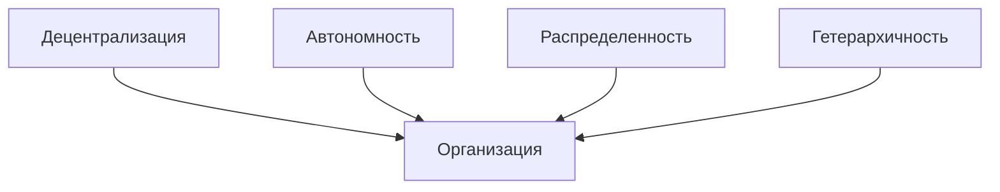

# goto Interactive Communications

> {:height="256":loading="lazy"}  
> Мы предлагаем создание инновационной децентрализованной платформы, основанной на технологиях SOLiD, Web3 и блокчейн. Наша платформа позволяет совершать P2P сделки напрямую, используя умные контракты для автоматизации и обеспечения безопасности транзакций. Мы используем распределенную и гетерархическую структуру DAO, что позволяет избежать необходимости вмешательства государства в качестве арбитра при возникновении споров.

## Преимущества и особенности организации

### Децентрализация
Организация основана на принципе децентрализованности, обеспечивая членам полный контроль над своими данными и решениями.

### Автономность
Организация действует в автономном режиме, позволяя ее членам принимать решения и действовать независимо в соответствии с установленными целями или принципами организации.

### Распределенность
Организация функционирует на принципе распределенности, сотрудничая и взаимодействуя между своими членами без единого центра управления или контроля.

### Гетерархичность
Организация оперирует на принципе гетерархичности, где взаимодействие и принятие решений осуществляются горизонтально, без жесткой иерархической структуры и вертикального контроля.

## Продукты организации

### Мои договоры

> {:height="256":loading="lazy"}  
> Открытые договоренности, принятые частным образом.

Забудьте о проблемах хранения договоров на компьютере или в неконтролируемых облачных сервисах - наше приложение предлагает удобное и безопасное решение! Храните свои договоры всегда под рукой в своем любимом браузере и найдите "тот самый договор" легко и быстро с реактивным клиентом для удобного семантического поиска.

- [Google Play](https://play.google.com/store/apps/details?id=ru.baskovsky.archive.twa)
- [PWA](https://archive.gotointeractive.com)

### ProstoDiary

> Попробуй облегчить жизнь с ботификацией.

Представьте, что у вас есть надежный помощник, который освобождает вас от рутины, советует правильные решения и оптимизирует вашу жизнь, помогая вам раскрыть свой потенциал. ProstoDiary - это ваш личный виртуальный секретарь, созданный для вашего комфорта, достижения счастья и успеха в жизни.

Наш подход основан на безопасной обработке личных данных в цифровой среде, где только вы имеете полный контроль над своей цифровой идентичностью. Мы знаем, что каждый пользователь сети неизбежно оставляет свою цифровую тень. Однако, с ProstoDiary все данные о вашем цифровом профиле остаются в вашем контроле, в хранилище, которым только вы управляете.

Наш виртуальный секретарь использует цифрового двойника вашей личности, помогая вам сэкономить время и лучше ориентироваться в хаосе вашей жизни. Взаимодействуя с другими виртуальными ассистентами, он берет на себя рутинные задачи, такие как поиск, сравнение, покупка, логистика и возвраты. ProstoDiary гарантирует конфиденциальность информации о вас и о себе, обеспечивая безопасные и защищенные сделки.

- [Презентация](https://docs.google.com/presentation/d/e/2PACX-1vTHiAsdaKnOFPi5cUs0zmg3hu4kA-rLwDknLODqwke_HV2r1Rs6u6q3addJA5Gp7qkKQqp2FqiJYkJ7/pub?start=false&loop=false&delayms=30000)
- [Web](https://prosto-diary.gotointeractive.com)

## Члены организации

### Стратеги 

* Внешний стратег - Денис Сергеевич Басковский[^1]
  > {:loading="lazy"}  
  > Если вы не управляете своим цифровым двойником, значит кто-то это делает за вас.  
* Внутренний стратег - [отправить заявку на вакансию внутреннего стратега](mailto:support@gotointeractive.com?subject=Рассмотрение вакансии внутреннего стратега).

### Тактики

* Идеалист -
 [отправить заявку на вакансию идеалиста](mailto:support@gotointeractive.com?subject=Рассмотрение вакансии тактика-идеалиста).
* Оценщик -
 [отправить заявку на вакансию оценщика](mailto:support@gotointeractive.com?subject=Рассмотрение вакансии тактика-оценщика).
* Специалист -
 [отправить заявку на вакансию специалиста](mailto:support@gotointeractive.com?subject=Рассмотрение вакансии тактика-специалиста).
* Реализатор -
 [отправить заявку на вакансию реализатора](mailto:support@gotointeractive.com?subject=Рассмотрение вакансии тактика-реализатора).
* Исполнитель -
 [отправить заявку на вакансию исполнителя](mailto:support@gotointeractive.com?subject=Рассмотрение вакансии тактика-исполнителя).
* Технолог -
 [отправить заявку на вакансию технолога](mailto:support@gotointeractive.com?subject=Рассмотрение вакансии тактика-технолога).
* Коммуникатор -
 [отправить заявку на вакансию коммуникатора](mailto:support@gotointeractive.com?subject=Рассмотрение вакансии тактика-коммуникатора).

## Социальные сети

- [GitHub Discussion](https://github.com/orgs/gotois/discussions)
- [Telegram Public](https://t.me/turbostate)

---

[^1]: Денис Сергеевич Басковский: [Персональный блог](https://baskovsky.ru), [GitHub](https://github.com/qertis), [LinkedIn](https://www.linkedin.com/in/baskovsky/).
