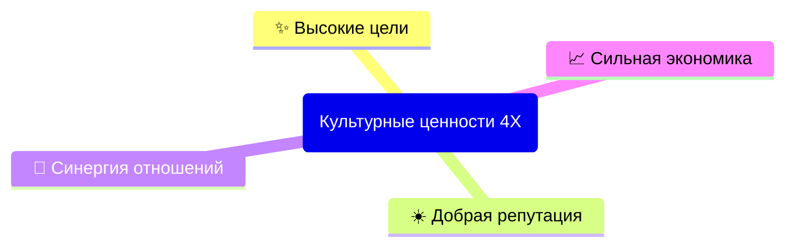

# Культурные ценности организации

## Высокие цели
- Сопричастность к миссии организации.
  - Сотрудники выбирают курс развития через создание уникальных разработок.
- Непрерывное персональное самосовершенствование.
  - Сотрудники развиваются через рискованные поступки.
- Осмысленность совершаемых действий.
  - Сотрудники несут ответственность личностного труда.
  - Сотрудники наделяют продукт носителем трансцендентного смысла.
    - Строительство и изобретение основывается на принципе внешней оправданности и внутренней красоты. 

## Добрая репутация
- Оперативное персонализированное обслуживание.
  - Сотрудники кастомизируют обслуживание под каждого принятого клиента.
- Качественное гибкое сотрудничество.
  - Сотрудники разрабатывают узко-направленный функционал.
    - Ничего лишнего: никаких заглушек и бэкдоров.
    - Отдаем предпочтение открытым (текстовым) протоколам. Никаких проприетарных или закрытых форматов реализации ПО..
  - Результаты работы открыты для наших партнеров.
    - Сотрудники знают, что клиент не всегда прав, но партнёр должен остаться доволен.
- Восприятие обратной связи.
  - Сотрудники быстро исправляют возникающие ошибки.
    - Ежедневное изучение результатов роботизированной проверки.
    - Ежедневное изучение результатов человеческой проверки.

## Синергия отношений
- Радикальная бескомпромиссная искренность.
  - Сотрудники соблюдают прозрачные процессы.
    - Каждый член организации вправе безопасно обменяться знанием процессов работы с другим.
  - Рациональность избираемого решения.
    - Иное мнение не осуждаемо на личностных качествах, но на способностях, потенциале и стремлениях.
- Самоуправляемость рабочих команд.
  - Свободный союз важнее команды. Команда важнее индивидуальности.
    - Коллективное принятие выбора.
    - Обучение каждого члена команды.
- Больше веселья. Больше денег.
  - Работаем на собственную пользу своего личного счёта.
  - Напряженный ритм деятельности поддерживается стабильностью и мобильностью в любых сферах работы.

## Сильная экономика
- Предложение наилучшей цены в соотношении стоимости к ценности спроса.
  - Не зависим только от монопольного источника.
- Создаем простые надежные решения.
  - Продукты быстро загружаются, просты, красивы, прикольны, законченны, удобны и работают у большинства.
- Стремимся к богатству организации.
  - Оплата за продвижение миссии.
    - Тарификация работающих изделий.
  - Держим свои данные внутри своего контура.
